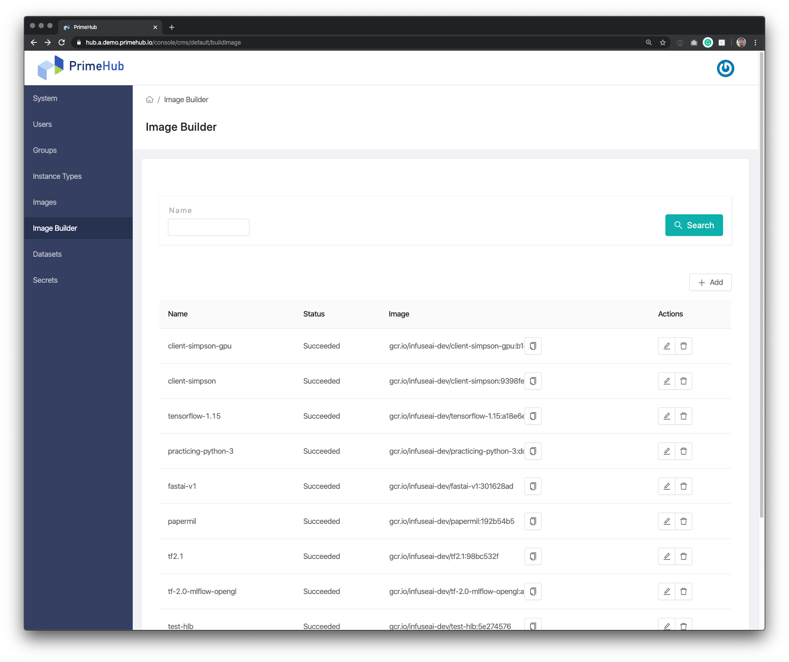
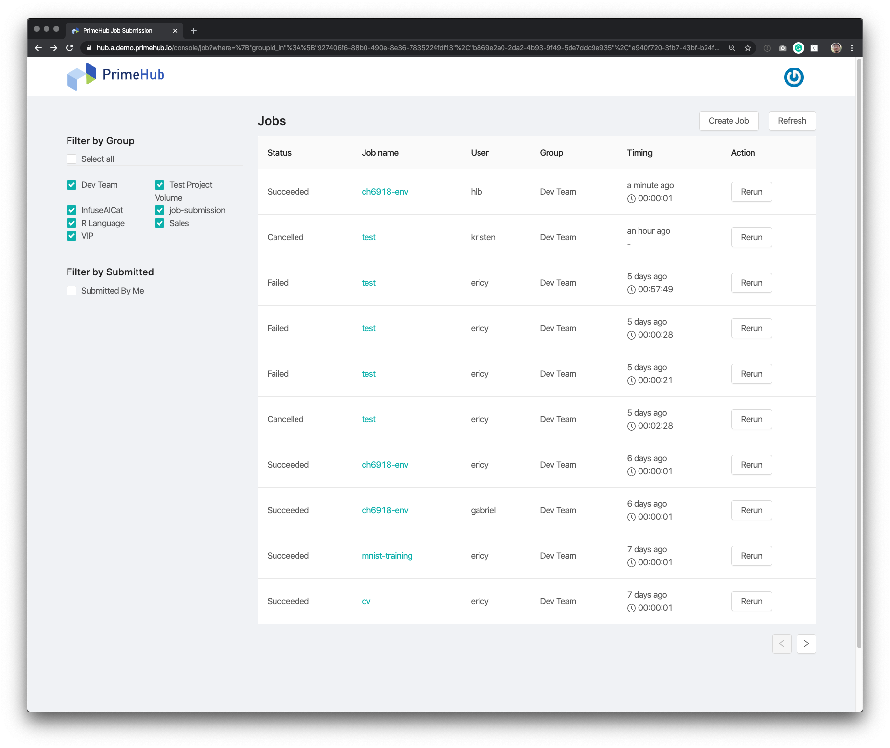

## What's New

### Image Builder (Beta)

Image Builder is a new feature that administrators are able to build up a variety of images which are pre-installed/pre-configured various tools/libraries for data scientists. It helps accelerate project development.

#### Documentation: [Image Builder](guide_manual/admin-build-image)

---

### Job Submission (Alpha)

#### Please be awared: This is a alpha version that it is subject to changes in the stable release in the near future.

Users are able to submit time-consuming jobs for running at the background.

#### Documentation: [Job Submission](job-submission), [Tutorial](job-submission-tutorial-p1)

---

### Safe mode

When Safe mode is enabled, during launching Jupyter, it mounts user home diretory under `/home/jovyan/user` instead of `/home/jovyan` of general mode. In case of user home directory is "no left space" or "is full of messy packages", now users are able to clean up files/packages under safe mode.

#### Documentation: [Safe Mode](user-advanced-setting#safe-mode)

---

### Support repo2docker-built image

repo2docker: Turn repositories into Jupyter enabled Docker Images [https://github.com/jupyter/repo2docker](https://github.com/jupyter/repo2docker)

#### Documentation: [repo2docker](concepts/designs/repo2docker)
