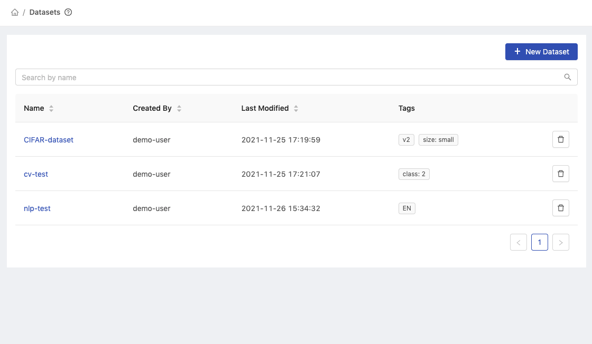
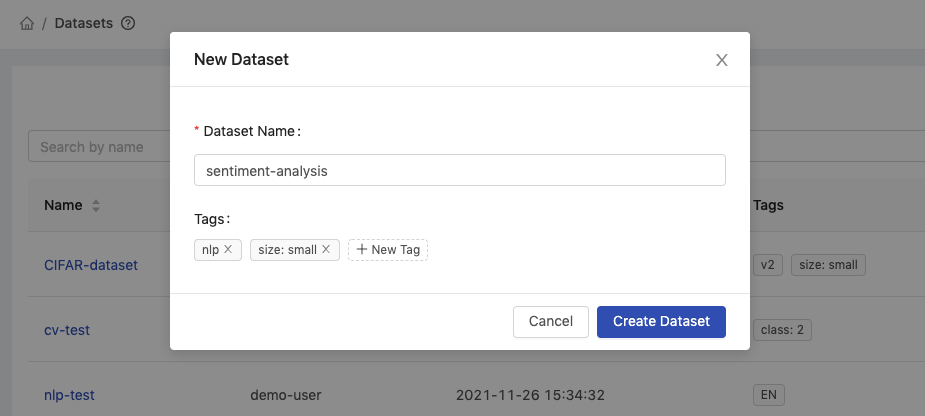
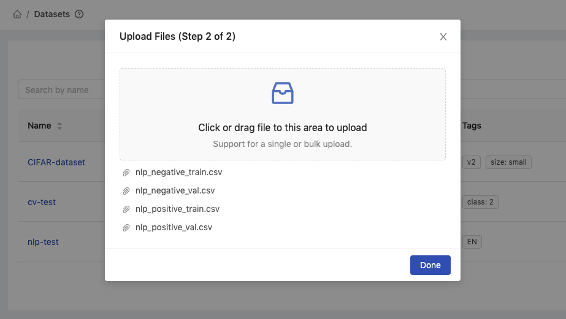
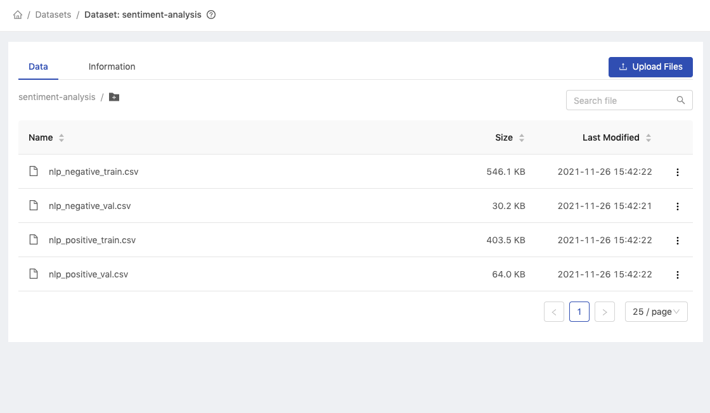
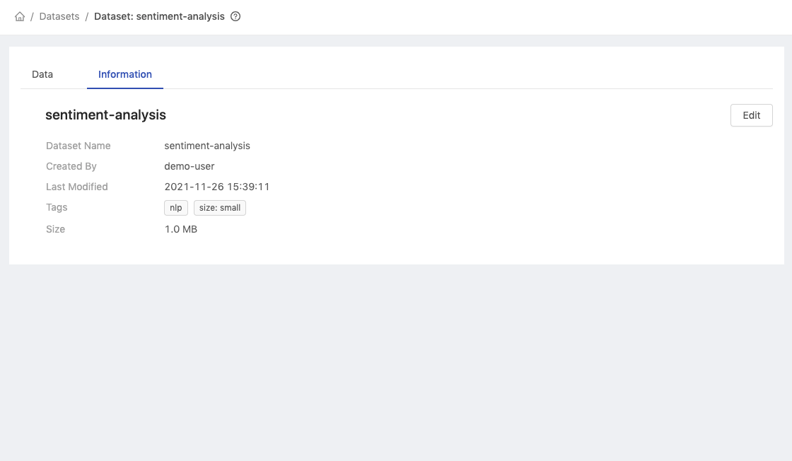
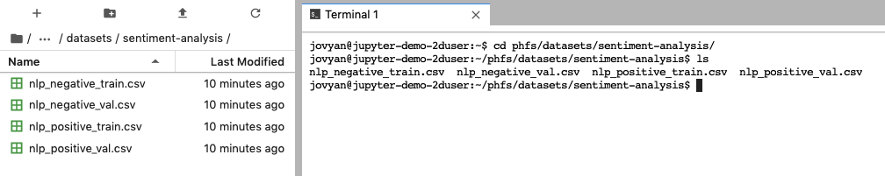
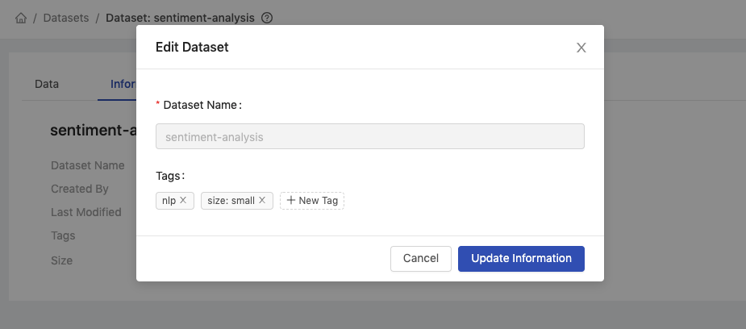
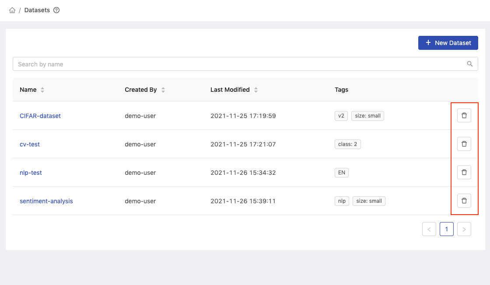

  
Enterprise
    Applicable to Enterprise Edition
  

  
Community
    Applicable to Community Edition
  

    
Deploy
    Applicable to Deploy Edition
  

 

Datasets management provides the capabilities of managing datasets resources such as create, update, and delete so that datasets can be accessed by team members.

...

maybe introduce the prerequisites of PHFS

based on shared files, some instuctions can follow the same steps

## Creating New Dataset

### Step 1: Name and Tags

### Step 2: Uploading Files

## Browse Dataset

### Data Tab

### Information Tab

## Access from Jupyter

## Editing Dataset

## Deleting Dataset

