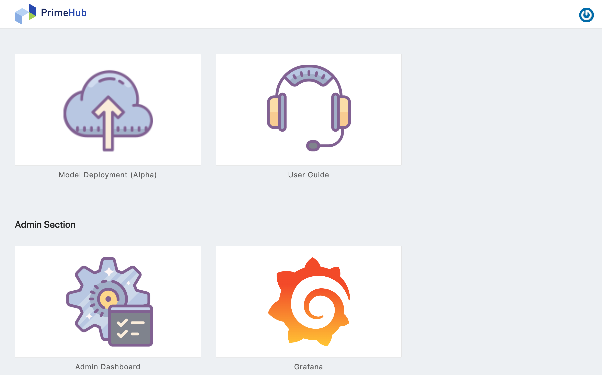

**PrimeHub Deploy** is a standalone Model Deployment-only version of **PrimeHub Enterprise**. In addition to the PrimeHub Enterprise version of the Model Deployment feature, PrimeHub Deploy also features an Admin Dashboard that allows administrators to manage resources and access-control.

## User Portal

After login, the landing page is a **User Portal** which contains several shortcuts of features.

### User Section

+ **Model Deployment**
Mode Deployment feature where users are able to deploy models as services.

+ **User Guide**
It is redirected to `Documentation` where user can find useful guides.

### Admin Section

This section is viewable only to administrators.

+ **Admin Dashboard**
It is redirected to `Admin Dashboard` where administrators can manage PrimeHub Deploy.
[Reference](model_deployment/md-system)

+ **Grafana**
It is redirected to the Grafana where we can monitor the metrics of served deployments.

### Logout

Please click `Logout` button at top-right. The page would be directed to the `Login` page.
