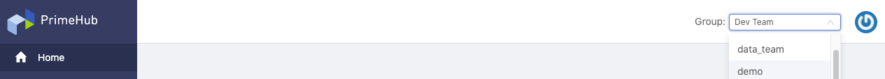

  
Deploy
    Applicable to Deploy Edition
  

 

**PrimeHub Deploy** is a standalone **Model Deployment** edition from **PrimeHub Enterprise** edition. It incorporates **Models** feature intact and certain administration features from PrimeHub Enterprise edition that administrators can manage resources and group privileges to deployments.

## User Portal

After login, it lands on **User Portal**. 

On portal, the left side is **side menu**, the right side is the **context varied in the specified working group**. At the top of the right side; `Group:` dropdown for switching working groups. Users can switch the working group among joining groups easily.

### Side Menu

+ **Home** where users can find `User Guide` link which connects to this `PrimeHub Documentation` site.

+ **Models (Beta)** where users can deploy and serve models as services. See [Model Deployment](model-deployment-feature).

