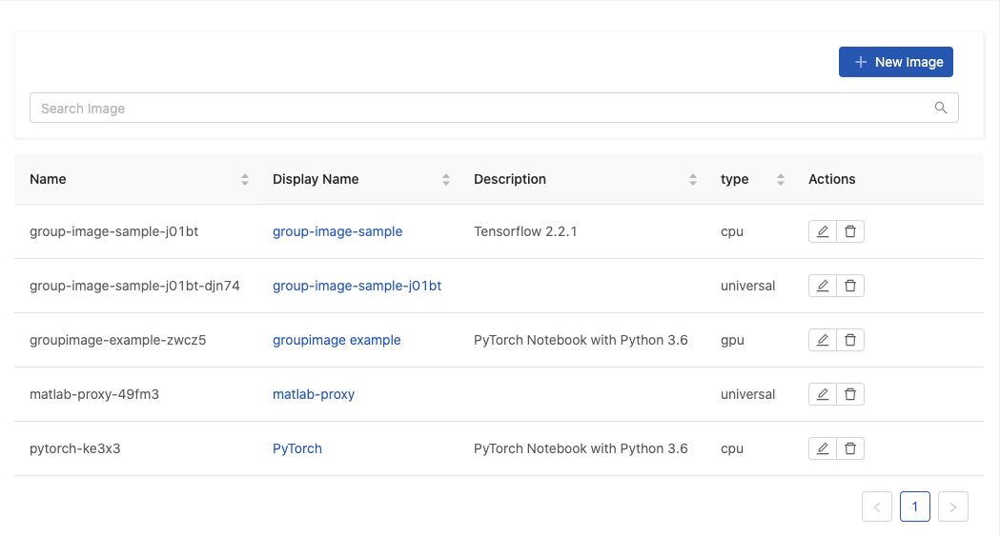
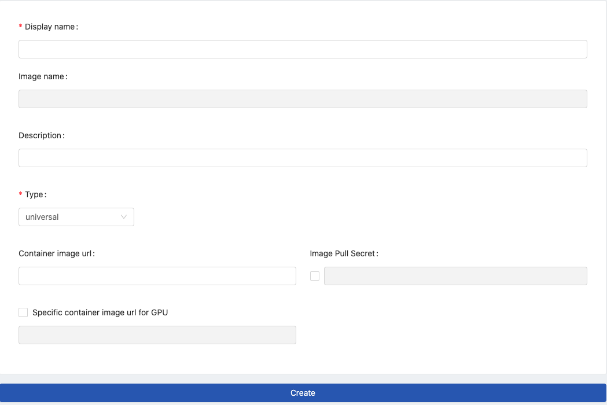
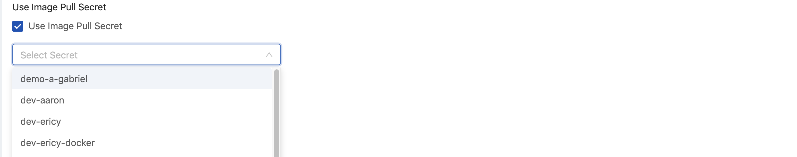

  
Enterprise
    Applicable to Enterprise Edition
  

  
Community
    Applicable to Community Edition
  

 

**Images** allows Group Admin to add images to the managed group. Only group members can access these group-specific images when the image selection is required.

>Images is a feature dedicated to [Group Admin](guide_manual/admin-group#members); only Group Admin can access it. Please contact Admin for Group Admin role.

+ `Search Image`: Search images by a keyword and press Enter.

## Adding New Image

Click `New Image` to add an Image.

Fill in fields:

+ `Display name`: (required): Only lowercase letters, numbers, hyphen `-` and a dot `.` can be filled in.

+ `Image name`: an auto-generated name based on Display name.

+ `Description`

+ `Type`: `cpu`, `gpu` and `universal`: Select what type of the image is.

+ `Container image url`: Fill the Image's link location in it.

+ `Image Pull Secret` Enable and select the secret if a pull-secret is required.

   

+ `Specific container image url for GPU` It appears when `universal` is selected. By default, it uses the same url as container image url. Enable it if a specific url for GPU is desired.

Click `Create` to complete the addition.

### Group Image

From image selection, `i` hint indicates an image `Group` image or `System` image.

## Deleting Image

Click Pen-icon for the editing.

## Editing Image

Click Trash-can-icon for the deletion.
  