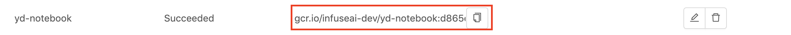

<div class="label-sect">
  <div class="ee-only tooltip">Enterprise
    <span class="tooltiptext">Applicable to Enterprise Edition</span>
  </div>
  <div class="ce-only tooltip">Community
    <span class="tooltiptext">Applicable to Community Edition</span>
  </div>
</div>
<br>

**Images** allows Group Admin to add images to the managed group. Only group members can access these group-specific images when the image selection is required.

>Images is a feature dedicated to [Group Admin](guide_manual/admin-group#members); only Group Admin can access it. Please contact Admin for Group Admin role.

## Group Image


If images are added for a group, from image selection, `i` hint indicates them `Group` image.


+ `Search Image`: Search images by a keyword and press Enter.

## Adding New Image

Click `New Image` to add an Image.


+ `Display name`: (required): Only lowercase letters, numbers, hyphen `-` and a dot `.` can be filled in.

+ `Image name`: an auto-generated name based on Display name.

+ `Description`

+ `Type`: `cpu`, `gpu` and `universal`: Select what type of the image is.

## Use Existing Image

Instead of re-using existing images, group admin can build custom images for the group.

+ `Container image url`: Fill in the Image's url. See [Reference](#reference).

+ `Image Pull Secret` Enable and select the secret if a pull-secret is required.

   

+ `Specific container image url for GPU` It appears when `universal` is selected. By default, it uses the same url as container image url. Enable it if a specific url for GPU is desired.

Click `Create` to complete the addition.


## Build Custom Image

>TBD

>There is build_custom_image picture

+ `Base image` (required) The url of the base image; we can use any valid image URLs or we can choose images which are added via Image Management from autocompletion. See [Reference](#reference).

+ `Image Pull Secret` Enable and select the secret if a pull-secret is required.

+ `Packages` choose packages installer/management and fill in packages requirement.

  + `APT` Packages management of Debian, Ubuntu and related Linux distribution.

  + `Conda` A packages management supports multiple programming language. [[Reference]](https://docs.conda.io/projects/conda/en/latest/user-guide/tasks/manage-pkgs.html#installing-packages)

  + `Pip`  Using python packages installer. [[Reference]](https://packaging.python.org/tutorials/installing-packages/#use-pip-for-installing)

  >In case of multiple packages, please using the **line break** for each package instead of putting them in one line.

Click `Confirm` to complete the addition.



Once the image is built successfully, the url of the image will be listed.

### Conda Package Match Specification

We want to mention specifically that Conda supports to specify `channel` where the package is sourced from and [match specification](https://docs.conda.io/projects/conda-build/en/latest/resources/package-spec.html#package-match-specifications) of the package. So we can specify images more precisely. The syntax is 

```txt
(channel(/subdir):(namespace):)name(version(build))[key1=value1,key2=value2]
```

For example, we want to install `numpy` package which is sourced from the channel,`conda-forge`, [here](https://anaconda.org/conda-forge/numpy).

We can use `conda-forge::` to specify the channel:

```bash
conda install conda-forge::numpy==1.17*
```

### Building Job

Clicking the link beside **Container image url**.
>TBD, There is Building Job picture

+ `Build Details`

+ `Logs`


## Deleting Image


Click Pen-icon for the editing.

## Editing Image


Click Trash-can-icon for the deletion.

### Rebuild

>TBD  

## Reference

+ [Available images provided by InfuseAI](guide_manual/images-list)