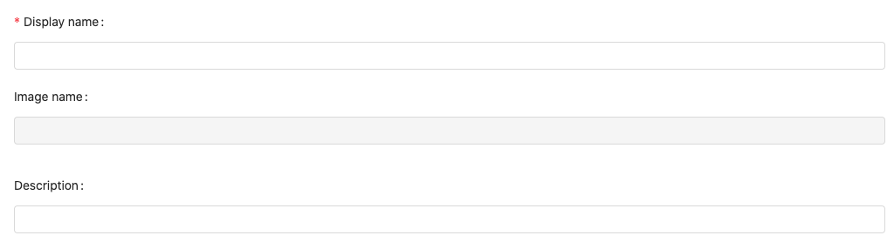
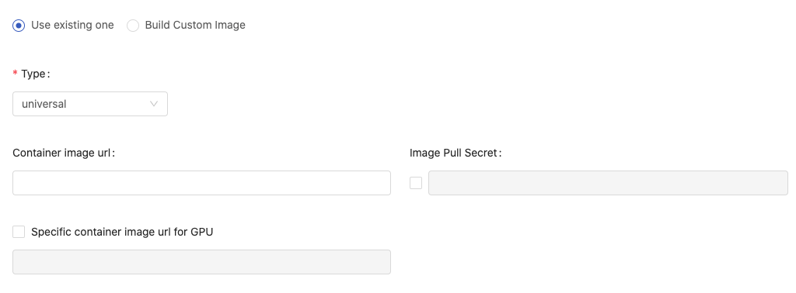
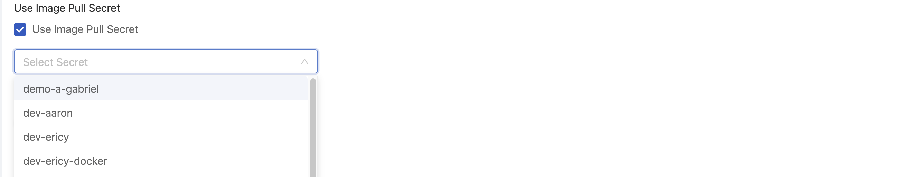
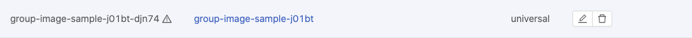
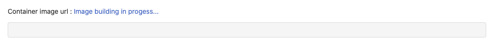

<div class="label-sect">
  <div class="ee-only tooltip">Enterprise
    <span class="tooltiptext">Applicable to Enterprise Edition</span>
  </div>
  <div class="ce-only tooltip">Community
    <span class="tooltiptext">Applicable to Community Edition</span>
  </div>
</div>
<br>

**Images** is a feature that Group Admin can manage images for the managed group. Only group members can access these group-specific images from the image selection when it is required.

>Images is a feature dedicated to [Group Admin](guide_manual/admin-group#members); only Group Admin can access it from User Portal. Please contact Admin to acquire Group Admin privilege.


+ `Search Image`: Search images by a keyword and press Enter.

## Add New Image

Click `New Image` to add an Image.



+ `Display name`: (required): Only lowercase letters, numbers, hyphen `-` and a dot `.` can be filled in.

+ `Image name`: an auto-generated name based on Display name.

+ `Description`

Choose `Use existing image` or `Build custom image`.

## Use Existing Image

Add an existing image for the group.



+ `Type`: `cpu`, `gpu` and `universal`: Select what type of the image is.

+ `Container image url`: Fill in the Image's url. See [Reference](#reference).

+ `Image Pull Secret` Enable and select the secret if a pull-secret is required.

   

+ `Specific container image url for GPU` It appears when `universal` is selected. By default, it uses the same url as container image url. Enable it if a specific image url for GPU is desired.

Click `Create` to complete the addition.


## Build Custom Image

Instead of adding existing images, Group Admin can build custom images and add them for the group.


+ `Type`: `cpu`, `gpu` and `universal`: Select what type of the image is.

+ `Base image url` (required) The url of the base image; we can use any valid image URLs or we can choose images which are added via Image Management from autocompletion. See [Reference](#reference).

+ `Image Pull Secret` Enable and select the secret if a pull-secret is required.

+ `Packages` choose packages installer/management and fill in packages requirement.

  + `APT` Packages management of Debian, Ubuntu and related Linux distribution.

  + `Conda` A packages management supports multiple programming language. [Ref.&neArr;](https://docs.conda.io/projects/conda/en/latest/user-guide/tasks/manage-pkgs.html#installing-packages)

  + `Pip`  Using python packages installer. [Ref.&neArr;](https://packaging.python.org/tutorials/installing-packages/#use-pip-for-installing)

  >In case of multiple packages, please using the **line break** for each package instead of putting them in one line.

Click `Create` to start the building.

### Conda Package Match Specification

Conda supports to specify `channel` where the package is sourced from and [match specification](https://docs.conda.io/projects/conda-build/en/latest/resources/package-spec.html#package-match-specifications) of the package. So we can specify images more specifically. 

The syntax is 

```txt
(channel(/subdir):(namespace):)name(version(build))[key1=value1,key2=value2]
```

For example, to install `numpy` package which is sourced from the channel, **conda-forge**, [Ref.&neArr;](https://anaconda.org/conda-forge/numpy).

Use `-c conda-forge::` to specify the channel:

```bash
-c conda-forge::numpy==1.17*
```

---

### Building in progress

While building, the image name is amended with an triangular exclamation mark to indicate the image is not ready.




Click the image name to view the detail, it shows `Image building in progress` beside Container image url.



Click `Image building in progress` to view the `Build Details` and `Log` of the building.


The building progress can be cancelled by `Cancel Build`.


### View build details and Rebuild

Once the building finishes successfully, there is no triangular exclamation mark as a postfix to the image name. The image becomes available from image selection.


Click `View build details` to view the detail and logs or to modify the detail for rebuilding.


To rebuild a image, by modification to the details and pressing `Rebuild`.

## Group Image

Whether adding an existing image or building a custom image for the managed group, the image can be selected from image selection; `i` hint indicates a `Group` image.


## Actions


Click Pen-icon for the **editing**; click Trash-can-icon for the **deletion**.

## Reference

+ [Available images provided by InfuseAI](guide_manual/images-list)
