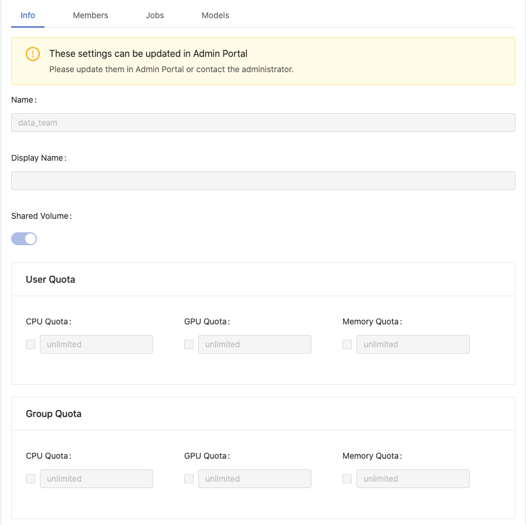
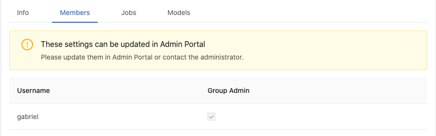
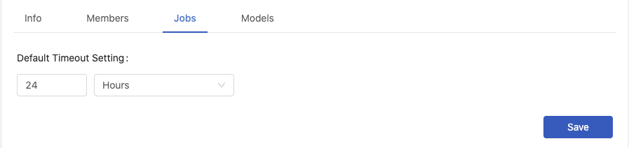
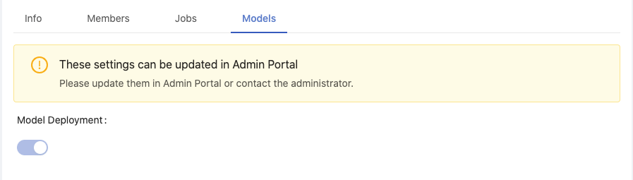

  
Enterprise
    Applicable to Enterprise Edition
  

  
Community
    Applicable to Community Edition
  

 

Group Admin now can view the current settings of the managed group which are configured by Platform Administrator. All of settings are viewable-only to Group Admin, except **Default Timeout Setting** of Jobs is configurable.

>To request Platform Administrator for adjustments.

## Info

It displays the current settings, **Name**, **Display Name**, **Shared Volume**, **User Quota** and **Group Quota** of the working group.

## Members

It displays group members and group administrators.

## Jobs

  
Enterprise
    Applicable to Enterprise Edition
  

 

+ `Default Timeout Setting`: Set Minutes / Hours / Days.

Group Admin can apply a group-wise Job timeout setting on every jobs submitted from the group. A running job will be cancelled when it exceeds the setting. This setting is able to be overwritten by each job submission for the customization. By default it is 7 days.

## Deployments

  
Enterprise
    Applicable to Enterprise Edition
  

 

It displays if **Model Deployment** is enabled to the group, i.e., if the group can use **Deployments** feature.
