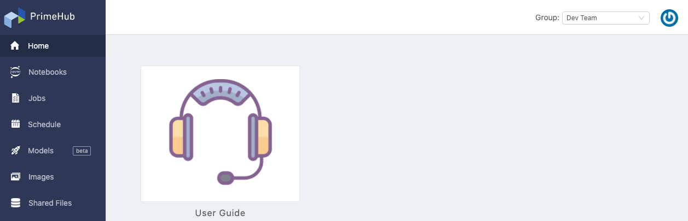

>PrimeHub 的所有文件都是以英文撰寫為主，一部分文件會經翻譯繁體中文化。這裡僅列出已中文化的文件，如需最新更多技術資訊，請參照[英文文件](introduction)。

## 簡介

**PrimeHub** 為以 *Kubernetes* 為基礎針對加速資料科學/機器學習研究開發而設計的平台。藉由專案群組為中心的設計概念，資料科學家可以輕易與專案成員共享研究資料/過程，並可以協同進行專案加速開發流程；同時藉由運算資源共享管理後台，平台管理者能有效兼彈性地分配並控管運算資源，提升運算資源的利用率。

### 主要特色

+ 叢集式運算
+ 一鍵式研發環境
+ 資料集快易載入
+ 資源分配及額度管理
+ 可客製化深度學習環境
+ 企業級帳戶存取管理

---

## 架設安裝

自行安裝者，請參照社群版及企業試用版的英文文件 [Provision of Kubernetes cluster, Installation of PrimeHub (Community/Enterprise)](dev-introduction)。

---

## Platform

PrimeHub 平台由 **User Portal** 及 **Admin Portal** 組成。

### User Portal

函括資料科學家不可或缺的常用功能；以 Notebook 進行開發，利用 Job 將工作流程串接成自動化，最後透過 Models 將訓練模型整合進容器環境，部署成服務來驗證效能，反覆持續地改進訓練模型。

參照 [User Guide](zh-tw/quickstart/login-portal-user) 了解更多。

### Admin Portal

函括資源共享管理功能及額度分配控管功能；平台管理者依據實際專案開發需求，建立專案群組，並針對群組資源做分配及額度控管；同時可以監控各個專案使用狀況。

參照 [Administration Guide](zh-tw/quickstart/login-portal-admin) 了解更多。

