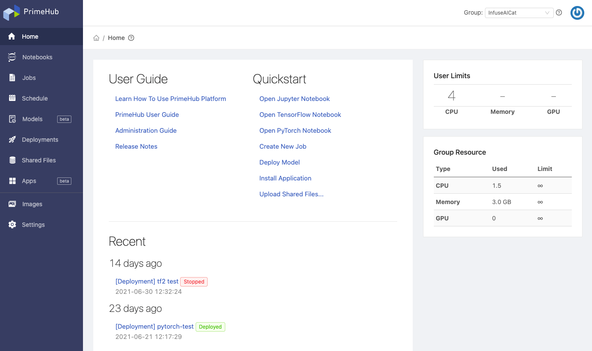

>PrimeHub 的所有文件都是以英文撰寫為主，一部分文件會經翻譯繁體中文化。這裡僅列出已中文化的文件，如需最新更多技術資訊，請參照[英文文件](introduction)。

## 簡介

**PrimeHub** 為以 *Kubernetes* 為基礎針對加速資料科學/機器學習研究開發而設計的平台。藉由專案群組為中心的設計概念，資料科學家可以輕易與專案成員共享研究資料/過程，並可以協同進行專案加速開發流程；同時藉由運算資源共享管理後台，平台管理者能有效兼彈性地分配並控管運算資源，提升運算資源的利用率。更進一步，藉由安裝第三方應用服務來擴充平台功能。

### 主要特色

+ 叢集式運算
+ 一鍵式研發環境
+ 資料集快易載入
+ 資源分配及額度管理
+ 可客製化深度學習環境
+ 企業級帳戶存取管理
+ 可擴充第三方應用服務

### 產品級別

PrimeHub 提供三種級別： **PrimeHub Community**、**PrimeHub Enterprise** 及 **PrimeHub Deploy**。關於級別功能差異，請見 [Tiers Feature Comparison](comparison)。

---

## 架設安裝

欲自行安裝者，請參照社群版及企業試用版的英文文件

[Provision of Kubernetes cluster, Installation of PrimeHub (Community/Enterprise)](dev-introduction)。

---

**PrimeHub** 平台主要由 **User Portal** 及 **Admin Portal** 組成。

## User Portal

函括資料科學家不可或缺的常用功能；以 Notebook 進行開發，利用 Job 將工作流程串接成自動化，最後透過 Deployments 將訓練模型整合進容器環境，部署成服務來驗證效能，反覆持續地改進訓練模型。

### Getting Started as Users

+ [User Portal 總覽](zh-tw/quickstart/login-portal-user)

+ [Notebook 進階啟動設定](zh-tw/user-advanced-setting)

+ [遞交 Job 及即時監視其資源使用](zh-tw/job-submission-cht)

+ [週期性 Job 排程](zh-tw/job-scheduling-feature-cht)

+ [模型部署](zh-tw/model-deployment-feature)

+ [群組限定共享檔案](zh-tw/shared-files-cht)

+ [追蹤管理模型版號 由模型管理開始](zh-tw/model-management-cht) `New` `Beta`

+ [擴充 PrimeHub：安裝第一個第三方應用 (更多內建 Apps)](zh-tw/primehub-app-cht) `New` `Beta`

+ [Notebook Extension 及 將 Notebook 遞交至 Job](zh-tw/ph-notebook-extension-cht)

+ [使用者資料儲存](zh-tw/quickstart/nb-data-store-cht)

+ [遠端 SSH 連線 Jupyter Notebook](zh-tw/guide_manual/ssh-config-cht)

+ [Start training a model and tuning it](../quickstart/qs-primehub) `Quick-start`

+ [Deploy a model in a quick way](../quickstart/qs-primehub-deploy) `Quick-start`

+ [Manage and Deploy a Model with MLflow](model-management-tutorial) `Tutorial`

+ [Data Labeling with Label Studio](primehub-app-tutorial-label-studio) `Tutorial`
  
+ [Install Grafana PrimeHub Dashboard](tasks/monitoring)

+ [Build Notebook image by repo2docker](tasks/repo2docker)

#### As Group Admin

+ [群組限定工作環境映像檔](zh-tw/group-image-cht)

+ [檢視目前群組相關設定](zh-tw/group-setting-cht)

## Admin Portal

函括資源共享管理功能及額度分配控管功能；平台管理者依據實際專案開發需求，建立專案群組，並針對群組資源做分配及額度控管；同時可以監控各個專案使用狀況。

### Getting Started as Platform Admin

+ [Admin Portal 總覽](zh-tw/quickstart/login-portal-admin)

+ [管理使用者、群組](zh-tw/guide_manual/admin-user-cht)

+ [指定群組管理者](zh-tw/quickstart/assign-group-admin-cht)

+ [管理 Instance types/映像檔/資料集](zh-tw/guide_manual/admin-instancetype-cht)

+ [客製工作環境映像檔](zh-tw/guide_manual/admin-build-image-cht)
  + [客製映像檔指南](zh-tw/guide_manual/custom-image-guideline)

+ [管理 secrets](zh-tw/guide_manual/admin-secret-cht)

+ [檢視使用量月報表](zh-tw/guide_manual/admin-report-cht)

+ [設定 PrimeHub 系統參數](zh-tw/guide_manual/admin-system-cht)

+ [維運用 Maintenance Notebook](zh-tw/maintenance-cht)

+ [快速上手操作](zh-tw/quickstart/create-user)