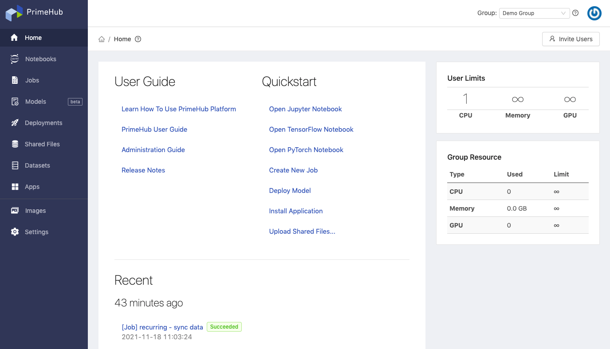
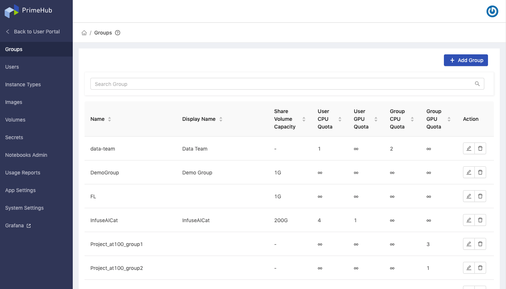

**PrimeHub** is a *Kubernetes-based* platform designed for groups of data scientists. It aims to be an all-in-one, enterprise-level, machine learning platform that provides a seamless MLOps experience.

PrimeHub adopts a group-centric design, which accelerates collaborative development. In PrimeHub, scientists can share datasets, artifacts, and seamlessly collaborate on projects in groups. Models can be developed, deployed, and monitored with full control in a transparent group environment.

Using PrimeHub’s granular controls, administrators can configure access control settings, manage resources, and adjust resource quotas for groups - All facilitating efficient resource utilization.

With the addition of 3rd-party app integration, PrimeHub’s capabilities can be augmented on demand, accelerating the machine learning workflow. These 3rd-party apps also benefit from the access control and resource configurability that is available through PrimeHub, making for a true, all-in-one, MLOps solution.

## Key Capabilities

+ Cluster Computing
+ One-Click Research Environments
+ Easy Dataset Loading
+ Management of Resource & Quota Privileges
+ Custom Deep Learning Environments
+ Enterprise-Class Account Management
+ Capability Augmentation via 3rd-party Apps

## Product Tiers

PrimeHub has **PrimeHub Community**, **PrimeHub Enterprise** and **PrimeHub Deploy**, three tiers. Regarding the differences, see [Tiers Feature Comparison](comparison).

---

**PrimeHub** is composed of a **User Portal** and an **Admin Portal**. The User Portal provides features aimed at data scientists and team members, and the Admin Portal provides configuration options relevant to platform administrators.

## User Portal

The User Portal provides access to a full MLOps feature set. Data scientists can turn workflows into automated pipelines via Jobs/Recurring Jobs; prepare data and develop trained models from Notebooks; deploy container-wrapped models as services via Model Deployment, and more.

### Get Started as a Team/Project Member

+ [User Portal overview](quickstart/login-portal-user.md)

+ [Starts a Jupyter Notebook](quickstart/launch-project)

+ [Start training a model and tuning it](quickstart/qs-primehub) `Quick-start`

+ [Deploy a model in a quick way](quickstart/qs-primehub-deploy) `Quick-start`

+ [Submit and monitor jobs](job-submission-feature#jobs)

+ [Schedule routine jobs](job-submission-feature#recurring-jobs)

+ [Share files within a group](shared-files)

+ [Start tracking versioned models with Model Management](model-management)

+ [Install the first 3rd-party application from built-in Apps](primehub-app)

+ [Notebook extension and submit notebooks as jobs](ph-notebook-extension)

+ [Learn about Persistent data stores](quickstart/nb-data-store)

+ [Access Jupyter Notebook remotely via SSH](guide_manual/ssh-config)

+ [Manage and Deploy a Model with MLflow](model-management-tutorial) `Tutorial`

+ [Data Labeling with Label Studio](primehub-app-tutorial-label-studio) `Tutorial`

+ [Install Grafana PrimeHub Dashboard](tasks/monitoring)

+ [Build Notebook image by repo2docker](tasks/repo2docker)

### Get Started as a Group Admin

+ [Add/Build images for my team/project](group-image)

+ [View the current settings of my team/project](group-setting)

---

## Admin Portal

The Admin Portal enables administrators to manage all aspects of Primehub, such as access-control, resource and quota control, building custom environments via image builder etc.

### Getting Started as an Administrator

+ [Admin Portal overview](quickstart/login-portal-admin)

+ [Manage PrimeHub system and the license status](guide_manual/admin-system)

+ [Manage users and groups](guide_manual/admin-user)

+ [Assign group admin](guide_manual/admin-group#members)

+ [Manage instance types](guide_manual/admin-instancetype)

+ [Manage images](guide_manual/admin-image)

+ [Manage volumes](guide_manual/admin-volume)

+ [Custom Image Guideline](guide_manual/custom-image-guideline)

+ [Manage secrets (credentials)](guide_manual/admin-secret.md)

+ [Review monthly usage report](guide_manual/admin-report)
