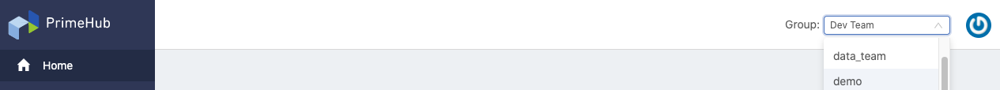

## Introduction

**PrimeHub v3**, in order to enhance the team/group-centric design, UI is revamped for introducing **Group-Context** experience to users that a current working project-group is required to be specified from associated groups of users, accordingly, the context/the operations are retained within the working group; therefore, it provides a consistent, intuitive experience of a working group/project; in the past PrimeHub v2, users had to choose a group to perform actions every time repeatedly which didn't provide a project-centric experience consistently.

In addition, there are two portals now, one is **User Portal** which provides general user-facing features, the other is **Admin Portal** which provides adminstration features.

## PrimeHub v3.3+

**Group Admin**： v3.3+ onwards, PrimeHub adds this role in a group. PrimeHub Admin is able to [assign group members Group Admin](guide_manual/admin-group#members); Group Admin is able to utilize dedicated new features from User Portal such as [Images](group-image).

---

## Installation

Getting Started from [Provision of Kubernetes cluster, Installation of PrimeHub (Community/Enterprise)](dev-introduction).

---

## User Portal Features

+ [Access User Portal](quickstart/login-portal-user.md)

+ [Launch/Shutdown projects of JupyterHub on PrimeHub](quickstart/launch-project)

+ [Advanced settings of JupyterHub Spawner](user-advanced-setting)

+ [Submit and monitor jobs](job-submission-feature)

+ [Schedule routine jobs](job-scheduling-feature)

+ [Store job artifacts](job-artifact-feature)

+ [Deploy Models and serve models](model-deployment-feature)

+ [Add group-specific images](group-image) `New`

+ [Upload and share files within a group](shared-files) `New`

+ [Notebook extension and submit notebooks as jobs](ph-notebook-extension)

+ [Store user data](quickstart/nb-data-store)

+ [Access Jupyter Notebook remotely via SSH](guide_manual/ssh-config)

+ [More](getting-started-user)

## Admin Portal Features

+ [Access Admin Portal](quickstart/login-portal-admin)

+ [Manage PrimeHub system and check the license](guide_manual/admin-system)

+ [Manage users and groups](guide_manual/admin-user)

+ [Assign group admin](guide_manual/admin-group#members) `New`

+ [Manage instance types, images, dataset resources](guide_manual/admin-instancetype)

+ [Build custom images for users](guide_manual/admin-build-image)
  + [Custom Image Guideline](guide_manual/custom-image-guideline)

+ [Manage secrets(credentials)](guide_manual/admin-secret.md)

  + [GitLab Pull Secret](quickstart/secret-pull-image)
  + [GitHub gitsync secret](quickstart/secret-gitsync)

+ [Review monthly usage report](guide_manual/admin-report)

+ [Perform operations via Maintenance Notebook](maintenance)

+ [More](getting-started-admin)

---

## Technical Reference

### Components Configuration

+ [SSH Server](getting_started/configure-ssh-server)

### Design Documents

+ [Architecture and more ...](design/architecture)

### Tasks

+ [Jupyter Images](tasks/repo2docker)
+ [API Token](tasks/api-token)

### Reference

+ [PrimeHub Chart Configuration](references/primehub_chart)
+ [Features Comparison](comparison)

### Trouble Shooting

+ [Category](trouble-shoot-guide)