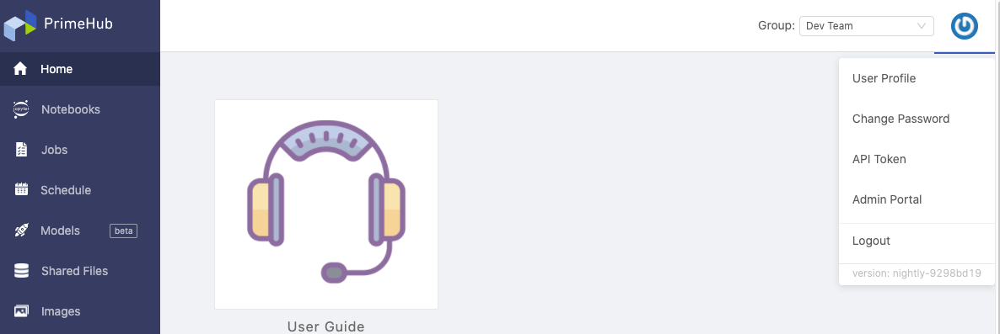
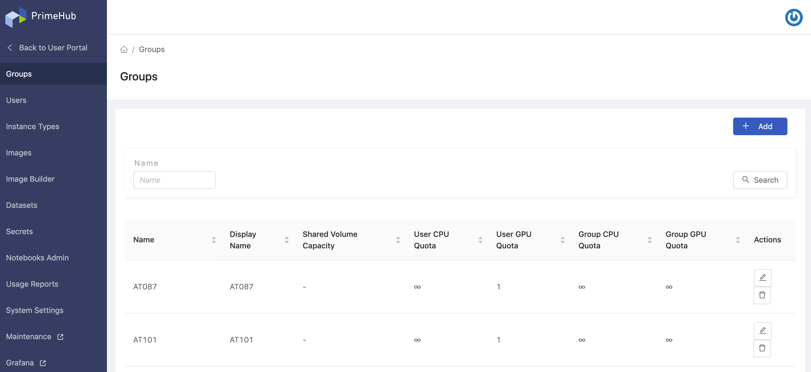

**PrimeHub** is a *Kubernetes*-based platform designed for groups of data scientists. It aims at being a all-in-one enterprise machine learning platform to provide seamless MLOps experience.

Adopting the group-centric design, scientists can share datasets, artifacts and co-work easily within same groups/projects, which accelerates collaborative development for project groups, besides, scientists are capable of developing models, serving and monitoring with full governance and transparency. In terms of platform administration, administrators are able to manage access control, resources quotas control for project groups accordingly, which facilitates the efficiency of resources managements.

### Key Capabilities

+ Cluster Computing
+ One-click Research Environments
+ Easy Dataset Loading
+ Management of Resource & Quota Privileges
+ Custom Deep Learning Environments
+ Enterprise-Class Account Management

---

## Platform

PrimeHub platform is composed of **User Portal** and **Admin Portal**.

### User Portal

incorporates scientists-facing prominent features that scientists are able to turn workflows into automating pipelines by Job submission/schedule, able to prepare data/generate trained models from Notebook and able to serve container-wrapped models by Model Deployment.

+ [User Portal Overview](quickstart/login-portal-user.md)

+ [Launch/Shutdown projects of JupyterHub on PrimeHub](quickstart/launch-project)

+ [Advanced settings of JupyterHub Spawner](user-advanced-setting)

+ [Submit and monitor jobs](job-submission-feature)

+ [Schedule routine jobs](job-scheduling-feature)

+ [Deploy Models and serve models](model-deployment-feature)

+ [Add/Build group-specific images](group-image) `New`

+ [Share files within a group](shared-files) `New`

+ [Notebook extension and submit notebooks as jobs](ph-notebook-extension)

+ [Persistent data store](quickstart/nb-data-store)

+ [Access Jupyter Notebook remotely via SSH](guide_manual/ssh-config)

### Admin Portal

incorporates administration features that administrators are able to have access control management, resources/quotas control management, and to oversight the usage, moreover, administrators are able to build custom environments by customization of images.

+ [Admin Portal Overview](quickstart/login-portal-admin)

+ [Manage PrimeHub system and check the license](guide_manual/admin-system)

+ [Manage users and groups](guide_manual/admin-user)

+ [Assign group admin](guide_manual/admin-group#members) `New`

+ [Manage instance types, images, dataset resources](guide_manual/admin-instancetype)

+ [Build custom images for users](guide_manual/admin-build-image)
  + [Custom Image Guideline](guide_manual/custom-image-guideline)

+ [Manage secrets (credentials)](guide_manual/admin-secret.md)

+ [Review monthly usage report](guide_manual/admin-report)

+ [Perform operations via Maintenance Notebook](maintenance)

