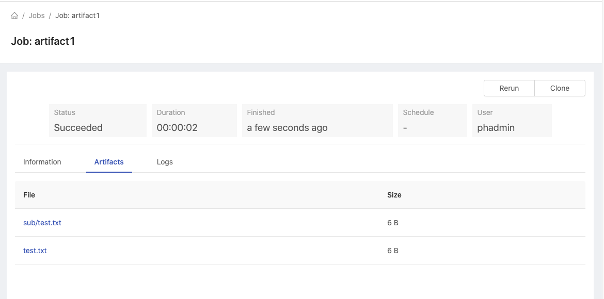
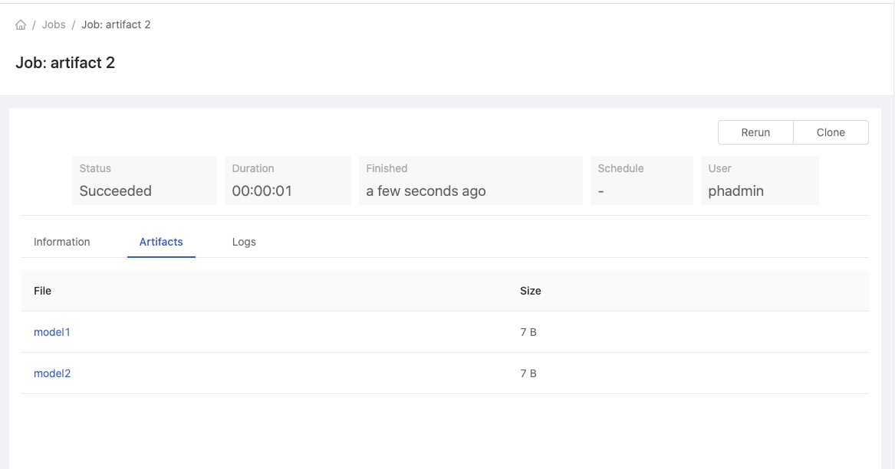

<div class="ee-only tooltip">Enterprise
  <span class="tooltiptext">Applicable to Enterprise tier only</span>
</div>

Allows users to store the job output and can be downloaded from the job UI.

## Prerequisites

The feature is only enabled if PrimeHub store and PHFS is enabled.

## Create Artifacts

To put artifacts in a job, just create an `artifacts` folder (or said `/home/jovyan/artifacts`) and put files to be copied here. The steps are

1. Create a job with the command

    ```
    mkdir -p artifacts/sub
    echo "hello" > artifacts/test.txt
    echo "hello" > artifacts/sub/test.txt
    ```

1. Go to the detail page of the newly created job.
1. Wait for the job completed
1. Go to the **Artifacts** tab. You will see all the two artifacts we just created

   

## Link Artfiacts Folder

We can also create a symbolic link `artifacts` to the actual folder where the files to copy out are located.

1. Create a job with the command

    ```
    mkdir -p mymodel
    echo "model1" > mymodel/model1
    echo "model2" > mymodel/model2
    ln -s mymodel artifacts
    ```

1. Go to the newly created job detail page.
1. Wait for the job completed
1. Go to the **Artifacts** tab. You will see all the two artifacts you just created
   

## Rentention

By default, the artifacts are kept only 7 days. The system will clean up the expired artifacts everyday.

## Size and file count Limit

By default, a job can have at most `100Mb` by size and `1000` artifacts. If a job exceeds the limit, no files would be copied.
