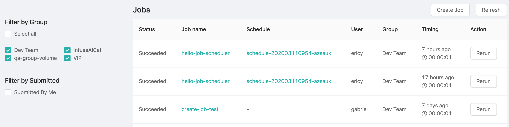

PrimeHub has Job Submission feature that we can submit a one-time job immediately for running asynchronously; however, we sometimes want to submit certain jobs regularly according schedules. PrimeHub, hence, provides another feature, **Job Scheduling** that we can create schedulers which are responsible for submitting jobs regularly according to the recurrence setting for us.

We can find Job Scheduling from user portal.

## Schedulers List

In the scheduler list, there are some information of each scheduler:

|Column|Description|
|------|-----------|
|`Name`|The name of the scheduler.|
|`Group`|The group where the triggered job runs.|
|`Recurrence`| The recurrence of the trigger if any.|
|`Next Run`| time when a job will be triggered next time.|
|`Created By`| The owner of job/scheduler.|
|`Action`|The action buttons are `trigger`, `edit` and `delete` in sequence. |

+ `Schedule Job` button: Click the button to create a scheduler.

+ `Refresh` button: Click the button to refresh the list.

### Filter

+ `Select all`: If checked off, it lists all of schedulers from groups where the user *belongs* to, in other words, schedulers from other groups are not listed.

+ `Filter by Group`: Groups which the user belongs are criteria. Checking off groups to filter out schedulers from other groups.

+ `Filter by Submitted`: If `Submitted by Me` is checked off, it lists schedulers **ONLY** are created by the user.

## Create Scheduler

Creating a scheduler is almost as same as creating a job, in addition to the settings of `Group`, `InstanceTypes`, `Images`, `Command`, we can set extra `Recurrence Options` setting.

+ `Group`: Select a group where the the job belongs to.

+ `InstanceTypes`: Select a instance type which allocates resources for the job.

+ `Images`: Select an image which the job run bases on.

+ `Schedule name`: The name of the scheduler.

+ `Command`: The sequential commands of the job context.

+ `Recurrence Options`: The rule of trigger recurrence if active.

    we can select one of presets of rules or customize a rule based on [`Cron` syntax [Reference]](https://en.wikipedia.org/wiki/Cron).
  
  |Options                            |Description                     |
  |-----------------------------------|--------------------------------|
  |`Inactive`                         | Deactivate the scheduler; a inactive scheduler cannot trigger jobs.|
  |`Every Day (at 4:00am)`            | A preset; trigger a job at 4 AM everyday.|
  |`Every Week (Sunday at 4:00am)`    | A preset; trigger a job at 4 AM on Sunday every week.|
  |`Every Month (on the 1st at 4:00am`| A preset; trigger a job at 4 AM on 1st every month.|
  |`Custom`                           | Customize the rule of the trigger recurrence; "`minute` `hour` `day of the month` `month` `day of the week`"; `0 4 * * *` represents 4 AM every day.|

## Edit Scheduler

Clicking the action button of `edit`  to enter the scheduler editing page.

## Delete Scheduler

Clicking the action button of `delete` to delete the scheduler.

## Jobs triggered by Scheduler

Schedulers are responsible for submitting jobs according the recurrence setting. Once jobs are submitted by schedulers, they will be listed in **Job Submission** list. We can notice these jobs with `Schedule` info.

