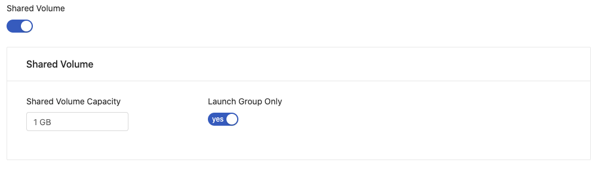

Enterprise
  Applicable to Enterprise tier only

By leveraging Job Submission, users can train a machine learning job in the background while doing other analyses in JupyterLab at the same time.

In this tutorial, we will go through a MNIST example, introduce and teach you how to use Job Submission functions, and also explain how Job Submission functions interact with other functions in PrimeHub.

## Prerequisite

### Group Volume

To fully utilize all Job Submission functions, there must be a `group volume` in your group. If you do not have one, please ask your administrator to create one for you.

Jobs cannot access `user volume` and a job's working directory is also a temporary directory. Therefore, the easiest way to persist your outputs is to output them into `group volume`. Also, the easiest way to use the code written in JupyterLab is to put your code in `group volume`.

The rest of this tutorial assumes that you have `group volume`.

Ask your administrator to switch on shared volume in Groups tab under the Admin page 

### Image and Instance Type

This tutorial uses Tensorflow 1.14 to train a MNIST handwritten digit classifier and assumes we at least have one virtual cpu and 2GB RAM when running a job.

Please make sure you have this kind of `image` and `instance type`. If not, please also submit a request to your administrator to create these for you in the Admin page. 

### Group Quota and User Quota

For this tutorial, the necessary total quota is two virtual CPU and 4GB RAM. Please ensure that you have enough quota or contact your administrator.