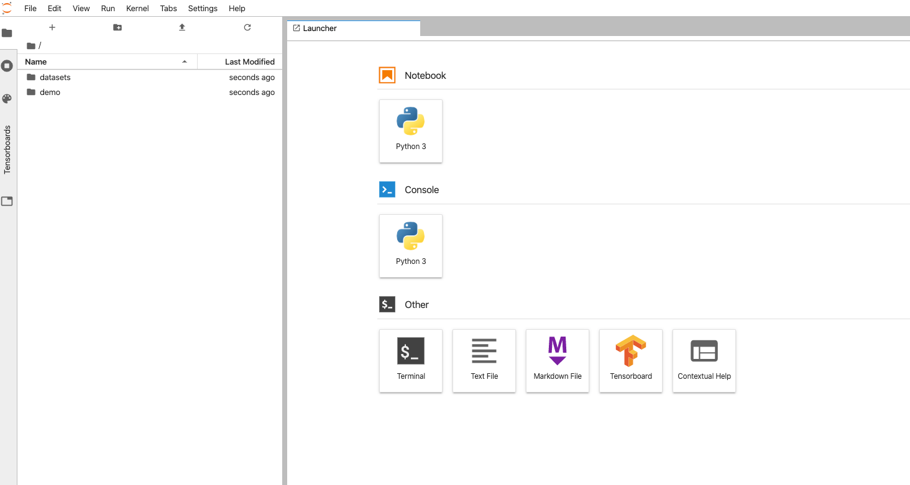
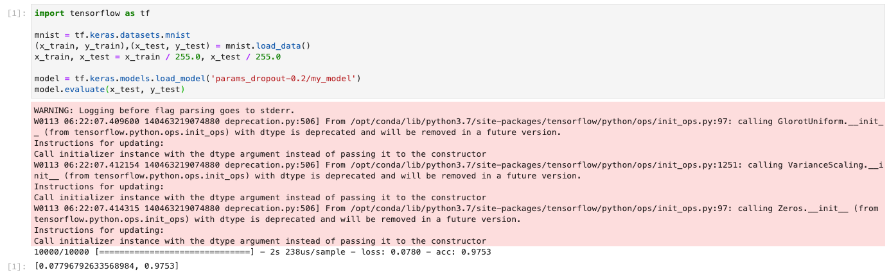

Select the JupyterHub icon upon logging in.

1. After you login to PrimeHub, please open `JupyterHub` in a new tab first.
2. Select an `instance type` with at least one virtual CPU and 2GB RAM.
3. Select an `image` with Tensorflow 1.14.
4. Start the notebook.

    

Example using our demo group

Follow the steps below to write code in `group volume`

1. Double click your group volume folder.
2. Click `Text File` in the right hand side under the 'Other' section.
3. Right click on the new `untitled.txt` and rename it into `train_mnist.py` 
4. Write code in the right hand side.

    ```
    import tensorflow as tf
    import argparse
    import shutil
    import os

    parser = argparse.ArgumentParser(description='Process some integers.')
    parser.add_argument('--dropout', type=float, default=0.2)
    args = parser.parse_args()

    mnist = tf.keras.datasets.mnist

    (x_train, y_train),(x_test, y_test) = mnist.load_data()
    x_train, x_test = x_train / 255.0, x_test / 255.0

    model = tf.keras.models.Sequential([
        tf.keras.layers.Flatten(input_shape=(28, 28)),
        tf.keras.layers.Dense(512, activation=tf.nn.relu),
        tf.keras.layers.Dropout(args.dropout),
        tf.keras.layers.Dense(10, activation=tf.nn.softmax)
    ])

    model.compile(optimizer='adam',
                    loss='sparse_categorical_crossentropy',
                    metrics=['accuracy'])

    model.fit(x_train, y_train, epochs=5)
    model.evaluate(x_test, y_test)

    export_path = "params_dropout-{}".format(args.dropout)
    if os.path.isdir(export_path):
        print('Cleaning up\n')
        shutil.rmtree(export_path)
    os.mkdir(export_path)

    model.save(os.path.join(export_path, 'my_model'))
    ```

This is the example code of training a MNIST classifier.

*Please note: we are saving a model file in a relative path.*

Congratulations! You have prepared everything you need to submit a job.

## Submit a Job


Select the Job Submission icon in a new tab to begin submitting a job


Select 'Create Job' in the top right corner on the Job Submission page

1. To submit a job, please open Job Submission in a new tab and create a job by clicking top right button.
2. Select your group, instance type and image on the left panel; ensure that these are the identical to the ones you are using in JupyterLab.
3. In the right panel, name the job `training mnist` in Job Name input field, or another name that prefer. 
4. Since our code is under group volume and will be mounted in `/project/<group name>`, type the following into the Command input field: 

    cd /project/<group name>/
    python -u train_mnist.py --dropout 0.2

### Some notes for the Command input field:

- You need to `cd` into `group volume` first. Because we save model in a relative path.
- `<group name>` is **case sensitive**.
- You may notice there is a `-u` in python command. In Job Submission, Python will buffer the log by default. Adding `-u` tells Python not to buffer the log so that we can see the log in real time.
- `--dropout` is a parameter which we specified in our code.
- Job Submission will execute command column as a shell script. Therefore, you can write multiple line just like you are writing a shell script.
- If you hover your mouse over the question mark next to `Command`, you can see more hints.

#### Jobs list page and refresh button


After submitting a job, the job will appear in the Jobs list in a `Pending` state. Click the Refresh button in the top right corner to get the latest status of your jobs. 

#### Logs tab


To view the Job's log, select the Job name and then click the `Logs` tab to see that the job is running. Wait for the job to finish running. While waiting, you don't need to wait in the Job Submission page - you can write code and continue to do analyses while the job is running!

When the job is complete, it will output a model file `mymodel` into JupyterLab.

## Test Outputted Model in JupyterLab

It's time to verify if our job really train a MNIST classifier.

#### Outputted model file located in JuypterLab


In your JupyterLab tab, you can find the outputted model file `params_dropout-0.2/my_model` in `group volume`.

If the file does not exist, please check to see if your job succeeded. If the job failed, select the job name to check the log for any error messages. Then try to fix errors and submit again.

Follow the steps below to test the MNIST classifier:

1. Ensure that you are in `group volume`
2. Click `Python 3` on the right hand side under the 'Notebook' section
3. Write code in your newly created Jupyter notebook on the right hand side: 

    

    **Example Code**
    ```
        import tensorflow as tf
        
        mnist = tf.keras.datasets.mnist
        (x_train, y_train),(x_test, y_test) = mnist.load_data()
        x_train, x_test = x_train / 255.0, x_test / 255.0
        
        model = tf.keras.models.load_model('params_dropout-0.2/my_model')
        model.evaluate(x_test, y_test)
    ```

4. Press `shift + enter` to execute your code.

    

Example code from testing a MNIST classifier. Warning messages (highlighted in red above) can be ignored since the model's accuracy is ~0.98.

Hooray! You have trained a MNIST classifier through the Job Submission feature!

You may have noticed that we used a notebook during testing, and a Python file in training. We suggest that you write experimental code in the notebook. Once you confirm that the code works, you can convert it to a regular Python file and fully utilize the power of Job Submission. From now on, you can submit many jobs with differing drop rates and check the results.
