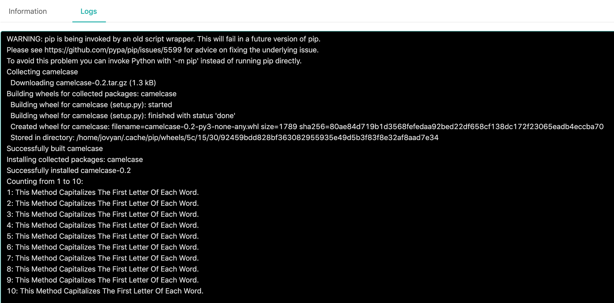

<div class="ee-only tooltip">Enterprise
  <span class="tooltiptext">Applicable to Enterprise tier only</span>
</div>

By leveraging Job Submission, users can run jobs (such as a time-consuming ML training) in the background while doing other analyses in JupyterLab at the same time.

In this tutorial, we are going to demonstrate the usage of a job submission with a simple example.

## Prerequisite

### Group Volume

To fully utilize all Job Submission functions, there must be a `group volume` in your group. If you do not have one, please ask your administrator to create one for you.

Jobs cannot access `user volume` and a job's working directory is also a temporary directory. Therefore, the easiest way to persist your outputs is to output them into `group volume`. Also, the easiest way to use the code written in JupyterLab is to put your code in `group volume`.

The rest of this tutorial assumes that you have `group volume`.


Ask your administrator to switch on shared volume in Groups tab under the Admin page 

### Image and Instance Type

This tutorial uses minor computing resources (CPU: 0.5 / Memory: 1G / GPU: 0) and jupyter/base-notebook.

Please make sure you have this kind of `image` and `instance type`. If not, please also submit a request to your administrator to create these for you in the Admin page.

### Group Quota and User Quota

For this tutorial, the necessary total quota is two virtual CPU and 4GB RAM. Please ensure that you have enough quota or contact your administrator.

## Tutorial Steps

We are going to run this code below as a job, in order to run the code successfully, the python package `camelcase` is necessary; `camelcase` is a tool which provides a method *capitalizes the first letter of each word.*. By using it, this code will output capitalized `This Method Capitalizes The First Letter Of Each Word.` every 1s 10 times in total.

```
import time
import camelcase

camel = camelcase.CamelCase()

txt = "this method capitalizes the first letter of each word."


start = 1
end = 10

print("Counting from 1 to 10:")
for num in range(start, end + 1): 
    time.sleep(1)
    print('{}: {}'.format(num, camel.hump(txt)))
```

1. Login `PrimeHub` and select `Notebook`.

2. Select an `instance type` and an `image` for launching a Notebook.

3. Double click your group volume folder for entering it.

4. Click `Text File` in the right hand side under the 'Other' section.

5. Right click on the new `untitled.txt` and rename it into `interval.py`.

6. Input the code above and save.

We have created a python file for our coming job. We can shutdown the Notebook or leave it. Next we are going to run it as a job.

### Submit a Job

Confirm if the current group is what you desire; switch the group by the `Group:` dropdown at the top of the right side.

1. Open `Jobs` from portal and and create a job.

2. Select your instance type and image on the left panel; ensure that these are the identical to the ones you are using in JupyterLab.

3. In the right panel, name the job `counting` in Job Name input field, or another name that prefer.
   
4. Since our code is under group volume and will be mounted in `/home/jovyan/<group name> -> /project/<group name>`, type the following into the Command input field; replace `<group name>`. 

    `<group name>` is **case sensitive**; [REF] [Directories/Paths](job-submission-feature#directories-paths-the-job-can-access-if-directories-exits).

    We use `camelcase` package in the code, it has to be installed first before code execution.

    ```
    pip install camelcase
    cd /project/<group name>/
    python -u interval.py
    ```

### Some notes for the Command input field:

   - You need to `cd` into `<group name>` first. Because we save model in a relative path.
   - `<group name>` is **case sensitive**;
   - You may notice there is a `-u` in python command. In Job Submission, Python will buffer the log by default. Adding `-u` tells Python not to buffer the log so that we can see the log in real time.
   - Job Submission will execute command column as a shell script. Therefore, you can write multiple line just like you are writing a shell script.
   - If you hover your mouse over the question mark next to `Command`, you can see more hints.

5. Submit the job, then status of job is changed from pending to running.

### Jobs List and Refresh Button

Once a jub is submitted, the intial status is `Pending`. Clicking the `Refresh` button to update the status.
   
### Logs Tab

Once the job succeeded, we should see the similar log, and we can tell the job installed python package `camelcase` first, then entering the group volume and run `interval.py`.
   
   


Congratulations, we have submitted a code as a job and run it successfully and we learnt how to interact files in group volume from a command field of a job. 


## More About

[Job Submission Feature](job-submission-feature)
