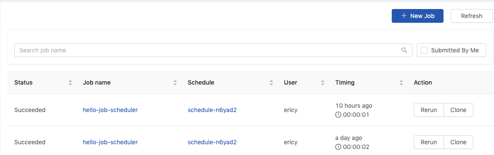
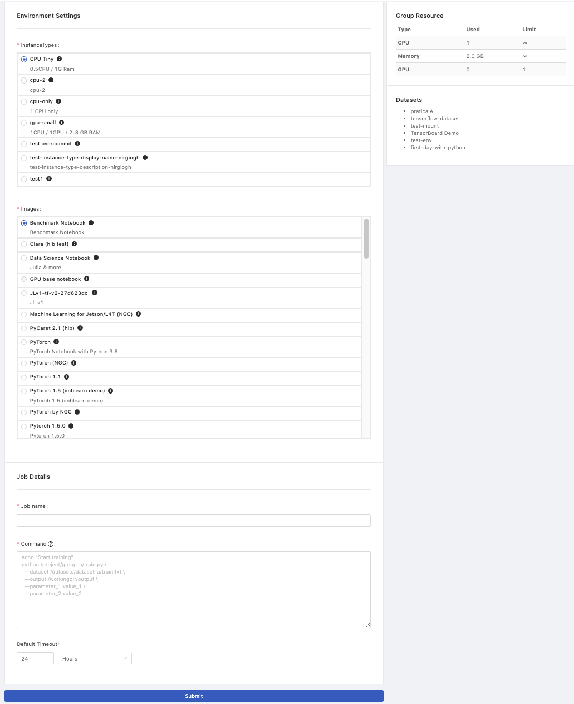
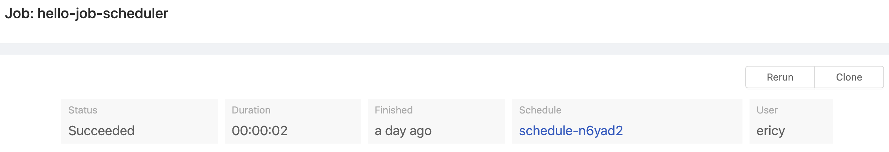
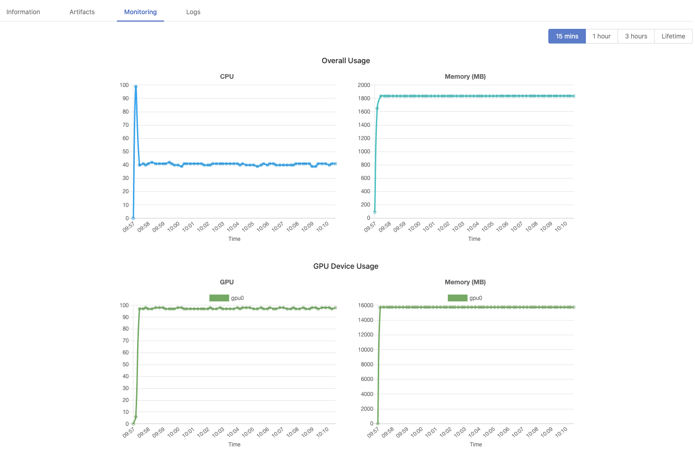

<div class="ee-only tooltip">Enterprise
  <span class="tooltiptext">Applicable to Enterprise tier only</span>
</div>

## Job

We sometimes have time-consuming tasks which have to be run sequentially, because tasks take considerable time to complete, users are not able to engage with the whole of the progress. In this case, we can use **Job Submission** to create a job of sequential multiple tasks and submit the job for execution at background, meanwhile we can monitor the progress from the log. If we want to create routine jobs that we can achieve it by [**Job Scheduler**](job-scheduling-feature).

### Lifetime

+ A running job can run for **24 hours** and it will be failed if the job doesn't finish within 24 hours.

+ Basically, An ended job log is saved for **7 days**. Once expired, The job still remain in the list without logs since the logs is wiped out. Furthermore, a job (succeeded, failed, cancelled), by default, are only ketp for **30 days**.
  >***NOTE: According to the container runtime, the job container is possibly recycled within 7 days so that the logs doesn't exist anymore.***

## Jobs List

There is a list showing created jobs within the current group with relevant information; switch the group by the `Group:` dropdown at the top of the right side.



There are several informative columns of the job list:

|Column|Description|
|------|-----------|
|`Status`|The status of the job. `Pending`,`Preparing`, `Running`, `Failed`, `Succeeded`, `Cancelled` and `Unknown`.|
|`Job name`|The name of the job.|
|`Schedule`|The name of the job scheduler if the job is triggered by the scheduler, otherwise it shows `-`.|
|`User`|The owner who submits the job.|
|`Group`|The group where the job runs.|
|`Timing`|The duration of the running job.|
|`Action`|The action buttons, `Cancel`, `Rerun`, `Clone`.|

+ `New Job` button: Click the button to create the job.

+ `Refresh` button: Click the button to refresh the list.

+ `Job name` link: Click the name to enter the job detail page.

+ `Schedule` link: Click the name to enter the scheduler detail page if any.

+ `Submitted by Me` if checked off, it lists jobs **ONLY** submitted by the user.

+ `Search job name` search by the keywords.

## Create Job

Confirm if the current group is what you desire; switch the group by the `Group:` dropdown at the top of the right side.



+ `InstanceTypes`: Select a instance type which allocates resources for the job.

+ `Images`: Select an image which the job run bases on.

+ `Job name`: The name of the job.

+ `Command`: The sequential commands of the job context.

+ `Default Timeout`: `Minutes`/ `Hours` / `Days`; a running Job will be cancelled after the interval of time, the setting here will overwrite the setting from a Group.

### Command

Users are able to run `sudo apt <command>` in a Job.

such as

```
sudo apt update
sudo apt install <package> --assume-yes
pip install <package>
```

### Directories/paths the job can access if directories exits:

>**Notice**：The default working directory of a Job is under `/home/jovyan`; This is `/home/jovyan` inside Job Pod *rather than `/home/jovyan` inside JupyterHub Pod*, therefore, *files are located under `/home/jovyan` of JupyterHub **don't exist** here*! There are `<group volume>` and `<dataset>` only mounted here in Job Pod.

|Directory|Description|
|---------|-----------|
|`/home/jovyan`|A **temporary working directory** while jobs running. ***Note**: saving data here will be lost when jobs finished.*|
|`/home/jovyan/<group> -> /project/<group>`|Using this path (or Symbolic link) to access a group volume, load files and save output persistently. ***Note:** a group volume is required, please consult administrators.*|
|`/home/jovyan/datasets/<dataset> -> /datasets/<dataset>`|Using this path (or Symbolic link) to access a dataset volume, load datasets which connect to the group. ***Note:** a existing dataset volume is required, please consult administrators.*|

### Environmental variables:

|Env Variable|Description|
|------------|-----------|
|`$PRIMEHUB_USER`|Job's owner|
|`$PRIMEHUB_GROUP`|Job's group|

**Python command option**

`python -u` we can use `-u` to force stdin, stdout and stderr to be totally unbuffered, so we can see logs in real time.

**Example 1**: There is a file, `train_mint.py`, stored in group volume, `research`, then we can execute the python file as a job like below. Since the python file is executed under `/project/research`, the data output by the job is saved under the path relatively.

```bash
cd /project/research/
python -u train_minst.py
```

**Example 2**: If we execute the job like below, the output data will be saved under `/home/jovyan` which is a *temporary* directory while the job is running. In other words, data saved under `/home/jovyan` will be lost.

```bash
python -u /project/research/train_minst.py
```

`Submit`: Click the button to submit the job.

## View Job

Click the job name on the list to view the job information and logs. The job can also be `Rerun` or `Clone` into a new job.

### Panel

It shows the brief information of the job.



|Field|Description|
|-----|-----------|
|`Status`|The status of the job. `Preparing`, `Running`, `Failed`, `Succeeded`, `Cancelled` and `Unknown`.|
|`Duration`|The duration of the job running.|
|`Finished`|How much time ago the job finished.|
|`Schedule`|The name of the job scheduler if the job is triggered by the scheduler; clicking the name to enter the scheduler detail page.|
|`User`|The owner who submits the job.|

---

### Tabs


### Information

Here are the detail information of the job:

|Field|Description|
|-----|-----------|
|`Message`|Messages returned from job running.|
|`Job ID`|The unique id of the job.|
|`Job name`|The name of the job.|
|`Creation Time`|The time the job is created at.|
|`Start Time`|The time the job starts at.|
|`Finished Time`|The time the job finishes at.|
|`Group`|The group where the the job belongs to.|
|`Instance type`|The instance type which the job uses.|
|`Image`|The image which the job run based on.|
|`Command`|The context of the job.|

### Artifacts

If a Job generates data so called **artifacts** under the [PHFS storage](design/phfs) `artifacts/` during the execution, here it lists those artifacts. Meanwhile, in Notebook, these artifacts are stored under `/phfs/jobArtifacts/job-xxxxx`. See the [simple usage of Job Artifacts](job-artifacts-simple).

### Monitoring

> It shows the message "feature not enabled, please contact admin", if underlying prerequisite [phfs](design/phfs) is not enabled.

Monitoring indicates how much resources the Job use.

+ `15 mins`, `1 hour`, `3 hours`, `Lifetime`: Select the latest timespan of metrics; *15min* shows metrics of the latest 15mins only, *Lifetime* shows metrics from the beginning to the end. See [The interval of data sampling per timespan](design/job-monitoring#data-format).

  >View the average usage within these most recent time frames

+ `Overall Usage`: CPU and Memory(MB).
+ `GPU Device Usage`: GPU and Memory(MB) display *if GPU is allocated*.



### Logs

>Logs viewer lists latest 2000 lines only of logs; press `Download` for the complete log file.

When a job comes to success or failure, it logs the whole of job running progress. This is where we can check the progress, result or even shoot troubles if failed.

The log viewer here only list the latest 2000 lines of logs. Clicking `Scroll to Bottom` to check the last logs at the bottom or clicking `Download` to download a complete log file.

However, when a job comes to cancellation or timeout, **there is no log left** since the pod has been deleted.

