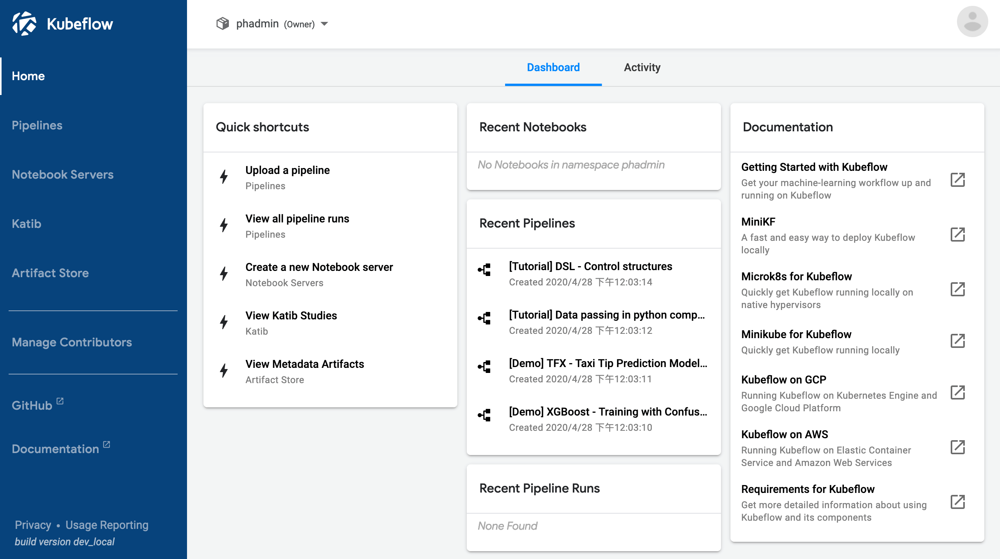

## Install Kubeflow


Kubeflow is a machine learning toolkit for Kubernetes. It provides a series of services like distributed trianinig, hyperparameter tuning and model serving for end-to-end model developing.

Here are the instructions to install Kubeflow together with Primehub in the cluster and use the account from Primehub to login and use Kubeflow

### Prepare your environment
For this document, we install kubeflow v1.0.2.
You can also refer to the [official website](https://www.kubeflow.org/docs/started/k8s/kfctl-istio-dex/) for the following content.

Download the kfctl binary for the Kubeflow CLI from the official website and set environment variables:

1. Download the kfctl v1.0.2 release from the [Kubeflow releases page](https://github.com/kubeflow/kfctl/releases/tag/v1.0.2).

2. Unpack the tar ball:

```sh
tar -xvf kfctl_<release tag>_<platform>.tar.gz
```

3. Create environment variables to make the deployment process easier

```sh
# Add kfctl to PATH, to make the kfctl binary easier to use.
# Use only alphanumeric characters or - in the directory name.
export PATH=$PATH:"<path-to-kfctl>"

# Set the following kfctl configuration file:
export CONFIG_URI="https://raw.githubusercontent.com/kubeflow/manifests/v1.0-branch/kfdef/kfctl_istio_dex.v1.0.2.yaml"

# Set KF_NAME to the name of your Kubeflow deployment. You also use this
# value as directory name when creating your configuration directory.
# For example, your deployment name can be 'my-kubeflow' or 'kf-test'.
export KF_NAME=<your choice of name for the Kubeflow deployment>

# Set the path to the base directory where you want to store one or more
# Kubeflow deployments. For example, /opt.
# Then set the Kubeflow application directory for this deployment.
export BASE_DIR=<path to a base directory>
export KF_DIR=${BASE_DIR}/${KF_NAME}

```

4. Download the config file

```sh
mkdir -p ${KF_DIR}
cd ${KF_DIR}

# Download the config file and change the default login credentials.
wget -O kfctl_istio_dex.yaml $CONFIG_URI
export CONFIG_FILE=${KF_DIR}/kfctl_istio_dex.yaml
```

### Configuration

#### Keycloak

1. Create a new client: `kubeflow`
2. Set the `Access Type` to: `confidential`
3. Add a `Valid Redirect URIs` for the client: `http://127.0.0.1:8080/login/oidc`
4. Copy the `Client Secret` in `Credential`
5. Make sure every user has email.

#### CONFIG_FILE

```sh
vim $CONFIG_FILE
```

and modeify the following part

```yaml=
- kustomizeConfig:
    overlays:
      - application
    parameters:
      - name: namespace
        value: istio-system
      - name: userid-header
        value: kubeflow-userid
      # Change the oidc_provider to keycloak
      - name: oidc_provider
        value: https://${KEYCLOAK_HOST}/auth/realms/primehub
      # Add the redirect uri which should be same as the setting in the keycloak
      - name: oidc_redirect_uri
        value: http://127.0.0.1:8080/login/oidc
      # Remove the following line
      # - name: oidc_auth_url
      #   value: /dex/auth
      # - name: skip_auth_uri
      #   value: /dex

      # Change the client_id to kubeflow
      - name: client_id
        value: kubeflow
      # Add client secret
      - name: application_secret
        value: d38bdc7e-ac28-43e0-b259-a6559cd1f106
    repoRef:
      name: manifests
      path: istio/oidc-authservice
  name: oidc-authservice
```

#### cert-manager

Since the cert-manager version used in kubeflow is not the same as in Primehub, we need to delete the existing cert-manager first or kubeflow installation will fail.

```sh
helm delete --purge cert-manager
```


### Deploy

```sh
kfctl apply -V -f ${CONFIG_FILE}
```

wait until the following message comes up

```
INFO[0193] Applied the configuration Successfully!
```

### Access Kubeflow

First, you need to expose the service

```sh
kubectl port-forward svc/istio-ingressgateway -n istio-system 8080:80
```

Open the website `127.0.0.1:8080`, it will go through the same login process as Primehub.



### Note

1. Currently, we only support using Primehub account to login Kubeflow.
2. The resources used in Kubeflow will not be counted and restricted by Primehub.
