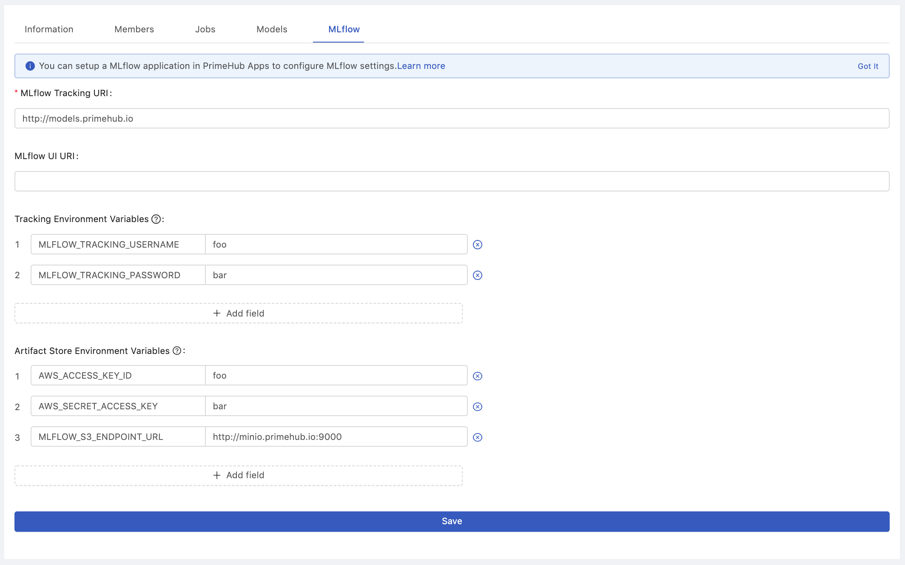

  
Enterprise
    Applicable to Enterprise Edition
  

  
Deploy
    Applicable to Deploy Edition
  

 

In order to use the Model Management feature, the Group Administrator has to set up a running installed **MLflow instance** and [Group Setting](group-setting#mlflow) has to be configured with related information.

The Group Administrator could configure MLflow either one of
* installed MLflow server by Apps
* integrate with the external MLflow server

## Configuration

In MLflow configuration page, there is a required field `MLflow Tracking URI` where the MLflow instance serves tracking clients. It will become the `MLFLOW_TRACKING_URI` environment variable in our system. You could use `MLFLOW_TRACKING_URI` in PHJob, Notebook and Deployments. 

However, you might see two groups of variables in the same page `Tracking Environment Variables` and `Artifact Store Environment Variables`, we will explain their usage later:

### Tracking Environment Variables

It is used to set the auth configuration to your tracking server.

* `MLFLOW_TRACKING_USERNAME` and `MLFLOW_TRACKING_PASSWORD` - username and password to use with HTTP Basic authentication. To use Basic authentication, you must set both environment variables.
* `MLFLOW_TRACKING_TOKEN` - token to use with HTTP Bearer authentication. Basic authentication takes precedence if set.

Please check [MLflow document](https://www.mlflow.org/docs/latest/tracking.html#logging-to-a-tracking-server) to find more information.

### Artifact Store Environment Variables

It is used to tell your client how to connect to the artifact storage. We take `S3-compatible storage` as an example:

* `AWS_ACCESS_KEY_ID` and `AWS_SECRET_ACCESS_KEY` are used by the s3 client
* `MLFLOW_S3_ENDPOINT_URL` is used to tell s3 client to connect your own S3-compatible storage rahter than the AWS S3 server

Please check [MLflow Artifact Storage](https://www.mlflow.org/docs/latest/tracking.html#amazon-s3-and-s3-compatible-storage) to find more information.

## MLflow instances

The easy way to set up a MLflow instance is to create a [MLflow instance](primehub-app-builtin-mlflow) from the PrimeHub App Template. In addition, it is possible to host your own MLflow instance outside PrimeHub. There are some key considerations when setting up a MLflow instance to make **Model Management** and **Deployment** working together, especially deploy a model from the `MLflow Model Registry`.

### Installed MLflow server by Apps

Requirements:

* Enable the **Group Volume** to save the artifacts
* create a Deployment in the same group

In the default settings, MLflow App Template uses the path `$(PRIMEHUB_APP_ROOT)/mlruns` as `DEFAULT_ARTIFACT_ROOT` to keep artifacts. When you deploy a model from `MLflow Model Registry` by modelUri `models:/<model-name>/<version-name>`, it will copy artifacts from `$(PRIMEHUB_APP_ROOT)/mlruns`. This is the reason why you should enable **Group Volume** and create a Deployment from the same group.

If you want to make the `installed MLflow server by Apps` sharing `MLflow Model Registry` to other groups, please configure proper [Artifact Stores](https://www.mlflow.org/docs/latest/tracking.html#artifact-stores). It is very common to use Amazon S3 and S3-compatible storage to save artifacts.

### Integrate with the external MLflow server

The only one consideration is to make sure `DEFAULT_ARTIFACT_ROOT` available to your MLflow client. Same as sharing `MLflow Model Registry` to other groups use case, it is a good idea to use Amazon S3 and S3-compatible storage.

