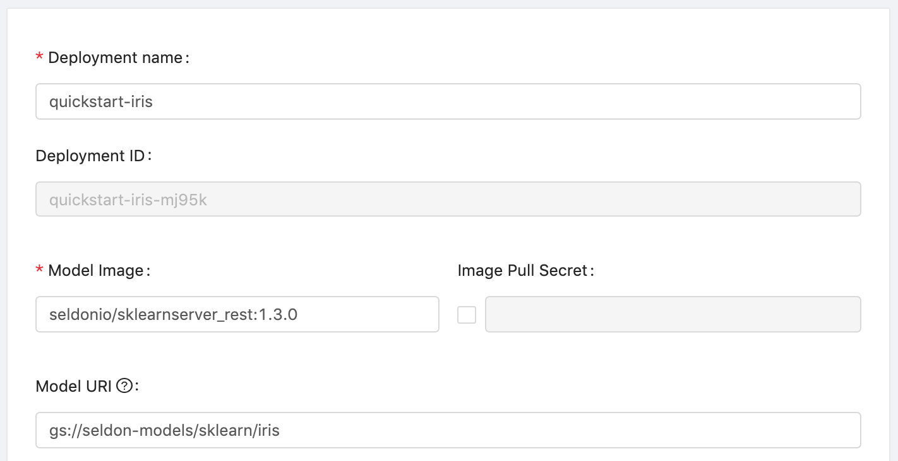

<div class="ee-only tooltip">Enterprise
  <span class="tooltiptext">Applicable to Enterprise tier only</span>
</div>

In this tutorial, we will show how to deploy a model by a pre-packaged server. We deploy a IRIS model by SKLearn pre-packaged server.

## Prerequisites

### Enable Model Deployment in Group Management

Remember to enable model deployment in your group, contact your admin if it is not enabled yet.


## Tutorial Steps

1. Go to [User Portal](quickstart/login-portal-user) and select `Models`.
2. Then we are in [model deployment list page](model-deployment-feature#list), now clicking on `Create Deployment` button.
3. Fill in the `Deployment name` field with `quickstart-iris`

   Fill in the `Model Image` field with `seldonio/sklearnserver_rest:1.3.0`; This image is a pre-packaged base image that can serve `scikit-learn` model.

   Fill in the `Model URI` field with `gs://seldon-models/sklearn/iris`; This path is included the trained model in the Google Cloud Storage.
   
   
4. In the `Resources`,
    - choose the instance type, here we use the one with configuration `(CPU: 0.5 / Memory: 1 G / GPU: 0)`
    - leave `Replicas` as default (1)
    
5. Click on `Deploy` button, then we will be redirected to model deployment list page. Wait for a while and click on `Refresh` button to check our model is deployed or not.
    
    
    

    When the deployment is deployed successfully, we can click on cell to check its detail.
    
    

6. We can view some detailed information in detail page, now let's test our deployed model! Copy the `endpoint URL` and replace the `${YOUR_ENDPOINT_URL}` in the following block.
    ```bash
    curl -X POST ${YOUR_ENDPOINT_URL} \
        -H 'Content-Type: application/json' \
        -d '{ "data": {"tensor": {"shape": [1, 4], "values": [5.3, 3.5, 1.4, 0.2]}} }'
    ```
    Then copy the entire block to the terminal for execution, and we are sending tensor as request data.

    - Example of request data
        ```bash
        curl -X POST https://hub.xxx.aws.primehub.io/deployment/quickstart-iris-xxx/api/v1.0/predictions \
            -H 'Content-Type: application/json' \
            -d '{ "data": {"tensor": {"shape": [1, 4], "values": [5.3, 3.5, 1.4, 0.2]}} }'
        ```
    - Example of response data (it predicts the species is `Iris setosa` as the first index has the highest prediction value)
        ```bash
        {
          "data": {
            "names": [
              "t:0",
              "t:1",
              "t:2"
            ],
            "tensor": {
              "shape": [
                1,
                3
              ],
              "values": [
                0.8700986370655746,
                0.12989376988727133,
                7.5930471540348975e-06
              ]
            }
          },
          "meta": {}
        }
        ```
7. Congratulations! We have deployed a model as an endpoint service that can respond requests anytime from everywhere.

## Reference

- For the completed model deployment feature introduction, see [Model Deployment (Alpha)](model-deployment-feature).
- For the pre-packaged base image list that provided by InfuseAI, see [Model server images list](will-do-in-ch13864).
- For the customized pre-packaged server instruction, see [Pre-packaged servers](model-deployment-prepackaged-server-intro).
