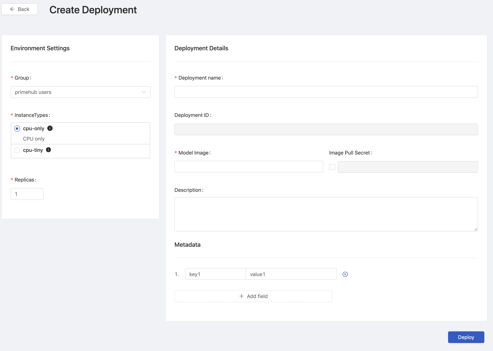
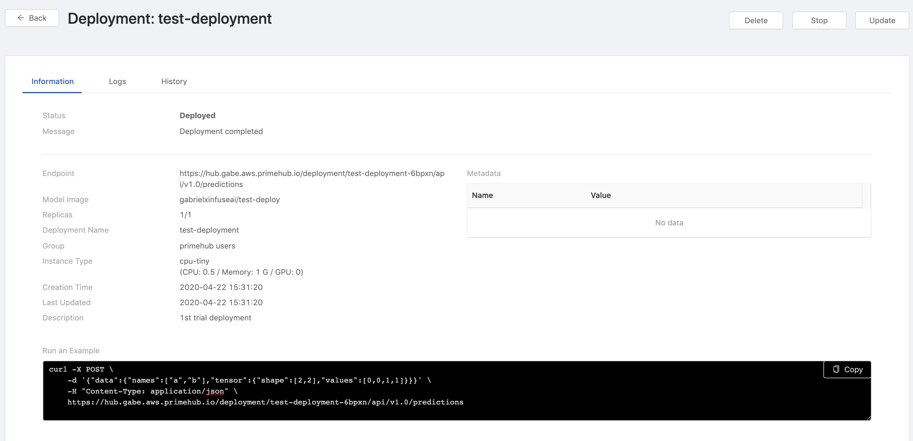
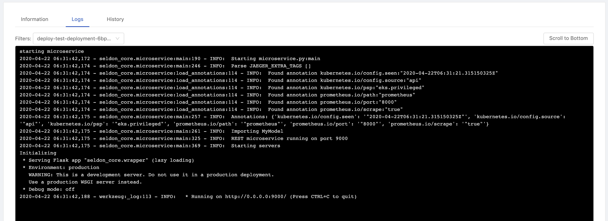
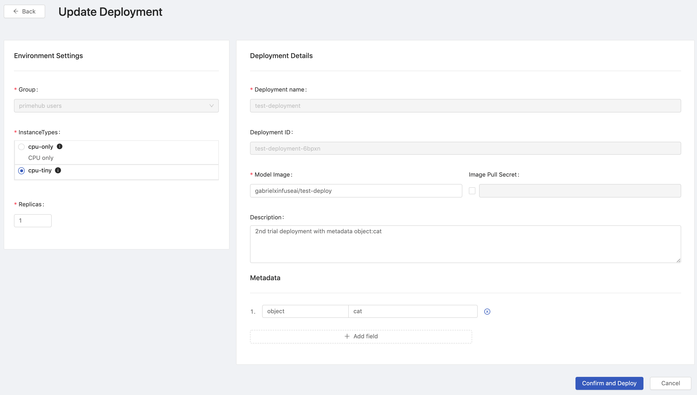

Model Deployment feature that users are allowed to manage model deployment endpoints within Group Management with CRUD operations. If the feature is enabled within a group, end-users of the group are allowed to deploy models obeying the restriction of the group quota. While a deployed model serves, administrators are able to monitor the status of model service such service health and resources usage information; moreover, end-users are able to check deployment history and log.

## Enable Model Deployment in Group Management

## List

This page indicates all of deployed services status.

|Status   |Color|
|---------|-----|
|Deployed |Green |
|Failed   |Red   |
|Deploying|Yellow|
|Stopped  |Grey  |

### Cell

Each cell represents a deployment. Clicking `View` link on a cell to view the detail.

|Info        |Description|
|------------|-----------|
|Title       | Deployment name|
|Group       | Deployment's owner group.|
|Endpoint    | Where the model is deployed and serve.|
|Metadata    | View the detail of model deployment.|
|Last Updated| Last updated time.|

**Tips**: Cursor hovering over endpoint links show entire links and clicking links make a copy to the clipboard.

+ `Create Deployment` button: Clicking for a deployment creation.

+ `Refresh` button: Clicking to retrieve the latest statuses of deployments.
  
## Create

### Environment Settings

+ `Group`: Select a group where the the job belongs to.

+ `InstanceTypes`: Select a instance type which allocates resources for the job.

+ `Replicas`: How many replicas for the service.

### Deployment Details

+ `Deployment Name`: The name of the deployment.

+ `Deployment ID`: An unique ID.

+ `Model Image`: The image which the model is based on.

+ `Image Pull Secret`: a pull secret for the model image if required.

+ `Descriptions`: User input description.

### Metadata

We can add key-value pairs.

+ `Name`: The name of key.
+ `Value`: The value.

Click `Deploy` button to start the deployment.

Click `Here` on the pop-up to view the deployment detail page.

## Deployment Detail

### Information

|Info           |Description|
|---------------|-----------|
|Status         |The status of the deployment.|
|Message        |The message related to the deployment if any.|
|Endpoint       |Where the model is deployed and serve.|
|Model Image    |The image which the model is based on.|
|Replicas       |The replicas of the deployment.|
|Deployment Name|The name of the deployment.|
|Group          |The owner group.|
|Instance Type  |The resources allocation which is requested for the deployment.|
|Creation Time  |Timestamps|
|Last Updated    |Timestamps|
|Description    |The description which users input during the creation. |
|Run an Example |Using `Curl` to query the service.|

### Logs

+ `Filters`: Select replica.

In Logs tab, the logs of current deployment are displayed here.

### History

In History tab, we can view historical deployments.

| Info   | Description     |
|---------------|----------|
| Description   | User input description |
| User          | Owner |
| Timestamp     | Creation time|
| Detail        | View the detail of the versioned deployment |

---

## Update

On a deployment detail page, clicking `Update` button to enter the deployment editing.
There are `Instance Type`, `Replicas`, `Model Image`, `Image Pull Secret`, `Description` and `Metadata` allowed to be modified once a deployment is created.

---

## Delete

On a deployment detail page, clicking `Delete` button for the deployment deletion.

---

## Stop

On a deployment detail page, clicking `Stop` button to stop the current deployed service.

---

## Monitor

Via Grafana, we are able to monitor metrics of **deployment**, **model** and **model version**.

Metrics:

+ global request rate (total)

+ request rate (based on the above choice)

+ request rate (different components in the graph)

+ reward:

    + The reward is interpreted as the proportion of successes in the batch of data samples. Thus this implementation inherently assumes binary rewards for each sample in the batch. The helper function *n_success_failures* calculates the number of successes and failures given the batch of data samples and the reward.

    + see: [https://github.com/SeldonIO/seldon-core/blob/master/components/routers/epsilon-greedy/README.md](https://github.com/SeldonIO/seldon-core/blob/master/components/routers/epsilon-greedy/README.md)

+ latency

### Deployment/Service Health

### Resource Usage Metrics

1. rps
2. qps
3. gpu
4. mem
