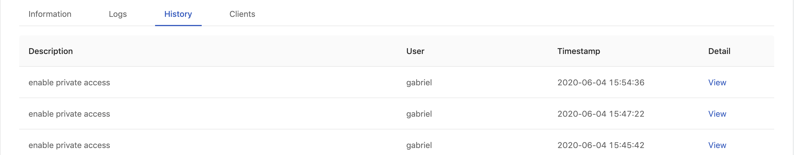

Enterprise
  Available in Enterprise tier only

>Please be noticed! This document is still **Working-in-Progress**!

Model Deployment feature that users are allowed to manage model deployment endpoints within Group Management with CRUD operations. If the feature is enabled within a group, end-users of the group are allowed to deploy models obeying the restriction of the group quota. While a deployed model serves, administrators are able to monitor the status of model service such service health and resources usage information; moreover, end-users are able to check deployment history and log.

## Enable Model Deployment in Group Management

First, we have to turn on **Model Deployment** in groups.

## List

This page indicates all of deployed services status.

|**Status** |Deployed |Failed|Deploying|Stopped|
|---------|--------|------|---------|-------|

### Cell

Each cell represents a deployment. Clicking on a cell to view the detail.

#### *Tips*

+ *Hovering the cursor over Metadata `View` of a cell, it lists the metadata view.*

+ *Hovering the cursor over Endpoint `Link` shows the entire link and clicking the link makes a copy to the clipboard.*

|Info        |Description|
|------------|-----------|
|Title       | Deployment name|
|Group       | Deployment's owner group.|
|Endpoint    | Where the model is deployed and serve.|
|Metadata    | Hovering over `View` to display the metadata info |
|Last Updated| Last updated time.|

+ `Create Deployment` button: Clicking for a deployment creation.

+ `Refresh` button: Clicking to retrieve the latest statuses of deployments.
  
## Create

### Environment Settings

+ `Group`: Select a group where the the job belongs to; if it shows *"No group is configured for you to launch a server. Please contact admin."*, contact administrators to enable this features for groups.

+ `InstanceTypes`: Select a instance type which allocates resources for the job.

+ `Replicas`: How many replicas for the service.

### Endpoint

+ `Private Access`: The toggle of private access of the endpoint; if enabled, there is `Clients` tab appearing in detail page. 

### Deployment Details

+ `Deployment Name`: The name of the deployment.

+ `Deployment ID`: An unique ID.

+ `Model Image`: The image which the model is based on.

+ `Image Pull Secret`: a pull secret for the model image if required.

+ `Descriptions`: User input description.

### Metadata

We can add key-value pairs.

+ `Name`: The name of key.
+ `Value`: The value.

Click `Deploy` button to start the deployment.

One the deployment is triggered, there is a notification popping up, we can click on it to view the deployment detail.

## Deployment Detail

### Information

|Info           |Description|
|---------------|-----------|
|Status         |The status of the deployment.|
|Message        |The message related to the deployment if any.|
|Endpoint       |Where the model is deployed and serve.|
|Access Type    | Public or Private |
|Model Image    |The image which the model is based on.|
|Replicas       |The replicas of the deployment.|
|Deployment Name|The name of the deployment.|
|Group          |The owner group.|
|Instance Type  |The resources allocation which is requested for the deployment.|
|Creation Time  |Timestamps|
|Last Updated   |Timestamps|
|Description    |The description which users input during the creation. |
|Run an Example |Verifying the service by using `curl` querying the service; it is varied with `Public` or `Private` access.|

### Logs

+ `Replicas`: Select a replica.

In Logs tab, the logs of current deployment are displayed here.

Clicking `Scroll to Bottom` button skips to the bottom of logs.

>It displays only logs of **latest 2000 lines**; clicking the `Download` button to download the whole log file.

### History

In History tab, we can view the detail of historical deployments.

Clicking on the `View` link for the detail of each deployment.

| Info   | Description     |
|---------------|----------|
| User          | Who triggered this deployment|
| Deployment Stopped | *true* or *false*|
| Model Image   | The model image url|
| Replicas      | The amount of replicas|
| Group         | The deployment's owner group|
| Instance Type | The instance type is selected|
| Timestamp     | Last updated time|
| Description   | User input description |
| Metadata      | Metadata mappings table|

### Clients

This tab appears if `Private Access` of the endpoint is enabled.

Filling in `Client Name` and clicking `Add client` to generate a `Client Token`.

The token is mandatory for accessing a private endpoint, we can bring it as `-u <client-name>:<client-token>` in a curl command.

>Client Token displays once only for a short while, please save it. If lost, deleting the record and generate it again.

---

## Update

On a deployment detail page, clicking `Update` button to enter the deployment editing.

There are `Instance Type`, `Replicas`, `Model Image`, `Image Pull Secret`, `Description` and `Metadata` allowed to be modified in a update once the initial deployment is created.

---

## Delete

Clicking on the cell of the deployment which we want to delete.

On a deployment detail page, clicking `Delete` button at top-right for the deployment deletion.

---

## Stop

Clicking on the cell of the deployment which we want to stop.

On a deployment detail page, clicking `Stop` button at top-right to stop the current deployed service.

---

## Monitor

PrimeHub provides a monitoring dashboard based on **Seldon Core Analytics** on Grafana, we are able to monitor metrics of **deployment**/**model**/**model version**.

1. Accessing the Grafana from the user portal

2. Selecting `PrimeHub / Model Deployments` dashboard, it lists deployment which are providing services.

    

3. Selecting a deployment and monitoring metrics on the board.

    

Default Metrics:

+ QPS (Queries Per Second)

+ Success rate

+ 4xx, error if any

+ 5xx, error is any

+ Predict QPS

+ Reward

  >The reward is interpreted as the proportion of successes in the batch of data samples. Thus this implementation inherently assumes binary rewards for each sample in the batch. The helper function *n_success_failures* calculates the number of successes and failures given the batch of data samples and the reward. -[Reference](https://github.com/SeldonIO/seldon-core/blob/master/components/routers/epsilon-greedy/README.md).

+ Latency

The board is based on **Seldon Core Analytics**, it can be advanced customized. Please see the [document](https://docs.seldon.io/projects/seldon-core/en/v0.3.0/analytics/analytics.html) and [code](https://github.com/SeldonIO/seldon-core/tree/master/helm-charts/seldon-core-analytics).
