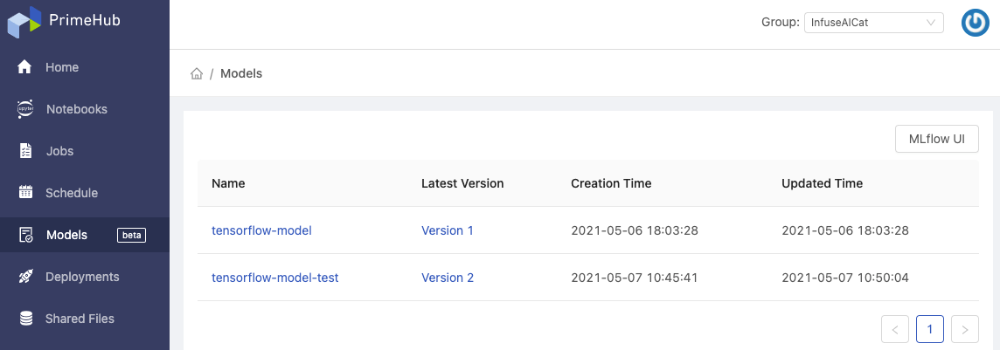
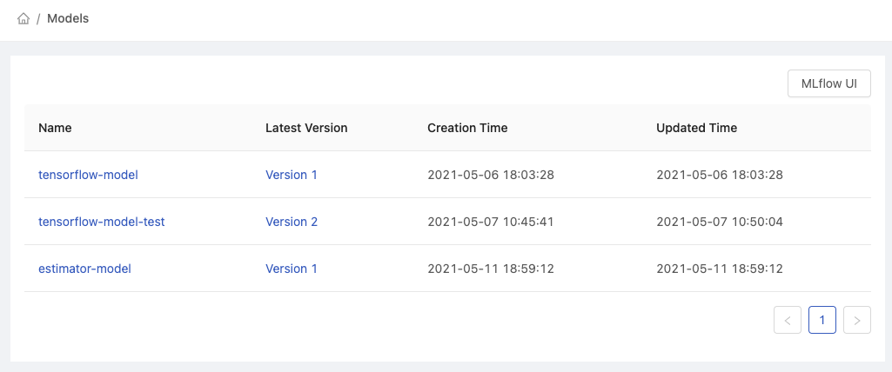
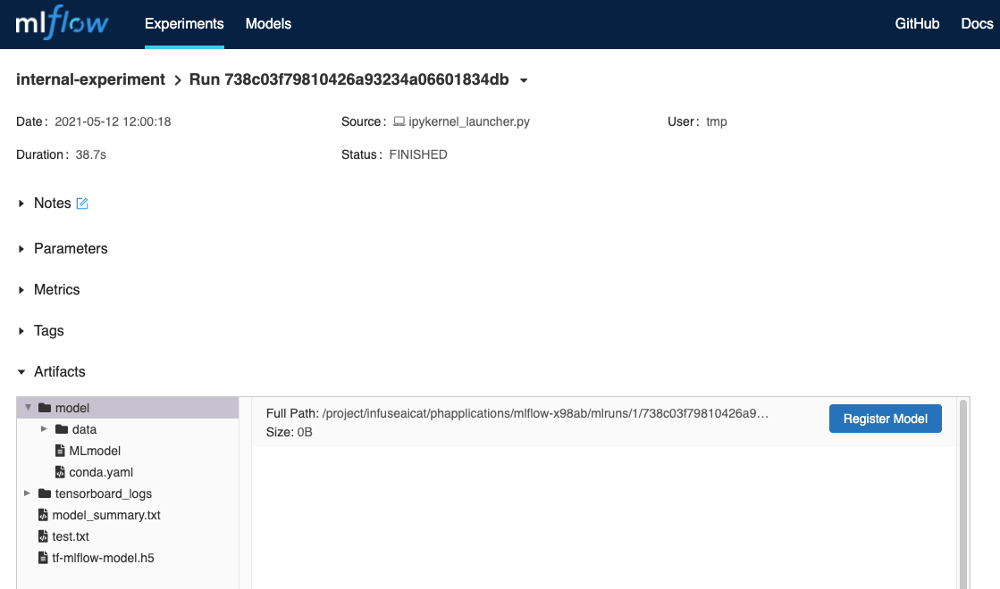
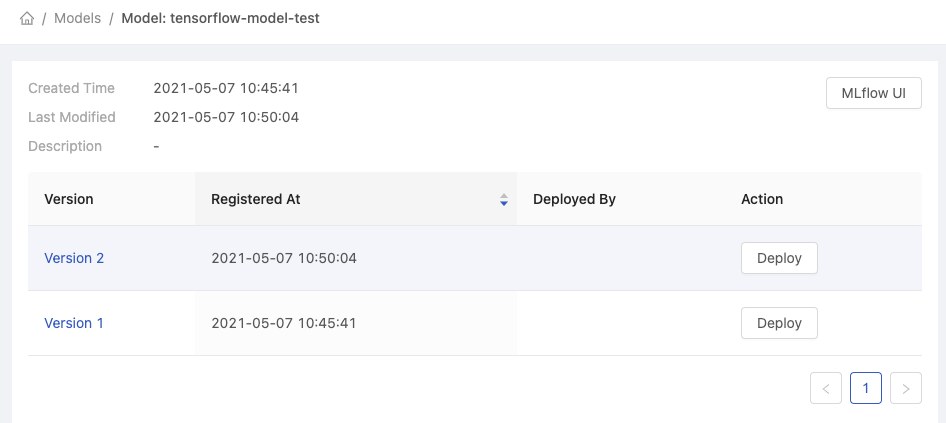
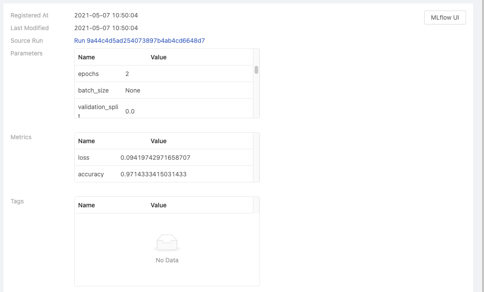
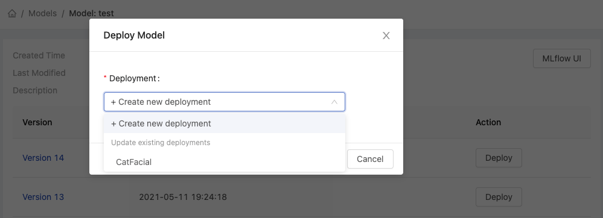

  
Enterprise
    Applicable to Enterprise Edition
  

  
Deploy
    Applicable to Deploy Edition
  

 

Data scientists requires to repeat training models with various combinations of dataset, feature, parameters etc., and conducting experiments on models, furthermore, to register/to version models which have decent performance according to results. Nowadays, this is one part of MLOps. 

Regarding managing versioned models, PrimeHub ,by integrating well-known *MLflow*, provides models management feature, **Models** that scientists can examine the performance of versioned/registered models and deploy a selected model directly as a service by **Deployments** on PrimeHub.

> A running installed MLflow instance is required.

## Models

The page displays registered models from binding MLflow.

+ See [Group Setting](group-setting#mlflow) for the information of binding MLflow instance.
+ See [Tutorial: Use MLflow Tracking](primehub-app-tutorial-mlflow#use-mlflow-tracking-in-primehub).

+ `MLflow UI` button: navigate to binding MLflow server in a new tab.

As long as an experimental model is registered on MLflow, it is listed in Models on PrimeHub as well.

### Versioned Model List

By clicking each model name, it navigates into the list of versioned models.

+ `Version`: Version number
+ `Registered At`: The registration date/time
+ `Deployed By`: The Deployment name if the model is deployed.
+ `Deploy` button: Deploying the selected versioned model.

### Versioned Model Detail

The page displays the information regarding this version.

+ `Registered At`
+ `Last Modified`
+ `Source Run`: linking to the run on MLflow
+ `Parameters`: if any
+ `Metrics`: if any
+ `Tags`: if any

## Deploy Versioned Model

In order to deploy a certain versioned model, click `Deploy` of a versioned model and select `+ Create new deployment` or update an existing deployment. It will navigate to [Deployment](model-deployment-feature) page, continue to submit the deployment with mandatory information.

