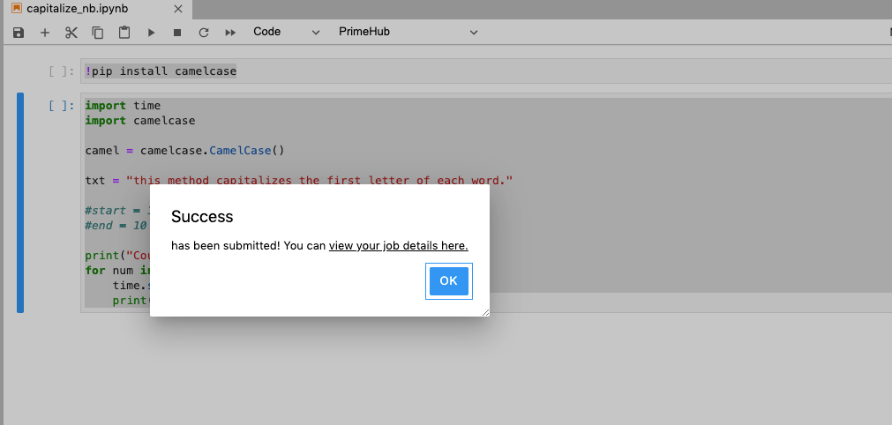
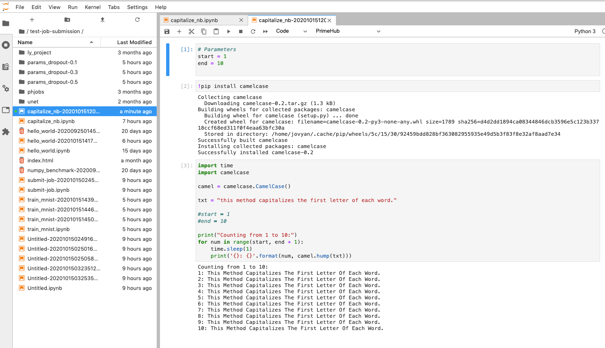
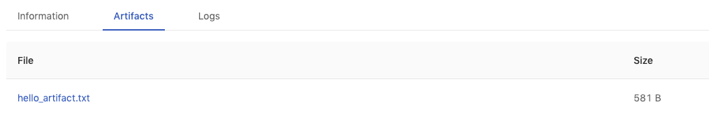

<div class="ee-only tooltip">Enterprise
  <span class="tooltiptext">Applicable to Enterprise tier only</span>
</div>

## Simple Usecase

>The working group's Group Volume is required.

1. Select **API Token** from the extension and add your own token. See [How to generate a API Token](tasks/api-token).
   
    

2. Launch Notebook instance from User Portal by using a base image from InfuseAI or a image built on top of a base image from InfuseAI.

3. Enter the Group Volume of the current working group, open a empty notebook file.
4. Add two cells.
   
   ```
   !pip install camelcase
   ```

    Here we comment out `start=1` & `end=10` because we will feed the parameters into notebook later.

    ```
    import time
    import camelcase

    camel = camelcase.CamelCase()

    txt = "this method capitalizes the first letter of each word."

    #start = 1
    #end = 10

    print("Counting from 1 to 10:")
    for num in range(start, end + 1):
        time.sleep(1)
        print('{}: {}'.format(num, camel.hump(txt)))
    ```


5. Select **Submit Notebook as Job** from the extension
   
    1.  Select Instance Type for the Job.
    2.  Select Image for the instance. (Use a base image from InfuseAI or a image built on top of a base image from InfuseAI)
    3.  Fill in **Job Name** you want.
    4.  Fill in **Notebook Parameters** `start=1; end=r10`.(using `;` as separator, *new lin*e is not allowed.)
    5.  Submit.

    

6. View the job status by clicking the link.

    

7. Once the job succeeded, go back to Notebook. There is a generated notebook file with the result beside the original notebook file. We can notice the parameter we gave is inserted as the first cell.
   
   


## Output Job Artifacts

Since a Notebook is submitted as a Job, the output data generated by the job can be stored as job artifacts. See [Job Artifact](job-artifact-feature).

Replace the 2nd cell with cells below.

Create the artifacts directory.

```bash
!mkdir -p artifacts/
```

This sample code will open a new file `hello_artifact.txt` under the `artifacts/` and write the output in.
```python
import time
import camelcase

camel = camelcase.CamelCase()

txt = "this method capitalizes the first letter of each word."

start = 1
end = 10

art = open("artifacts/hello_artifact.txt", "w")

print("Counting from 1 to 10:")
for num in range(start, end + 1): 
    time.sleep(1)
    print('{}: {}'.format(num, camel.hump(txt)))
    art.write('{}: {}\n'.format(num, camel.hump(txt)))
art.close()
```

Submit this Notebook as another job, once the job succeeded, `hello_artifact.txt` will be listed from Job.

   

We also can find it `/phfs/jobArtifacts/job-<ID>/hello_artifact.txt` from Notebook.
