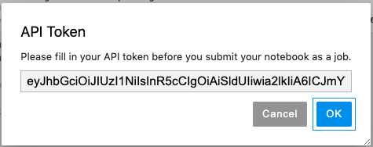

Enterprise
  Applicable to Enterprise tier only

**PrimeHub Extension** is an extension of *Jupyter Notebook* developed for PrimeHub. We plans to roll out more features to enhance user's ML workflow and experience from Notebook.

>The latest images provided by InfuseAI are built with **PrimeHub Extension** and the corresponding environment to execute extension features smoothly. To Use these features, please make sure the running image is the latest one or is built on top of the latest one from InfuseAI. See the [list](guide_manual/images-list).

> How to build own images including **PrimeHub Extensions**? See the [repo](https://github.com/InfuseAI/primehub-job/tree/master/jupyterlab_primehub).

After opening a Notebook file (*.ipynb), there is **PrimeHub** extension on the menu bar of the Notebook. This document explains these extension features briefly.

## Submit Notebook as a Job

>The working group's Group Volume is required.

Users are able to submit a Notebook file as a executable Job run by PrimeHub Job, then it outputs the result as a Notebook file for the review. See the [simple usecase](notebook-as-job).

## API Token

To use these extension features, a API Token of a user is required. See [How to generate a API Token](tasks/api-token).

