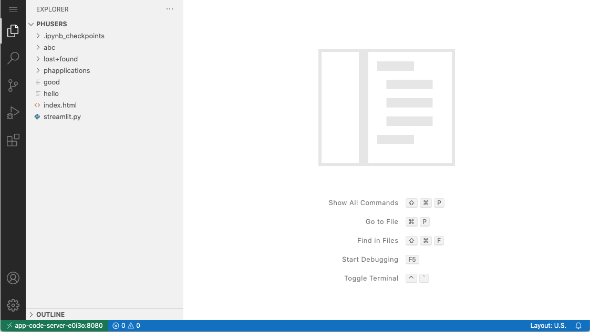

  
Enterprise
    Applicable to Enterprise Edition
  

  
Community
    Applicable to Community Edition
  

## Introduction

Run VS Code on any machine anywhere and access it in the browser.

Property    | Description
------------|------
App Image | [`codercom/code-server`](https://hub.docker.com/r/codercom/code-server)
Official Website  | https://github.com/cdr/code-server

## Screenshots

## Usage

1. Create a code server app and open it
1. In the code server, open the menu at the upper-left corner
1. Click *File > Open* to open a folder
1. Select `/project/<group-name>/path/to/your/folder`, and click `OK`
1. Happy coding ;)

## Troubleshooting

If you show a blank page when opening the code server app, please check if there is a code server opened in another browser tab. If yes, please close the tab and reload again.

