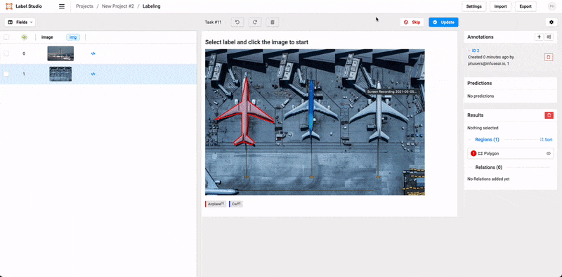

  
Enterprise
    Applicable to Enterprise Edition
  

  
Community
    Applicable to Community Edition
  

## Introduction

Label Studio is an open source data labeling tool for labeling and exploring multiple types of data.

Property    | Description
------------|------
App Image | [`heartexlabs/label-studio`](https://hub.docker.com/r/heartexlabs/label-studio)
Official Website  | https://github.com/heartexlabs/label-studio

## Screenshots

## Usage

1. Create a label studio app
2. There are five predefined environment variables
3. The default username is `$(PRIMEHUB_GROUP)@infuseai.io`
4. The default password is `$(PRIMEHUB_GROUP)_password!`
5. The default value of data root directory `$(PRIMEHUB_APP_ROOT)/label-studio-data` is the folder under the group volume
6. Local file serving is enabled in default
7. Singup wihout link is disabled in default
8. Happy labeling ;)

