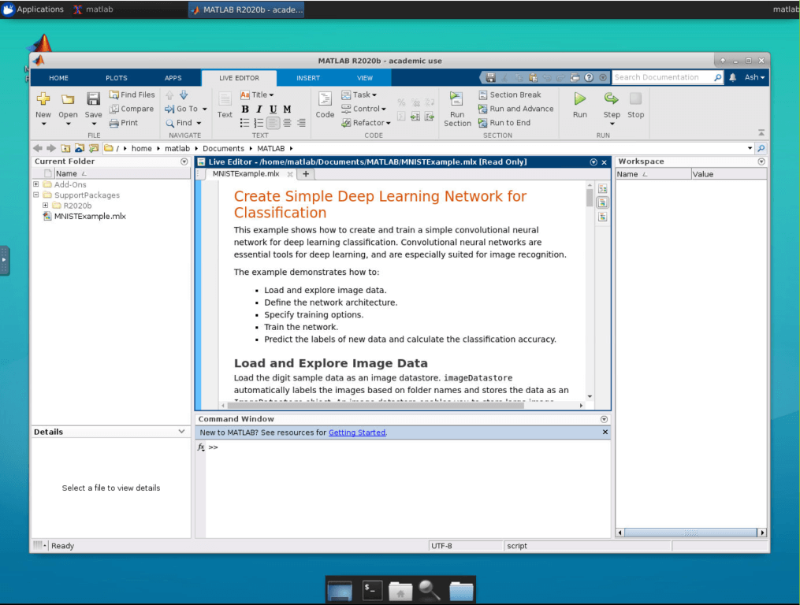

  
Enterprise
    Applicable to Enterprise Edition
  

  
Community
    Applicable to Community Edition
  

## Introduction

MATLAB is a programming and numeric computing platform used by millions of engineers and scientists to analyze data, develop algorithms, and create models.

Property    | Description
------------|------
App Image | [`nvcr.io/partners/matlab`](https://ngc.nvidia.com/catalog/containers/partners:matlab)
Official Website  | https://www.mathworks.com/products/matlab.html

## Screenshots

## Usage

1. Create a MATLAB app
1. After created, you can visit MATLAB app Web UI and enter your MathWorks account credentials to use MATLAB
