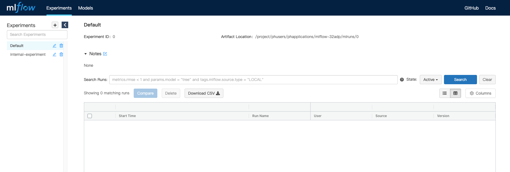

  
Enterprise
    Applicable to Enterprise Edition
  

  
Community
    Applicable to Community Edition
  

## Introduction

MLflow is an open source platform to manage the ML lifecycle, including experimentation, reproducibility, deployment, and a central model registry.

Property    | Description
------------|------
App Image | [`larribas/mlflow`](https://hub.docker.com/r/larribas/mlflow)
Official Website  | https://mlflow.org/

## Screenshots

## Usage

1. Create a MLflow app
1. There are two predefined environment variables
1. The default value of backend store uri `sqlite:///$(PRIMEHUB_APP_ROOT)/mlflow.db` is the sqlite db under the group volume
1. The default value of artifact root `$(PRIMEHUB_APP_ROOT)/mlruns` is the folder under the group volume
1. You can change these environment variables to use your own settings if you want
1. After created, MLflow is ready to manage your ML lifecycle
