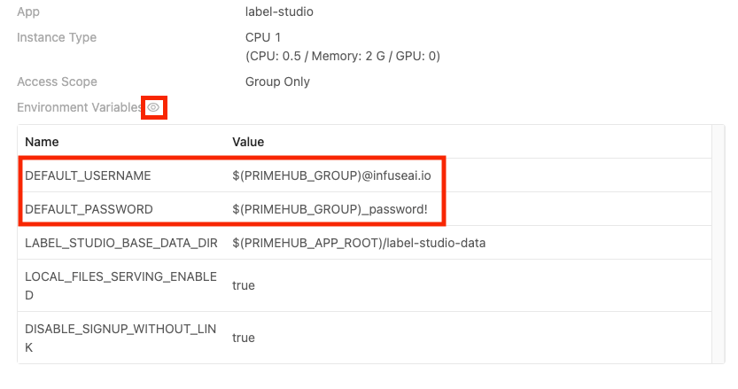
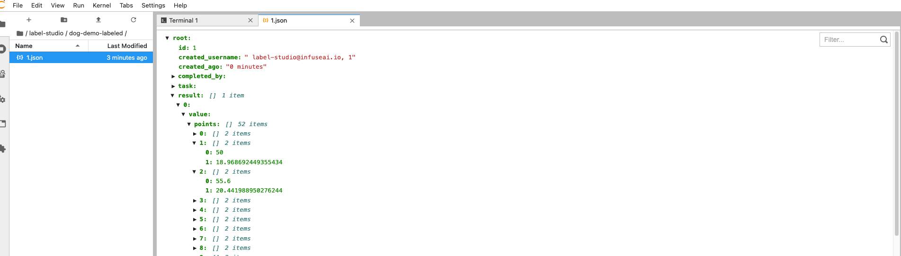

  
Enterprise
    Applicable to Enterprise Edition
  

  
Community
    Applicable to Community Edition
  

 

This tutorial covers the basic flow to help you get started with Label Studio in PrimeHub.

## Install Label Studio
First, you need to install it in the `Apps` tab. Please check the [Overview](primehub-app) section to learn how to install an App. 

In the installing process, you can change the environment variables.

`DEFAULT_USERNAME` and `DEFAULT_PASSWORD` are the login account information. You can change them and use them to log into Label Studio after installed.

If you don't know the meaning of other environment variables, you can use the default values or check the [Label Studio Official Doc](https://github.com/heartexlabs/label-studio/blob/master/docs/source/guide/start.md) or the tooltip beside the environment variable for more details.

## Label Studio UI
PrimeHub shows the app's state in the `Apps` tab. You can open the Label Studio UI by clicking `Open` after the state becomes `Ready`.

It will open a new window and show the Label Studio UI. You can find your login information by clicking `Manage` in the `Apps` tab and then clicking the eyes icon. The `$(PRIMEHUB_GROUP)` is the group name.

## Label Dataset
### What we need?

- The [dataset](guide_manual/admin-dataset) in PrimeHub you want to label (we use `/datasets/dog-demo` in this tutorial)
- The directory in group volume that you want to save the labeled results (we use `/project/<group_name>/dog-demo-labeled` in the tutorial)

>Please have the dataset, group volume, or request administrators for assistance before we start.

### Steps

1. After login, please click `Create` button.

    

2. Enter your `Project Name`. Skip the `Data Import` step. And choose the `Labeling Setup`. Here we choose `Semantic Segmentation with Polygons`.

3. Delete the original `Labels` settings and `Add` our own label names.

    

4. Click the `Settings` on the upper-right. Click `Cloud Storage` and `Add Source Storage` to sync the `/datasets/dog-demo` dataset to label. You need to set `Local path` to `/datasets/dog-demo` and click `Sync Storage`. And turn on toggle of `Treat every bucket object as a source file`.

    

5. Click `Add Target Storage` to sync to labeled results to `/project/<group_name>/dog-demo-labeled`. You need to set `Local path` to `/project/<group_name>/dog-demo-labeled`.

    

6. Back to the project in Label Studio. The data in the dataset has been shown on the UI. And you can click each row of data to label.

    
    

7. After you submit the labeled result, the labeled json file will be under the `/project/<group_name>/dog-demo-labeled`.
    

That's the basic use of how to label the dataset by using Label Studio and PrimeHub. Enjoy it!