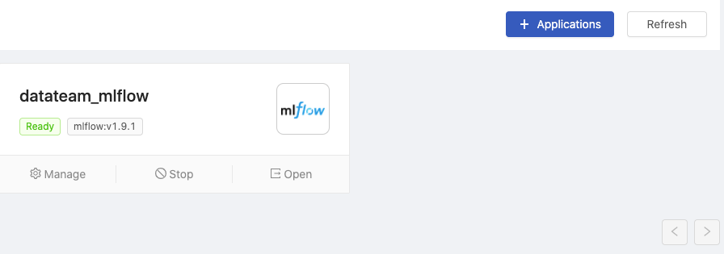
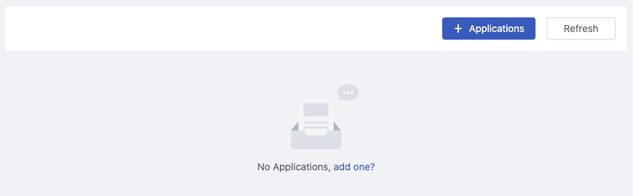

  
Enterprise
    Applicable to Enterprise Edition
  

  
Community
    Applicable to Community Edition
  

 

> This is an Alpha feature. The page content is subject to change.

**PrimeHub** aims at being a MLOps platform where scientists can orchestrate data/tools for the acceleration of researches. In terms of a platform, we introduce **PrimeHub Apps** that PrimeHub capability is able to be extended by integrations of 3rd-party applications such as auto ML tools, visualization tools, etc. These integrated applications also benefit from access-control and resource constraints of PrimeHub.

## Installed Apps

The landing page of Apps displays installed applications;

|Info|Description|
|----|-----------|
|Title| The name of the application instance |
|Status| The status of the application instance|
|App version| The application version of the instance|

+ `Manage`: Enter the detail page of the instance
+ `Action`: Start / Stop the instance
+ `Open`: Open the URL of the application in a new tab

likewise it displays a blank when no installed one.

+ `+ Applications`: Select and install an application from Store

## App Store

+ `Search`: Search available applications by a keyword
+ `App Documents`: Open the external official documentation of the application in a new tab
+ `+ Install to PrimeHub`: Enter the installing page

## Installing App

+ `App`: Selection of applications
+ `App ID`: A random ID of App
+ `Name`: Name the instance
+ `Environment Variables`: Displays/Add/Modify required environment variables by default
+ `Instance Types`: Select an instance type for the application
+ `Access Scope`: Select targeted users who can access the application
  + `Group members only`: Current working group members only
  + `PrimeHub users only`: Platform-wise users
  + `Public`: To anyone with the URL

> Please assure that Group Resources are sufficient to run the instance.

## Installed App Detail

### Panel

+ `Title`: The name of the application instance
+ `App version`: The application version of the instance
+ `Description`: A digest of the application

Action buttons:

+ `Open Web UI`: Open the URL of the application in a new tab
+ `App Documents`: Open the external official documentation of the application in a new tab
+ `Start/Stop`: toggle the instance
+ `Update`: Modify the instance detail and re-start the instance with updates
+ `Uninstall`: Remove the instance

### Information

|Info|Description|
|----|-----------|
|Status|The status of the application instance|
|Message|The message describes the status; error message if any |
|App URL|The URL of the application|
|Service Endpoints| The service endpoint|
|App ID|A random ID of App|
|Name|The name of the instance|
|Instance Type| Allocated instance type|
|Access Scope| The targeted users who can access the application|
|Environment Variables| Added environmental variables|

### Logs

The logs of the running instance.

Log viewer only list the latest 2000 lines of logs. Clicking `Scroll to Bottom` to check the last logs at the bottom or clicking `Download` to download a complete log file

