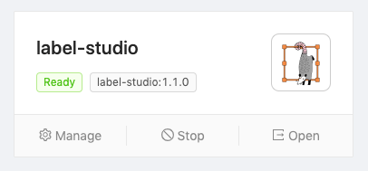
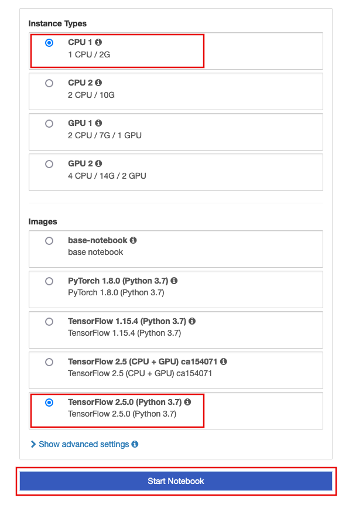
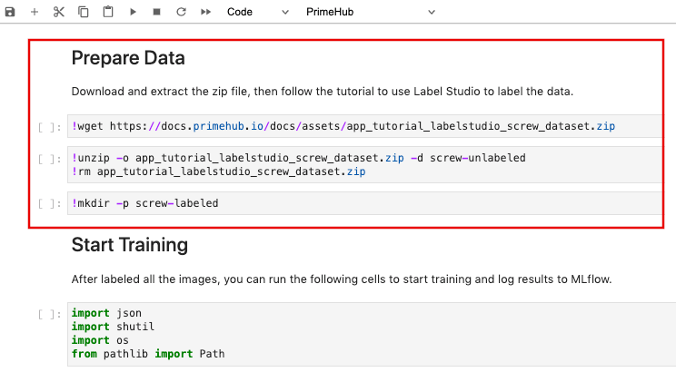
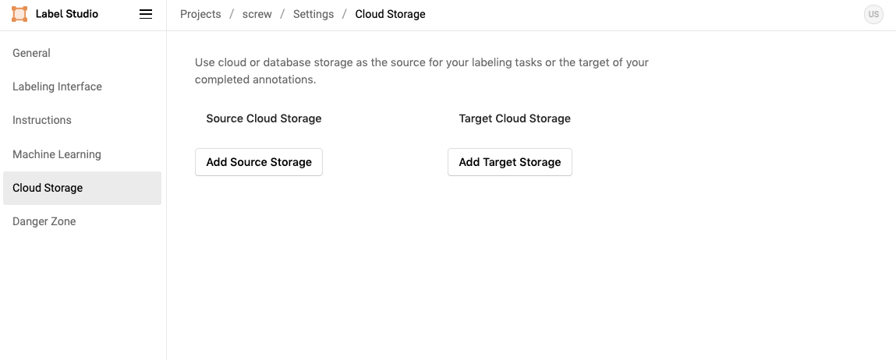
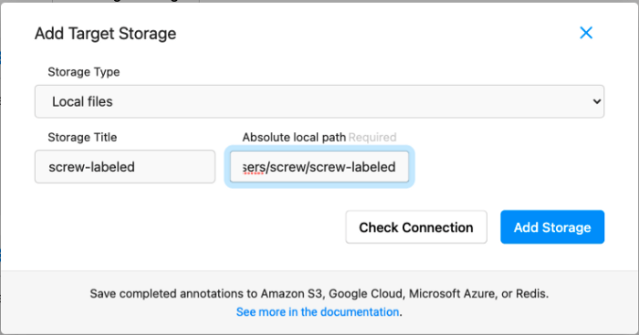
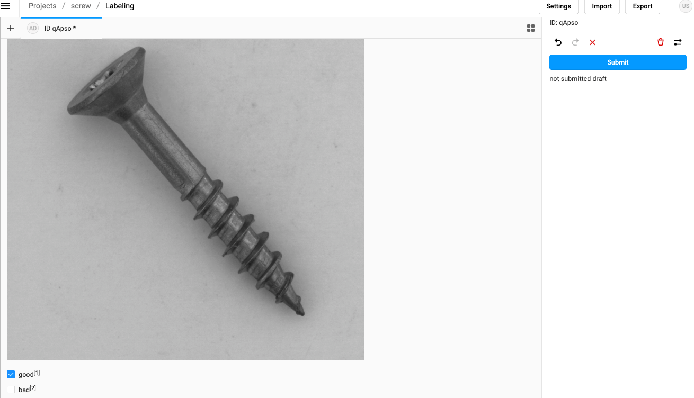
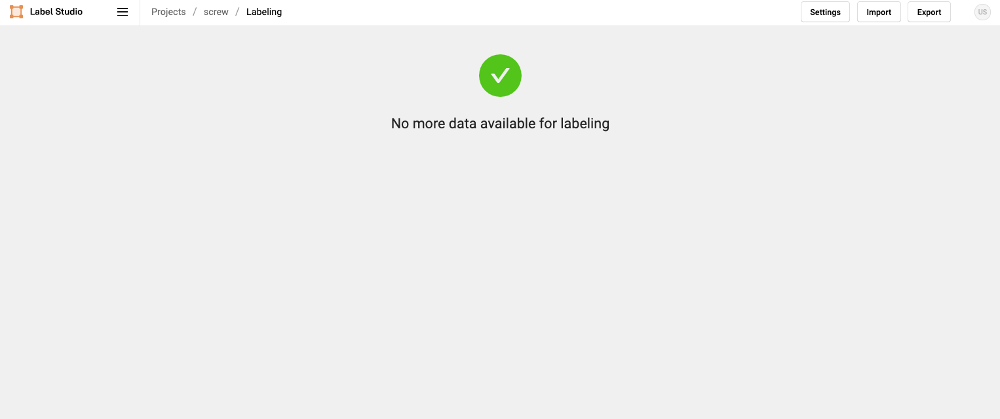

  
Enterprise
    Applicable to Enterprise Edition
  

 

The dataset labeling is the critical part of AI / ML model development. Data scientists cannot make good models without well-defined data because we all know “garbage in, garbage out”. 

[Label Studio](https://labelstud.io/) is a useful open-source data labeling tool. In [PrimeHub Apps](primehub-app), it provides an easy way for setting up Label Studio in a cloud-ready environment for your team.

In this tutorial, we will use `PrimeHub Apps` with `Label Studio` to label the screw data for further training works.

## What we need?

- Enable [Shared Volume](guide_manual/admin-group#shared-volume) in your group.

- Install [Label Studio]() in PrimeHub Apps.
    1. Click `Install to PrimeHub` in Label Studio.
    
    2. Fill in `Name` with `label-studio`.
    
    3. Click `Create` button.
    
    4. The `Label Studio` app is installed successfully.
    

## Use `Label Studio` to label data

We will use the good/bad screw images as our dataset (the screw images are collected from [MVTEC AD](https://www.mvtec.com/company/research/datasets/mvtec-ad/)).

The example image on the left side is the good screw; and the example image on the right side is the bad screw since you can see there is a manipulated front.

Go to Notebooks tab in the PrimeHub UI to start a notebook server.
- Choose Instance Type: CPU 1 (CPU: 1 / Memory: 3G/ GPU: 0)
- Choose Image: TensorFlow 2.4.1

After went into the notebook environment, now create a folder `screw` under our group shared volume `~/<group_name>/`. In this example, the <group_name> is `phusers`.

Next, download [tutorial_screw_train.ipynb](assets/tutorial_screw_train.ipynb) and upload it to `~/<group_name>/phusers`.

Please run the `Prepare Data` section in the notebook file to download all necessary data. And don’t run the cells after `Start Training` section.

Back to PrimeHub UI and go to Apps page, we can open the Label Studio UI by clicking `Open`.

Click `Create` button to create a new project in the Label Studio.

Enter project name `screw`. Skip the `Data Import` step. In the `Labeling Setup`, we choose `Image Classification`.

Delete the original choices and add our own label classes: `good/bad`, then click `Save` to create the project.

Every group members can access the `Group Shared Volume`, and it is also accessible in the PrimeHub App. Since we installed the Label Studio by PrimeHub App, we can start to sync the data between `Group Shared Volume` and `Label Studio`.

Go to `Settings` -> `Cloud Storage` to set up `Source` and `Target` storages.

Click `Add Source Storage` to configure following settings, then click `Add Storage` -> `Sync Storage`.
- Storage Type: `Local files`
- Storage Title: `screw`
- Absolute local path: `/project/<group_name>/screw/screw-unlabeled` (in this example, the `<group_name>` is `phusers`).
- File Filter Regex: `.*png`
- Turn on toggle of `Treat every bucket object as a source file`

Click `Add Target Storage` and configure following settings, then click `Add Storage`.
- Storage Type: `Local files`
- Storage Title: `screw-labeled`
- Absolute local path: `/project/<group_name>/screw/screw-labeled` (in this example, the `<group_name>` is `phusers`).

After added storage, now you can go back to the project view in Label Studio. Click `Label` to start labeling.

You can type keyboard numbers (`good: 1`; `bad: 2`) to select the class or click the checkbox directly. Click `Submit` to confirm your selected class.

Successfully labeled all the screw images!

All the labeled results are saved in JSON format and located under `~/<group_name>/screw/screw-labeled`.

In the next tutorial, we will organize the labeled data into the format that we can continue to train a good/bad screw classifier.
