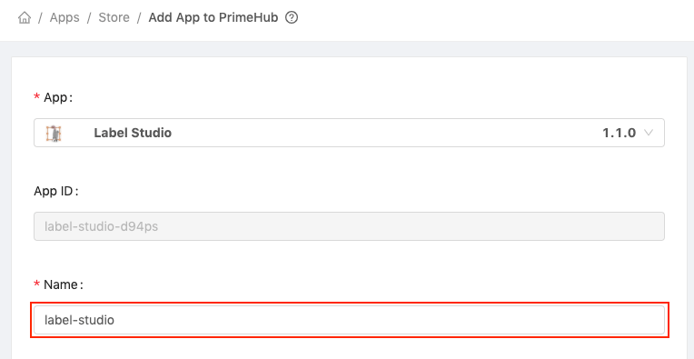
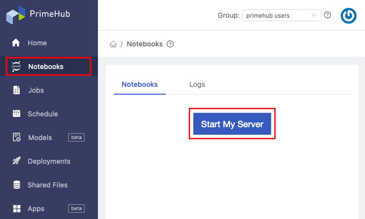
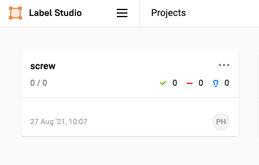

  
Enterprise
    Applicable to Enterprise Edition
  

 

Data labeling is a critical part of model development for machine learning. By using a well defined dataset, data scientists are able to train effective models.

In this tutorial, we will be using [Label Studio](https://labelstud.io/), an open source data labeling tool, to label data and train a model. The aim of our model will be to detect a good or bad example of a screw from a given photograph.

Label Studio is available as part of [PrimeHub Apps](primehub-app), a convenient way to integrate 3rd-party apps into your ML Workflow.

 and bad (right) screws that we will train our model to detect")

## Prerequisites

First, let's enable a shared volume for storage, and install Label Studio.

### Enable Shared Volume

> For the purposes of this tutorial, the group name will be **phusers**.

In the [Admin Portal](quickstart/login-portal-admin) left sidebar, click **Groups** and find the **phusers**  group. Click the **pencil icon**  in the **Actions** column to edit the group. 

Click the **Shared Volume** toggle to enable it, and then click the **Confirm** button to save your changes.

### Install Label Studio

In the [User Portal](quickstart/login-portal-user), click **Apps** in the left sidebar, and then click the **+&nbsp;Applications** button.

Find the Label Studio app and click **+&nbsp;Install to PrimeHub**. 

In the **Name** field enter "label-studio".

Click the **Create** button to install the app.

When Label Studio has finsihed installing, you will see the green **Ready** label. 

## Start a Notebook Server

Before we can start using Label Studio, we first need to start a notebook server and prepare the data for this tutorial.

### Notebook Server Settings

In the **User Portal**, click **Notebooks** in the left sidebar. Then, on the Notebooks page, click the **Start&nbsp;My&nbsp;Server** button.

Configure the server using the following settings:

- **Instance Type**: CPU 1 (1 CPU)
- **Image**: TensorFlow 2.5 (or higher)

After selecting an Instance Type and Image, click the **Start Notebook** button to start the server.

>  If this is your first time starting a server, it may take a minute to pull the image before starting the server.

### Prepare Data (Jupyter Notebook)

After the Notebook server has started, click the **My Server** button to open Jupyter Notebook.

In Jupyter Notebook, create a folder named **screw** in your group's shared volume. The group name for this tutorial is **phusers**, so the path to the new folder will be:

`/phusers/screw`

Double click the **screw** folder to enter it.

Download the tutorial script, [tutorial_screw_train.ipynb](assets/tutorial_screw_train.ipynb), to your local computer, and then upload it to the newly created screw folder.

In the left sidebar, double click **tutorial_screw_train.ipynb** to open it.

Run the steps in the **Prepare Data** section to download and prepare the data.

After the running the **Prepare Data** section, the **screw** folder should now contain two new folders:

- **screw-unlabeled**: Containing a series of png image files
- **screw-labeled**: An empty folder  

## Using Label Studio

Now that we have prepared our data, we can start the labelling process.

On the **Apps** page of the PrimeHub **User Portal**, click **Open** to start Label Studio (a new web browser tab will open).

If prompted to log in, the default credentials are:

- username: `<group_name>@infuseai.io`
- password: `<group_name>_password!`

> Substitute <group_name> with your group. The default group for this tutorial is *phusers*

### Create Project

Click the **Create** button to create a new project.

The **Create Project** screen has three horizontal tabs:

- Project name
- Data Import
- Labeling Setup

In the Project Name tab, enter **screw** as the **Project Name**.

Then, click the **Labeling Setup** tab and click **Image Classification.** A new settings page will open.

Delete the existing choices by clicking the **red 'X'**. In the **Add Choices** textarea, enter the following choices, one per line, then click the **Add** button.

- good
- bad

Click the **Save** button to create the project.

### Add Storage

The shared volume we enabled earlier allows the sharing of data between PrimeHub and 3rd party apps. As such, we can configure Label Studio to access this shared volume.

Click the **Settings** button to open our new project's settings page.

Click **Cloud Storage** in the left sidebar. We will be configuring both **Source** and **Target storage**.

#### Add Source Storage

Click the **Add Source Storage** button and enter the following settings:

- **Storage Type**: `Local files`
- **Storage Title**: `screw`
- **Absolute local path**: `/project/<group_name>/screw/screw-unlabeled` 
The **group name** used in this tutorial is **phusers**
- **File Filter Regex**: `.*png`
- Click the **toggle** to enable `Treat every bucket object as a source file`

Click on **Add Storage**, then on the newly added storage click **Sync Storage**

> Don't forget to click **Sync Storage** to insure Label Studio can see the prepared data

#### Add Target Storage

Click the **Add Target Storage** button and enter the following settings:

- **Storage Type**: `Local files`
- **Storage Title**: `screw-labeled`
- **Absolute local path**: `/project/<group_name>/screw/screw-labeled`  The **group name** used in this tutorial is **phusers**

Click **Add Storage** to finish adding target storage.

> Check the **Absolute local path** carefully to avoid errors when adding storage

### Start Labeling

Click the **Label Studio logo** at the top left and then click **Projects**.

On the Projects page, click the newly created screw project.

In the screw project, click **Label All Tasks** to start labeling.

For each image click either the **good** or **bad** checkbox, or use the keyboard numbers 1 for good, or 2 for bad, and then click the **Submit** button to proceed to the next image.

When all images have been labeled the message **No more data available for labeling** will be displayed.

The results of the labeling are saved in JSON formatted files, and can be found in Jupyter Notebook in the **screw-labeled** folder we created earlier. 

## Conclusion

In this tutorial we have enabled a group volume, installed Label Studio via PrimeHub Apps, and used a Jupyter Notebook server to prepare data. We then synced the group volume with Label Studio, and labeled a set of images. Using the labeled dataset, we can move on to the next step.

In the next tutorial, we will create a notebook job to train the screw classification model, and adjust parameters to tune the accuracy.