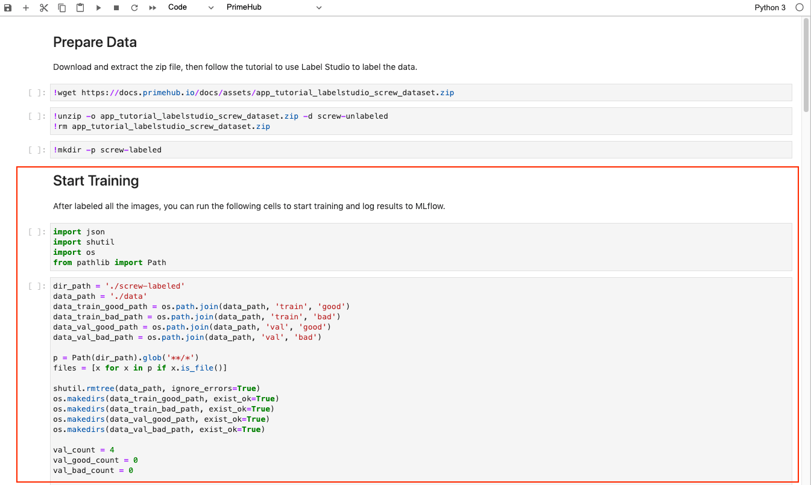
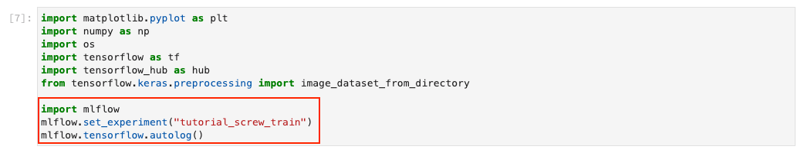
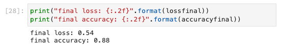
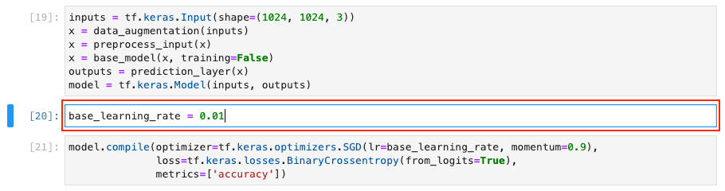
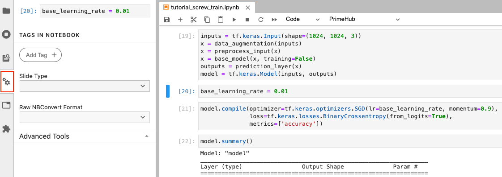
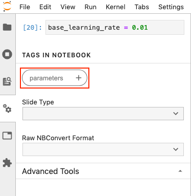

  
Enterprise
    Applicable to Enterprise Edition
  

 

In this tutorial, we will organize the labeled data and feed into the model in PrimeHub Notebooks. Also, we will make our notebook as a repeatable job to perform parameters tuning.

## What we need?

- Install [MLflow]() in PrimeHub Apps.
    1. Click `Install to PrimeHub` in MLflow.
    
    2. Fill in `Name` field with `mlflow`.
    
    3. Click `Create` button.
    
    4. The `MLflow` app is installed successfully.
    

- Configure [MLflow]() app in your group to keep track of experiments/runs.
    1. Click `Manage` to go to the detail page of MLflow app.
    
    2. Copy the values of `App URL` and `Service Endpoints`.
    
    3. Click `Settings` in sidebar menu and navigate to `MLflow` tab.
    
    4. Fill in `MLflow Tracking URI` with `http://`+`Service Endpoints`, and fill in `MLflow UI URI` with `App URL`, then click `Save`.
    

## Train the Model

Now you can run all cells after `Start Training` section.

It will parse the JSON content and put all the images into the folder `~/<group_name>/screw` in the following structure:
- `data/train/good`: Good screw images as the training dataset
- `data/train/bad`: Bad screw images as the training dataset
- `data/val/good`: Good screw images as the validation dataset
- `data/val/bad`: Bad screw images as the validation dataset

Also, we set the experiment name with `tutorial_screw_train` and enable [MLflow autologging API](https://www.mlflow.org/docs/latest/python_api/mlflow.tensorflow.html#mlflow.tensorflow.autolog) to automatically export our execution to MLflow app for experiment tracking.

We can see that achieved around 88% of validation accuracy after training.

## Send Notebook as Job for Parameter Tuning

Now, we have a runnable notebook to train the screw classification model.

Next, we can access [PrimeHub Notebook Extension](ph-notebook-extension) to submit our notebook as job to perform parameters tuning.

Let's configure the learning rate to see how model accuracy can be better!

Click on the `cell 20` with default `base_learning_rate` configured.

Click on `Property Inspector` button.

Click on `Add Tag`, fill in `parameters`, and click on `+` icon. This makes the feed parameters to overwrite the `base_learning_rate`.

To submit notebook as a job, we need to setup [API Token]() at first.

Click on PrimeHub button to expand extension menu, then click `API Token`.

In the pop-up dialog, click `here` to access `API Token` page.

In the `API Token` page, click `Request API Token`.

After the token displayed, click `Copy` to store our token value.

Back to notebooks, click on PrimeHub button and select `API Token` again.

We can paste our token here then click `OK`.

Next, click on PrimeHub button and select `Submit Notebook as Job`.

In the pop-up dialog, we can adjust instance type to gain more running resources, or we can adjust image to make notebook execution on different environment. Here is the settings: 
- Instance Type: default value
- Image: default value
- Job Name: `tf-screw-training-lr-0.01`.
- Notebook Parameters: `base_learning_rate = 0.01`

Click `Submit` to start training with `base_learning_rate = 0.01`.

Again, click PrimeHub button and select `Submit Notebook as Job`. Let's submit another training with `base_learning_rate = 0.05` with following settings:
- Instance Type: default value
- Image: default value
- Job Name: `tf-screw-training-lr-0.05`.
- Notebook Parameters: `base_learning_rate = 0.05`

Back to PrimeHub UI and go to [PrimeHub Jobs](), our two submitted jobs are succeeded! The respective notebook training results will be automatically exported to `MLflow` app.

In the next tutorial, we will analyze these two training results, manage trained models, and deploy the best model to cloud environment.
