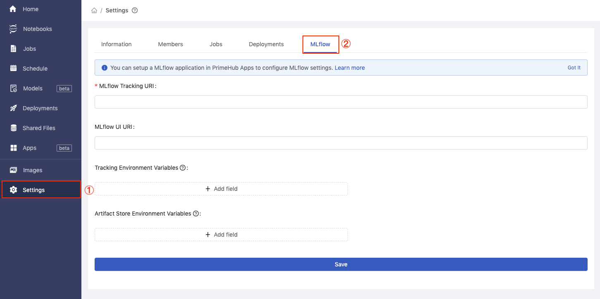
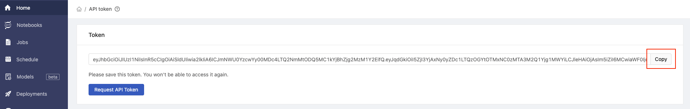
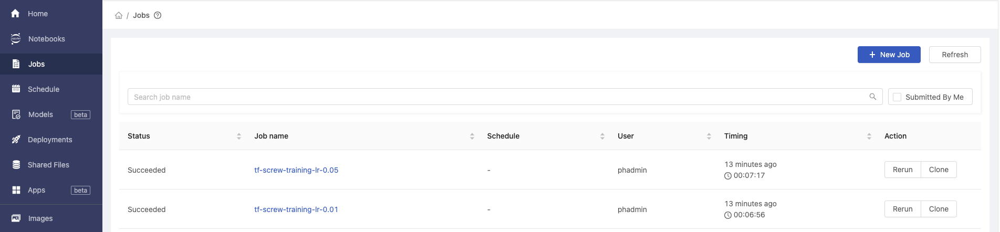

  
Enterprise
    Applicable to Enterprise Edition
  

 

In this tutorial, we will organize the labeled data and feed into the model in PrimeHub Notebooks. Also, we will make our notebook as a repeatable job to perform parameters tuning.

## What we need?

- Install [MLflow]() in PrimeHub Apps.
    1. Click `Install to PrimeHub` in MLflow.
    
    2. Fill in `Name` field with `mlflow`.
    
    3. Click `Create` button.
    
    4. The `MLflow` app is installed successfully.
    

- Configure [MLflow]() app in your group to keep track of experiments/runs.
    1. Go to the detail page of MLflow app by clicking `Manage`.
    
    2. tmp
    
    3. Click `Settings` in sidebar menu and navigate to `MLflow` tab.
    
    4. tmp
    

## Train the Model

Now you can run all the code after Go To PrimeHub App section.

It put our training and validation data into the folder ~/<group_name>/screw in the following format:
    Good screw images as the training data: data/train/good
    Bad screw images as the training data: data/train/bad
    Good screw images as the validation data: data/val/good
    Bad screw images as the validation data: data/val/bad

The label result JSON file contains the image location and the label. Based on these files generated from Label Studio, we parsed the content and put all the images into the correct location.

We have prepared the dataset for you. The dataset contains three folders:
1. `train/good` contains the perfect screw
1. `train/bad` contains the screw with some defects
1. `unlabeled` contains the screw images that are not yet labeled as good or bad screw 

We will use the images in `train/good` and `train/bad` as the training dataset and use Label Studio to label the images in `unlabeled` as the validation dataset.

Please download the notebook file [tutorial_screw_train.ipynb](assets/tutorial_screw_train.ipynb), which trains a model to classify the good or bad screw. Then, go to PrimeHub [notebook](quickstart/launch-project), upload it to `~/<group_name>/screw-train` based on the similar steps of uploading the zip file in `What we need?`.

There is one cell need to be modified in the notebook file. In the second code cell, please replace the `<group_name>` with your group name. `dir_path` is the target storage of the labeled results that we labeled in the previous step. We use these new labeled data as the validation dataset.

After modified that cell, you can run all cells in the notebook. It uses the mobilenet as the pre-trained model and uses it's outputted feature vector to classify the screw quality.

We can see that we achieve around 90% of accuracy both in training and the validation dataset after training.

## Send Notebook as Job for Parameter Tuning

Now, we have a runnable notebook to train the screw classification model.

Next, we can access [PrimeHub Notebook Extension](ph-notebook-extension) to submit our notebook as job to perform parameters tuning.

Let's configure the learning rate to see how model accuracy can be better!

Click on the `cell 18` with default `base_learning_rate` configured.

Click on `Property Inspector` button.

Click on `Add Tag`, fill in `parameters`, and click on `+` icon. This makes the feed parameters to overwrite the `base_learning_rate`.

Click on PrimeHub button to expand extension menu, we need to setup [API Token](tasks/api-token) at first.

Back to PrimeHub UI, select `API Token` from the top-right menu.

Click on `Request API Token` button.

After the API token displayed, click on `Copy` to store our token value.

Back to notebooks, click on PrimeHub button and select `API Token`.

We can paste our token here then click on `OK` button.

Next, click on PrimeHub button and select `Submit Notebook as Job`.

In the pop-up dialog, we can adjust instance type to gain more running resources, or we can adjust image to make notebook execution on different environment. Here is the settings: 
- Instance Type: default value
- Image: default value
- Job Name: `tf-screw-training-lr-0.01`.
- Notebook Parameters: `base_learning_rate = 0.01`

Click on `Submit` to start training with `base_learning_rate = 0.01`.

Again, click on PrimeHub button and select `Submit Notebook as Job`. Let's submit another training with `base_learning_rate = 0.05` with following settings:
- Instance Type: default value
- Image: default value
- Job Name: `tf-screw-training-lr-0.05`.
- Notebook Parameters: `base_learning_rate = 0.05`

Back to PrimeHub UI, select `Jobs` page to check our two submitted jobs are succeeded now!

