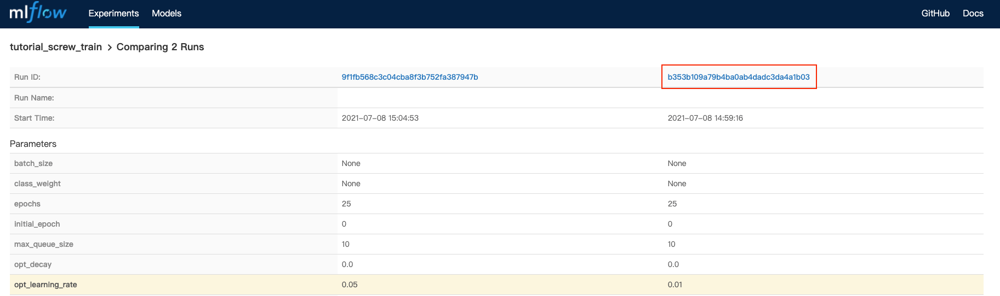

<div class="label-sect">
  <div class="ee-only tooltip">Enterprise
    <span class="tooltiptext">Applicable to Enterprise Edition</span>
  </div>
</div>
<br>

In this tutorial, we will blahblah..

## What we need?

- Enable [model deployment](model-deployment-feature) in your group.

## Model Management (Choose Best Model)
With the `Submit Notebook as Job` feature, we can set multiple variables combination to fine-tune our model. 

After all submitted jobs completed, we now select [Models](model-management) in PrimeHub UI.

In the `Models` page, click on the `MLflow UI` button.


In the MLflow UI, switch to `Experiments` tab.


Select our specified experiment name `tutorial_screw_train`.


It shows all runs in `tutorial_screw_train` experiment, now check our two executed run and click on `Compare` button.


We will be directed to page that comparing 2 runs' parameters and metrics. We analyzed these 2 runs and found the `base_learning_rate=0.01` can perform better results.


Thus, we click on its Run ID: `b353b109a79b4ba0ab4dadc3da4a1b03`.


Both parameters, metrics, and artifacts of this run can be found in this page.


Scroll down to the artifacts section. Click on the `exported model` and `Register Model` button.


In the model selector, choose `Create New Model`.


Fill in model name with `tf-screw-model` and click on `Register` button.


We can see our model is successfully registered as `version 1`.


Back and refresh the models page in the PrimeHub UI, now we can see our model `tf-screw-model` is managed in model list.


## Customize Model Server Image

Now, we have registered current best model in Model Management. To deploy the managed model, we need to setup the pre-packaged model image to be runnable container environment.

Use the [Tensorflow2 Prepackaged Model Server](https://github.com/InfuseAI/primehub-seldon-servers/tree/master/tensorflow2) as template of pre-packaged model image.

```bash
git clone https://github.com/InfuseAI/primehub-seldon-servers.git
cd tensorflow2/
```

We can edit [tensorflow2/Model.py](https://github.com/InfuseAI/primehub-seldon-servers/blob/master/tensorflow2/tensorflow2/Model.py) to meet our input data requirements.

Original template
```python
def predict(self, X, feature_names = None, meta = None):
    ...
    if isinstance(X, bytes):
        img = Image.open(BytesIO(X))
        img = np.array(img).astype(np.float32)
        X = np.copy(img)
        X /= 255.0
        X = np.expand_dims(X, axis=0)
    ...
```

Ours
```python
def predict(self, X, feature_names = None, meta = None):
    ...
    if isinstance(X, bytes):
        img = Image.open(BytesIO(X))
        img = np.array(img).astype(np.float32)
        img = np.stack((img,)*3, axis=-1)
        X = np.expand_dims(img, axis=0)
    ...
```

The `np.stack((img,)*3, axis=-1)` can convert a grayscale input image to a 3-channel image, making it able to fit the shape of model input layer.

After edited the `Model.py`, let's execute following command to build the pre-packaged model image.

```bash
docker build . -t tensorflow2-prepackaged
```

Execute `docker images` to check the built image.

```bash
REPOSITORY                TAG          IMAGE ID       CREATED        SIZE
tensorflow2-prepackaged   latest       689530dd1ef9   3 minutes ago  1.67GB
```

Next, tag the built image based on your docker registries, we added `screw-classification` tag to this image and used `Docker Hub` to store image.

```bash
docker tag tensorflow2-prepackaged:latest infuseai/tensorflow2-prepackaged:screw-classification
```

Then push to docker registry.

```bash
docker push infuseai/tensorflow2-prepackaged:screw-classification
```

## Model Deployment

Now, we have prepared the trained model in PrimeHub Model Management and pushed the customized pre-packaged model image to Docker Hub.

Let's continue to deploy our model!

Back to `Models` page, click on our managed model name `tf-screw-model`.


It shows all versions of `tf-screw-model`, let's click on the `Deploy` button of `Version 1`.


In the deployment selector, choose the `Create new deployment` and click on `OK` button.


We will be directed to [Create Deployment](model-deployment-feature#create) page. And the `Model URI` field will be auto fill-in with registered model scheme (`models:/tf-screw-model/1`).


Next,

1. Fill in deployment name with `tf-screw-deployment`.
2. Fill in model image with `infuseai/tensorflow2-prepackaged:screw-classification`; this is our customized pre-packaged model image that can serve the trained screw model.


Choose the instance type, the minimal requirements in this tutorial is `CPU: 0.5 / Memory: 1 G / GPU: 0`.


Then, click on `Deploy` button.

Our model is deploying, let's click on the `tf-screw-deployment` cell.


In the [deployment detail](model-deployment-feature#deployment-detail) page, we can see the status is `Deploying`.


Wait for a while and our model is `Deployed` now!

We can view some detailed information, now let's copy the value of `Endpoint` (`https://.../predictions`) to test our deployed model!


Replace `${YOUR_ENDPOINT_URL}` with your `Endpoint` value in the following block.

```bash
curl -F 'binData=@path/to/image' ${YOUR_ENDPOINT_URL}
```

Then copy the entire block to the terminal for execution, and we are sending exact image as request data.

- Example of request data

    ```bash
    curl -F 'binData=@val/good/000.png' https://xxx.primehub.io/deployment/tf-screw-deployment-xxxxx/api/v1.0/predictions
    ```
    

- Example of response data
    ```bash
    {"data":{"names":["t:0"],"tensor":{"shape":[1,1],"values":[2.065972089767456]}},"meta":{"requestPath":{"model":"infuseai/tensorflow2-prepackaged:screw-classification"}}}
    ```
    The `positive` return value represented as `good` screw; and the `negative` return value represented as `bad` screw.

    Therefore, the return value `2.065972089767456` indicated that the requested screw image is a good screw!

Congratulations! We have trained the model in Notebooks, fine-tuned the model in Jobs, versioned the trained model in Model Management, and further deploy it as an endpoint service in Model Deployment. Making it able to respond to requests anytime from everywhere.
