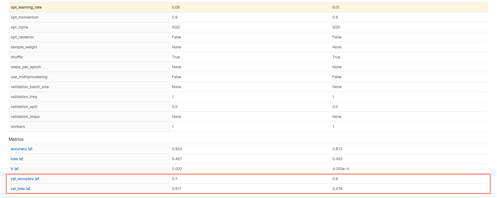
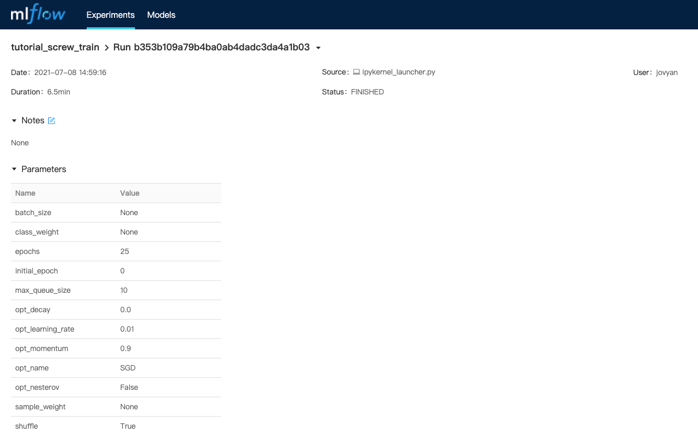
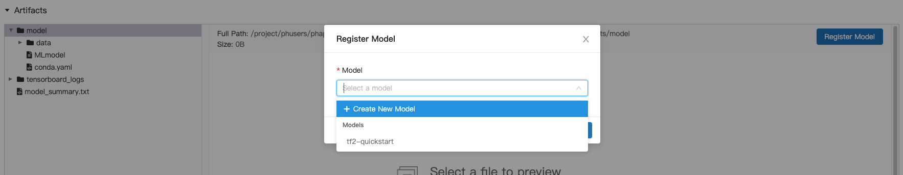

<div class="label-sect">
  <div class="ee-only tooltip">Enterprise
    <span class="tooltiptext">Applicable to Enterprise Edition</span>
  </div>
</div>
<br>

In the previous tutorial we submitted two model training runs via Primehub Jobs. In this part, we will compare the results of these two runs. The run with the best performance will be registered in [PrimeHub Models](model-management) and then deployed as an online service via [PrimeHub's Model Deployment](model-deployment-feature) feature.


## Prerequisites

### Enable Model Deployment

Before we get started, enable the Model Deployment toggle in your group settings.


### Docker Account

A Docker account is required to follow the Customize Model Server Image section of this tutorial. If you don’t have an account you can set one up for free at [Docker](https://hub.docker.com/).


## Model Management (Selecting the Best Model)

We will use MLflow to compare the results from our two jobs (referred to as ***runs*** in MLflow). As we have already connected PrimeHub to MLflow, the results from these two runs will be automatically available there.

In the User Portal, click **Models** in the left sidebar, then click the **MLflow UI** button. MLflow will open in a new tab.


In MLflow, click the **Experiments** tab.


Click on our experiment **tutorial_screw_train** in the left sidebar.


Here we can see all runs for the **tutorial_screw_train** experiment. 

### Compare Run Results

To compare the results, click the checkbox next to each run to select them, and then click the **Compare** button.


The following page displays the parameters and metrics for each run in a comparison table. 

Inspecting the **accuracy** and **loss** results for each run, we can see that a `base_learning_rate` (referred to in the table as `opt_learning_rate`) of `0.01` performs better.



> Note: Your accuracy and loss results may differ slightly than those shown here

At the top of the page, click the **Run ID** link for the run with the base_learning_rate of 0.01


Here we can see the parameters, metrics, and artifacts of this run.



### Register Model

To register this run as a model, scroll down to the **artifacts** section, click **model** in the left sidebar, and then click the **Register Model** button.


In the **Register Model** dialog, click the **Select a Model** dropdown, and then click **Create New Model**.



Enter the **Model Name** as **tf-screw-model** and then click the **Register** button.


The model will be registered as v1 (version 1).


Go back to PrimeHub and refresh the **Models** page.  The newly created **tf-screw-model** will be listed.


## Customize Model Server Image

To deploy our registered model, we need to set up the container environment. For this step we’ll be customizing a pre-packaged model image to suit our needs. This will demonstrate how to modify, build, and deploy a custom image using PrimeHub Deployments. 

### Requirements

To follow the instructions in this section you should have: 

- A docker account
- A familiarity with the command line
- Python version 3 or above
- An x86/64 CPU  (Apple M1 currently not supported)


We will be using this [Tensorflow2 Prepackaged Model Server](https://github.com/InfuseAI/primehub-seldon-servers/tree/master/tensorflow2) as a template.

### Clone and Edit Server Image

On your local computer, run the following commands to clone the model server repository:

```bash
git clone https://github.com/InfuseAI/primehub-seldon-servers.git
```

```bash
cd primehub-seldon-servers/tensorflow2/
```

In a text editor, open the following file: 
  [tensorflow2/Model.py](https://github.com/InfuseAI/primehub-seldon-servers/blob/master/tensorflow2/tensorflow2/Model.py) 

We will be updating this file to meet our input-data requirements.

Find the following section:

```python
def predict(self, X, feature_names = None, meta = None):
    ...
    if isinstance(X, bytes):
        img = Image.open(BytesIO(X))
        img = np.array(img).astype(np.float32)
        X = np.copy(img)
        X /= 255.0
        X = np.expand_dims(X, axis=0)
    ...
```

Replace these three lines:

```python
        X = np.copy(img)
        X /= 255.0
        X = np.expand_dims(X, axis=0)
```

With these two lines:

```python
       img = np.stack((img,)*3, axis=-1)
       X = np.expand_dims(img, axis=0)
```


Your code should now look like this:

```python
def predict(self, X, feature_names = None, meta = None):
    ...
    if isinstance(X, bytes):
        img = Image.open(BytesIO(X))
        img = np.array(img).astype(np.float32)
        img = np.stack((img,)*3, axis=-1)
        X = np.expand_dims(img, axis=0)
    ...
```


The line `np.stack((img,)*3, axis=-1)` converts a grayscale image to a 3-channel image. As the demo images for this tutorial are grayscale, we require this line to ensure images are in a suitable format to act as input for our model.

After editing and saving **Model.py**, build the pre-packaged model image with the following command.

```bash
docker build . -t tensorflow2-prepackaged
```
Check that the image is listed by running: 

```bash
docker images
```
The output should look similar to: 

```
REPOSITORY                TAG          IMAGE ID       CREATED        SIZE
tensorflow2-prepackaged   latest       689530dd1ef9   3 minutes ago  1.67GB
```

### Tag and Push to Docker

Tag the image into your Docker registry with the **screw-classification** tag, replacing **\<username\>** with your Docker username.

```bash
docker tag tensorflow2-prepackaged:latest <username>/tensorflow2-prepackaged:screw-classification
```

If you’re not logged into docker yet, log in now:

```bash
docker login
```

Push the image we just tagged to your docker registry. Again, change **\<username\>** to match your Docker username.

```bash
docker push <username>/tensorflow2-prepackaged:screw-classification
```

## Model Deployment

Once the image has been successfully pushed to docker, it’s time to deploy our model!

On the **Models** page in PrimeHub, click our managed model with the name **tf-screw-model**.


The following page shows all versions of the **tf-screw-model** model. Click the  **Deploy** button for **Version 1**.


In the **Deploy Model** dialog, select **Create new deployment** from the **Deployment** dropdown and then click **OK**.


You will be directed to the [Create Deployment](model-deployment-feature#create) page, and the **Model URI** field will have been automatically filled with the path of the selected model (`models:/tf-screw-model/1`).


Complete the form with the following information:

In the **Deployment Name** field enter **tf-screw-deployment**.

Then, in the **Model Image** field, enter the Docker path of the model we pushed to your Docker registry, e.g. `<username>/tensorflow2-prepackaged:screw-classification`, replacing **\<username\>** with your Docker username.


Configure the instance type settings - The minimal requirements for this tutorial are `CPU: 0.5 / Memory: 1 G / GPU: 0`.


Click the **Deploy** button and you will be redirected to the **Deployments** page. 


To view the details of the deployment, click the **tf-screw-deployment** card.


On the [deployment details](model-deployment-feature#deployment-detail) page, we can see the status is currently **Deploying**


## Test Deployed Model

Once the model has successfully deployed, the page will automatically update and the status will show as **Deployed**. We can now test the deployed model.

Copy the value of **Endpoint** (`https://.../predictions`)


Run the following code in your terminal, replacing `path/to/image` with the path of a locally saved screw image, and  `${YOUR_ENDPOINT_URL}` with the value we copied from the **Deployment** page.

```bash
curl -F 'binData=@path/to/image' ${YOUR_ENDPOINT_URL}
```

For example:

```bash
curl -F 'binData=@val/good/000.png' https://xxx.primehub.io/deployment/tf-screw-deployment-xxxxx/api/v1.0/predictions
```


Here’s the response from the model:

```bash
{"data":{"names":["t:0"],"tensor":{"shape":[1,1],"values":[2.065972089767456]}},"meta":{"requestPath":{"model":"infuseai/tensorflow2-prepackaged:screw-classification"}}}
```

The **positive** number returned for **values** indicates that this was a **good** screw. A **negative** return value would indicate a **bad** screw.

> Note: If you try to upload your own images, not from the demo set, please resize to 1024 x 1024 and limit the size to under 1MB

## Conclusion

In this tutorial, we compared and selected a suitable model using MLflow, customized a Tensorflow 2 Prepackaged Model Server, deployed a model, and tested the model with sample data.

In part 4, we will add a web interface to our model using Streamlit, another app available through PrimeHub Apps.
