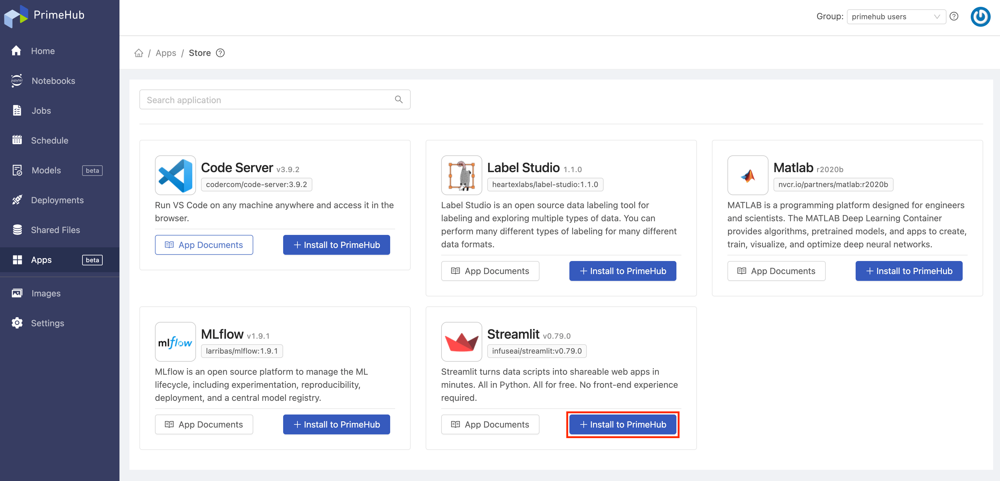
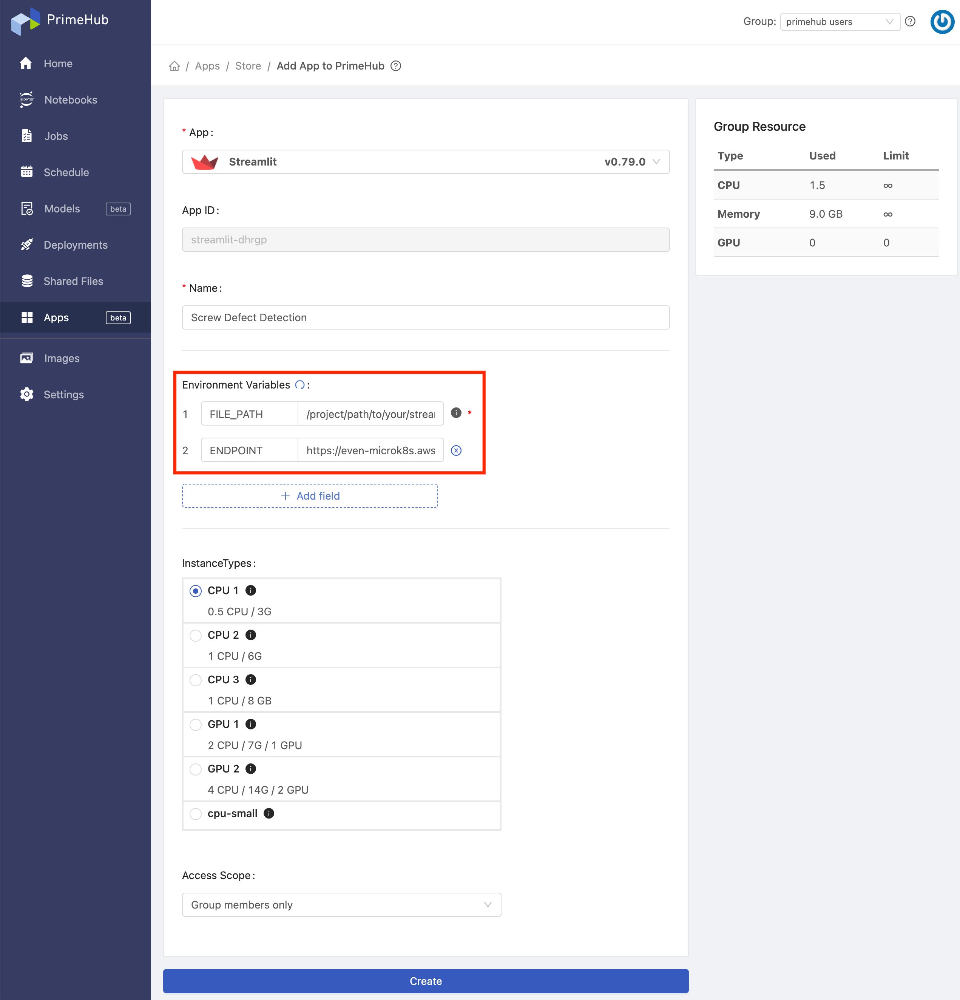
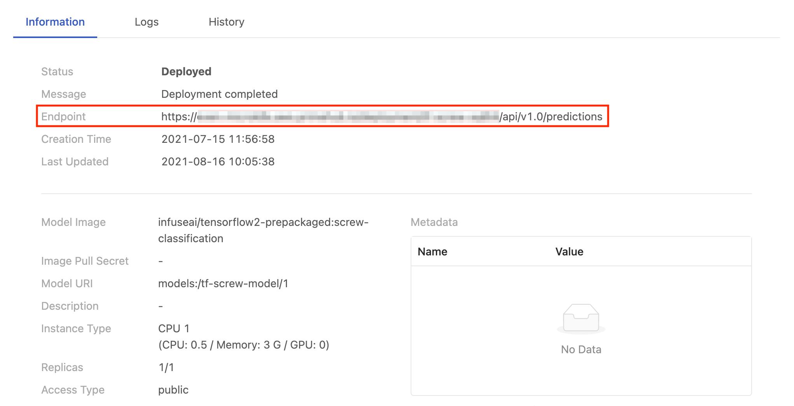
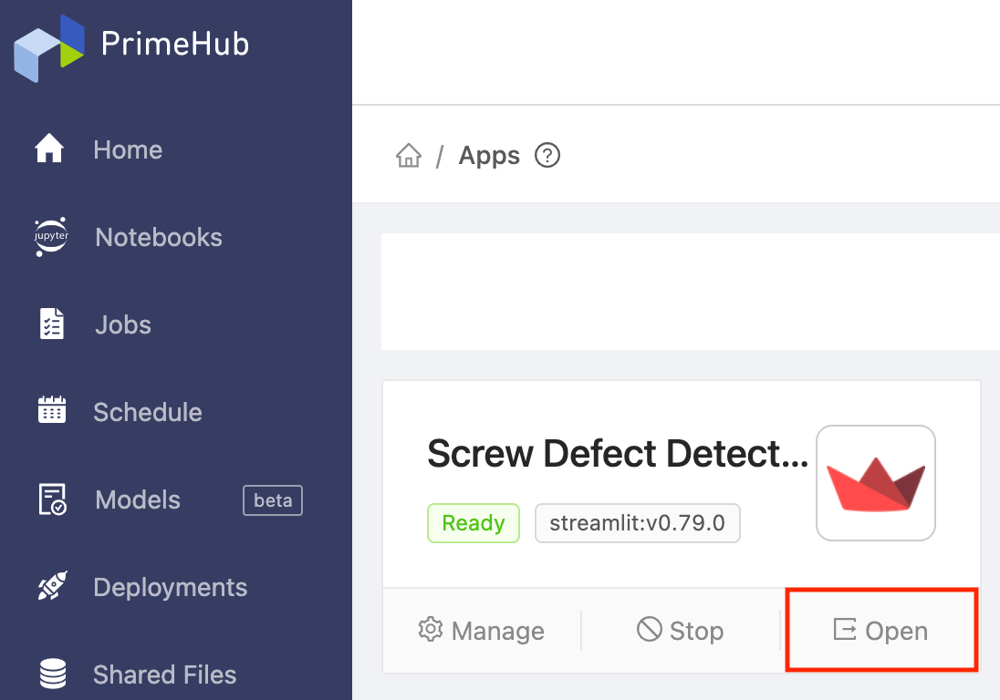

  
Enterprise
    Applicable to Enterprise Edition
  

 

In this tutorial, we will build a screw defect detection web app with the deployed model and [Streamlit](primehub-app-builtin-streamlit).

## Streamlit App

Download [tutorial_screw_app.py](assets/tutorial_screw_app.py) and upload it to `~/<group_name>/screw`. Replace the `endpoint` at line 6 with the deployed model endpoint in [3 - Manage, Compare, and Deploy the Model](primehub-end-to-end-tutorial-3).

Fill in `FILE_PATH` with `/project/phusers/screw/tutorial_screw_app.py`.

Open your web app when it is ready.

Upload screw images from the upper-left corner. Then, the inference results are shown in the right side. You can adjust the threshold of good or bad screw. Also, you can select the column size for the result.

## Summary

Congratulations! We have finished the tutorials!

In the [1 - Label Data](primehub-end-to-end-tutorial-1), we've used `Label Studio` installed in `PrimeHub Apps` to label the screw images.
- In addition to image data, `Label Studio` can also be beneficial to text, audio, and video data labeling.
- In `PrimeHub Apps`, it provides an easy way for setting up well-known applications for your team such as [Code Server](primehub-app-builtin-code-server), [Matlab](primehub-app-builtin-matlab), [Label Studio](primehub-app-builtin-label-studio), [MLflow](primehub-app-builtin-mlflow), and [Streamlit](primehub-app-builtin-streamlit). Allowing users to orchestrate data/tools for the acceleration of machine learning workflow.

In the [2 - Train and Tune the Model](primehub-end-to-end-tutorial-2), we've trained the model in `PrimeHub Notebooks` and submit entire notebook file as a parameterized job. Furthermore, the results of training job is logged to MLflow app for experiment tracking.
- With the feature of `submit notebook as job`, we can simply adjust instance type to gain more running resources, change image to make notebook execution on experimental environment, and even use different parameter specifications to achieve flexible parameter tuning.
- With configured `MLflow` app, we can easily perform `MLflow autologging` in `PrimeHub Notebooks` and `PrimeHub Jobs`. It makes every training execution can be parsed and collected so that we can review parameters, metrics, and artifacts of each training history.

In the [3 - Manage, Compare, and Deploy the Model](primehub-end-to-end-tutorial-3), we've made the best model to be version managed in `PrimeHub Model Management` and deployed it as an endpoint service in `PrimeHub Model Deployment`.
- In `Model Management`, the trained models can be version managed in different projects, frameworks, or any designated patterns. Users can reuse previous trained models, deploy the latest model to `Model Deployment`, and share the well-trained models across teams.
- In `Model Deployment`, we can customize model input/output in model image then deploy it in a cloud-ready environment. It is no need to prepare the infrastructure for model deployment purpose by yourself, PrimeHub will setup all required resources to ensure it can respond to requests anytime from everywhere.

In the [4 - Build the Web app](primehub-end-to-end-tutorial-4), we've made a screw defect detection web app with our best deployed model in `PrimeHub Apps`.
- With `Streamlit`, you can build web apps with trainee models easily. There a a bunch of apps can be done with Streamlit, such as internal tools for data feedback, data correction, model validation, etc.

With PrimeHub, you will experience a wonderful machine learning journey! Enjoy it!
