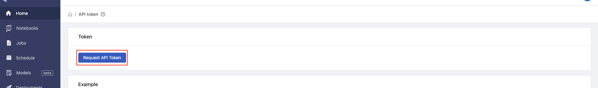

  
Enterprise
    Applicable to Enterprise Edition
  

## Introduction

If you want to run the jupyter notebook in the background, you can submit your PrimeHub Notebook to the Job, and then we can see the result after the Job is done.

## Input Parameters and API Access

Now that we have a runnable notebook to train the screw classification model, we can tweak parameter values and then submit our notebook as a job via the [PrimeHub Notebook Extension](ph-notebook-extension).

### Tweak Parameters

First, let's allow the editing of the `base_learning_rate` input parameter. This will enable us to submit jobs with a different learning rate and compare model accuracy.

Click the **Property Inspector** button.

Click **Add Tag** and enter **parameters** as the tag name, then click the **+** icon to add the tag. Adding this tag allows us to override the `base_learning_rate`.

### **Set up an API Token**

To submit the notebook as a job, we need to set up an [API Token](tasks/api-token).

Click on the **PrimeHub** dropdown menu in the toolbar, then click **API Token**.

In the pop-up dialog, you will see the message `Visit here to access your API token.` Click the **here** link in the pop-up dialogue, and the PrimeHub **API Token** page will open in a new tab.

On the **API Token** page, click the **Request API Token** button.

Click the **Copy** button to copy the API token to your clipboard.

Go back to your notebook, paste the API token into the text field, and click **OK**.

# **Submit Notebook Jobs**

With API access now configured, we can submit notebook jobs.

Click the **PrimeHub** dropdown in the toolbar again, but this time click **Submit Notebook as Job**.

In the pop-up dialog, we can adjust the following settings:

| Variable | Meaning | Value |
| --- | --- | --- |
| Instance Type | Adjust computational resources | CPU 2 |
| Image | Notebook environment | Tensorflow 2.5 with PrimeHub extension |
| Job Name | The job of name | tf-screw-training-lr-0.05 |
| Notebook Parameters | The parameters we can modify without changing the Notebook value. | base_learning_rate = 0.05 |

After you Submit the Job, you can see the following message.

You can click `view your job details here` to get the job information.

