<div class="label-sect">
  <div class="ee-only tooltip">Enterprise
    <span class="tooltiptext">Applicable to Enterprise Edition</span>
  </div>
</div>
<br>

This tutorial shows how to construct the end-to-end machine learning project life cycle in PrimeHub.

We have prepared the dataset for you. The dataset contains three folders:
1. `train/good` contains the perfect screw
1. `train/bad` contains the screw with some defects
1. `unlabeled` contains the screw images that are not yet labeled as good or bad screw 

We will use the images in `train/good` and `train/bad` as the training dataset and use Label Studio to label the images in `unlabeled` as the validation dataset.

## What we need?
- Enable [model deployment](model-deployment-feature) in your group.
- Enable [shared volume](guide_manual/admin-group#shared-volume) in your group.
- Configuration [model management](model-configuration) in your group.
- Add [notebook image](guide_manual/admin-image) `infuseai/docker-stacks:tensorflow-notebook-v2-4-1-dbdcead1`.
- Add [instance type](guide_manual/admin-instancetype) with 1 CPU and 3 GB memory at least.
- Create a [dataset](guide_manual/admin-dataset) named `screw` and add your group to writable groups.
- Please download the [tutorial_screw_dataset.zip](assets/tutorial_screw_dataset.zip), unload the zip file to the `~/datasets/screw` folder by the [notebook](quickstart/launch-project).
- Create a folder `/<group_name>/screw-labeled` in notebooks to save labels later.

Choose the notebook image and instance type based on `What we need?`. (If the notebook image or instance type is not existed, please request administrators for assistance.)

Please ignore the warning of large file size warning and upload the zip file. There will be a progress bar in the bottom.
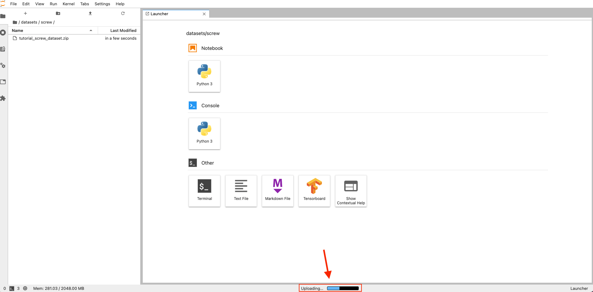

After the file uploaded, open a terminal in the `notebook`.
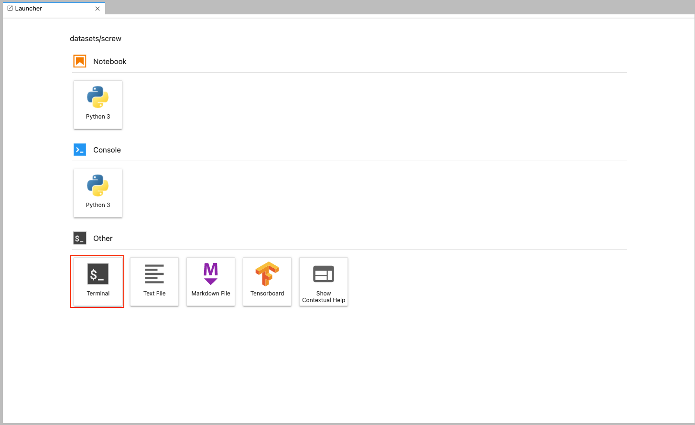

Type the following command:
```bash
cd ~/datasets/screw
unzip tutorial_screw_dataset.zip
rm tutorial_screw_dataset.zip
```

Now you can see there are folders `train/good`, `train/bad`, and `unlabeled` in `~/datasets/screw`.

Here are examples of good and bad screws. The first image is the good screw. The second image is the bad screw as you can see the there is a manipulated front.


## 1. Use Label Studio to Label Unlabeled Data

Install and login to the [App](primehub-app-tutorial-label-studio) of Label Studio.

Please click `Create` button and enter your project name. Skip the `Data Import` step and choose the `Labeling Setup`. Here we choose `Image Classification`.


Delete the original choices and add our own label classes: `good`, `bad`, then save it to create the proeject.


Go to `Settings -> Cloud Storage` to setup source and target storage.

`Add Source Storage` with following settings:
- Stroage Type: `Local files`
- Absolute local path: `/datasets/screw/unlabeled`
- File Filter Regex: `.*png`
- Turn on toggle of `Treat every bucket object as a source file`.

After added, click `Sync Storage`.

`Add Target Storage` with following settings:
- Stroage Type: `Local files`
- Absolute local path: `/project/<group_name>/screw-labeled`

The labeled results will be synced to the local path.

Back to the project in Label Studio. The images in the dataset has been shown and you can click `Label` to start labeling. (Tip: you can type keyboard numbers to select the class)


> After you labeled all images, you may see the following message. This is a known issue. Please click `OK`, click your project name and refresh the page.
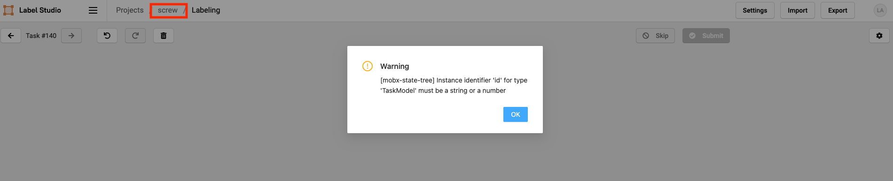

Now you have labeled all data by the label studio. We can go back to our [notebook](quickstart/launch-project) to train the model.

## 2. Train the Model

Please download the notebook file [tutorial_screw_train.ipynb](assets/tutorial_screw_train.ipynb), which trains a model to classify the good or bad screw. Then, go to PrimeHub [notebook](quickstart/launch-project), upload it to `~/<group_name>/screw-train` based on the similar steps of uploading the zip file in `What we need?`.

There is one cell need to be modified in the notebook file. In the second code cell, please replace the `<group_name>` with your group name. `dir_path` is the target storage of the labeled results that we labeled in the previous step. We use these new labeled data as the validation dataset.

After modified that cell, you can run all cells in the notebook. It uses the mobilenet as the pre-trained model and uses it's outputted feature vector to classify the screw quality.

We can see that we achieve around 90% of accuracy both in training and the validation dataset after training.

## 3. Send Notebook as Job for Parameter Tuning

Now, we have a runnable notebook to train the screw classification model.

Next, we can access [PrimeHub Notebook Extension](ph-notebook-extension) to submit our notebook as job to perform parameters tuning.

Let's configure the learning rate to see how model accuracy can be better!

Click on the `cell 18` with default `base_learning_rate` configured.
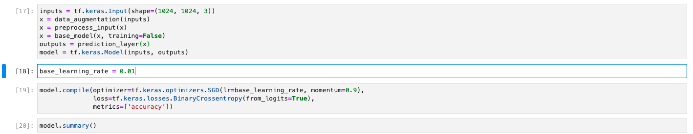

Click on `Property Inspector` button.
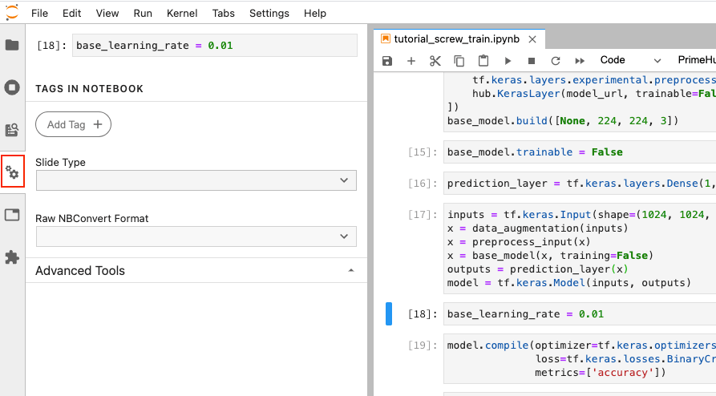

Click on `Add Tag`, fill in `parameters`, and click on `+` icon. This makes the feed parameters to overwrite the `base_learning_rate`.
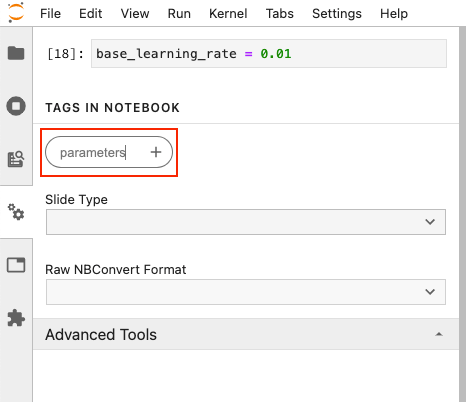

Click on PrimeHub button to expand extension menu, we need to setup [API Token](tasks/api-token) at first.
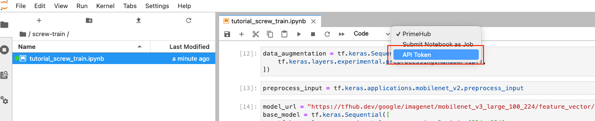

Back to PrimeHub UI, select `API Token` from the top-right menu.
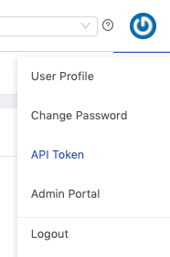

Click on `Request API Token` button.


After the API token displayed, click on `Copy` to store our token value.


Back to notebooks, click on PrimeHub button and select `API Token`.


We can paste our token here then click on `OK` button.
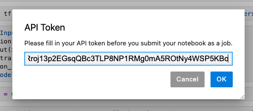

Next, click on PrimeHub button and select `Submit Notebook as Job`.

In the pop-up dialog, we can adjust instance type to gain more running resources, or we can adjust image to make notebook execution on different environment. Here is the settings: 
- Instance Type: default value
- Image: default value
- Job Name: `tf-screw-training-lr-0.01`.
- Notebook Parameters: `base_learning_rate = 0.01`

Click on `Submit` to start training with `base_learning_rate = 0.01`.
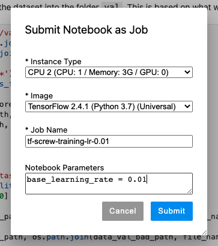

Again, click on PrimeHub button and select `Submit Notebook as Job`. Let's submit another training with `base_learning_rate = 0.05` with following settings:
- Instance Type: default value
- Image: default value
- Job Name: `tf-screw-training-lr-0.05`.
- Notebook Parameters: `base_learning_rate = 0.05`

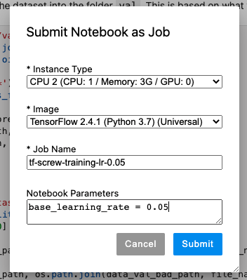

Back to PrimeHub UI, select `Jobs` page to check our two submitted jobs are succeeded now!
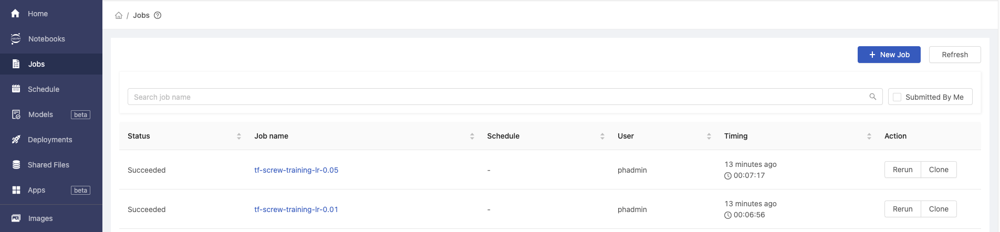

## 4. Model Management (Choose Best Model)
With the `Submit Notebook as Job` feature, we can set multiple variables combination to fine-tune our model. 

After all submitted jobs completed, we now select [Models](model-management) in PrimeHub UI.

In the `Models` page, click on the `MLflow UI` button.


In the MLflow UI, switch to `Experiments` tab.


Select our specified experiment name `tutorial_screw_train`.


It shows all runs in `tutorial_screw_train` experiment, now check our two executed run and click on `Compare` button.


We will be directed to page that comparing 2 runs' parameters and metrics. We analyzed these 2 runs and found the `base_learning_rate=0.01` can perform better results.


Thus, we click on its Run ID: `b353b109a79b4ba0ab4dadc3da4a1b03`.


Both parameters, metrics, and artifacts of this run can be found in this page.


Scroll down to the artifacts section. Click on the `exported model` and `Register Model` button.


In the model selector, choose `Create New Model`.


Fill in model name with `tf-screw-model` and click on `Register` button.


We can see our model is successfully registered as `version 1`.


Back and refresh the models page in the PrimeHub UI, now we can see our model `tf-screw-model` is managed in model list.


## 5. Customize Model Server Image

Now, we have registered current best model in Model Management. To deploy the managed model, we need to setup the pre-packaged model image to be runnable container environment.

Use the [Tensorflow2 Prepackaged Model Server](https://github.com/InfuseAI/primehub-seldon-servers/tree/master/tensorflow2) as template of pre-packaged model image.

```bash
git clone https://github.com/InfuseAI/primehub-seldon-servers.git
cd tensorflow2/
```

We can edit [tensorflow2/Model.py](https://github.com/InfuseAI/primehub-seldon-servers/blob/master/tensorflow2/tensorflow2/Model.py) to meet our input data requirements.

Original template
```python
def predict(self, X, feature_names = None, meta = None):
    ...
    if isinstance(X, bytes):
        img = Image.open(BytesIO(X))
        img = np.array(img).astype(np.float32)
        X = np.copy(img)
        X /= 255.0
        X = np.expand_dims(X, axis=0)
    ...
```

Ours
```python
def predict(self, X, feature_names = None, meta = None):
    ...
    if isinstance(X, bytes):
        img = Image.open(BytesIO(X))
        img = np.array(img).astype(np.float32)
        img = np.stack((img,)*3, axis=-1)
        X = np.expand_dims(img, axis=0)
    ...
```

The `np.stack((img,)*3, axis=-1)` can convert a grayscale input image to a 3-channel image, making it able to fit the shape of model input layer.

After edited the `Model.py`, let's execute following command to build the pre-packaged model image.

```bash
docker build . -t tensorflow2-prepackaged
```

Execute `docker images` to check the built image.

```bash
REPOSITORY                TAG          IMAGE ID       CREATED        SIZE
tensorflow2-prepackaged   latest       689530dd1ef9   3 minutes ago  1.67GB
```

Next, tag the built image based on your docker registries, we added `screw-classification` tag to this image and used `Docker Hub` to store image.

```bash
docker tag tensorflow2-prepackaged:latest infuseai/tensorflow2-prepackaged:screw-classification
```

Then push to docker registry.

```bash
docker push infuseai/tensorflow2-prepackaged:screw-classification
```

## 6. Model Deployment

Now, we have prepared the trained model in PrimeHub Model Management and pushed the customized pre-packaged model image to Docker Hub.

Let's continue to deploy our model!

Back to `Models` page, click on our managed model name `tf-screw-model`.


It shows all versions of `tf-screw-model`, let's click on the `Deploy` button of `Version 1`.


In the deployment selector, choose the `Create new deployment` and click on `OK` button.


We will be directed to [Create Deployment](model-deployment-feature#create) page. And the `Model URI` field will be auto fill-in with registered model scheme (`models:/tf-screw-model/1`).


Next,

1. Fill in deployment name with `tf-screw-deployment`.
2. Fill in model image with `infuseai/tensorflow2-prepackaged:screw-classification`; this is our customized pre-packaged model image that can serve the trained screw model.


Choose the instance type, the minimal requirements in this tutorial is `CPU: 0.5 / Memory: 1 G / GPU: 0`.


Then, click on `Deploy` button.

Our model is deploying, let's click on the `tf-screw-deployment` cell.


In the [deployment detail](model-deployment-feature#deployment-detail) page, we can see the status is `Deploying`.


Wait for a while and our model is `Deployed` now!

We can view some detailed information, now let's copy the value of `Endpoint` (`https://.../predictions`) to test our deployed model!


Replace `${YOUR_ENDPOINT_URL}` with your `Endpoint` value in the following block.

```bash
curl -F 'binData=@path/to/image' ${YOUR_ENDPOINT_URL}
```

Then copy the entire block to the terminal for execution, and we are sending exact image as request data.

- Example of request data

    ```bash
    curl -F 'binData=@val/good/000.png' https://xxx.primehub.io/deployment/tf-screw-deployment-xxxxx/api/v1.0/predictions
    ```
    

- Example of response data
    ```bash
    {"data":{"names":["t:0"],"tensor":{"shape":[1,1],"values":[2.065972089767456]}},"meta":{"requestPath":{"model":"infuseai/tensorflow2-prepackaged:screw-classification"}}}
    ```
    The `positive` return value represented as `good` screw; and the `negative` return value represented as `bad` screw.

    Therefore, the return value `2.065972089767456` indicated that the requested screw image is a good screw!

Congratulations! We have trained the model in Notebooks, fine-tuned the model in Jobs, versioned the trained model in Model Management, and further deploy it as an endpoint service in Model Deployment. Making it able to respond to requests anytime from everywhere.
