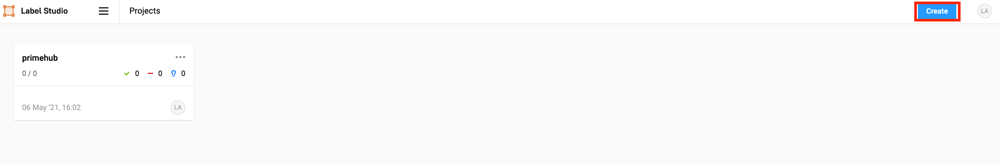
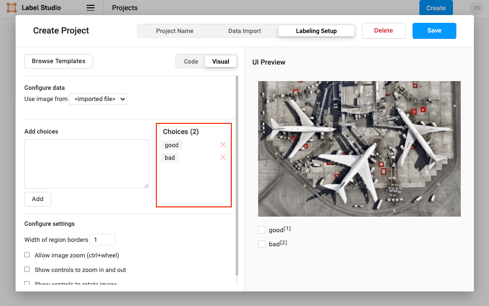
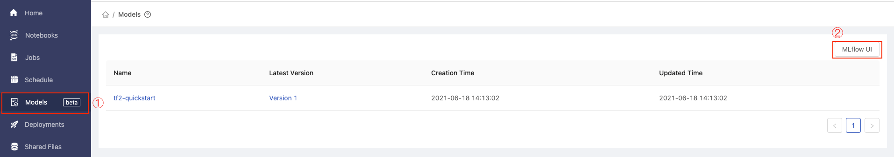
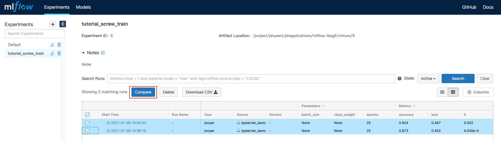
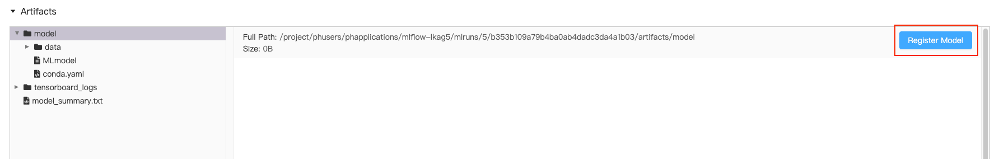
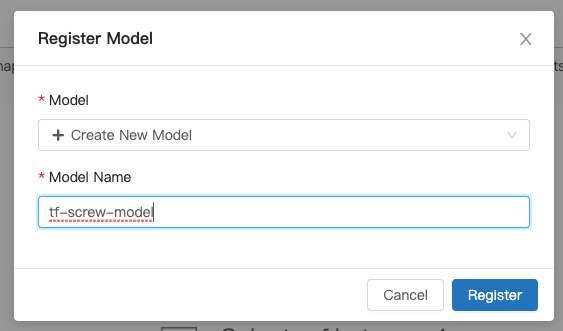
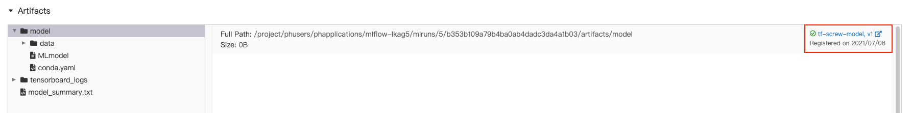
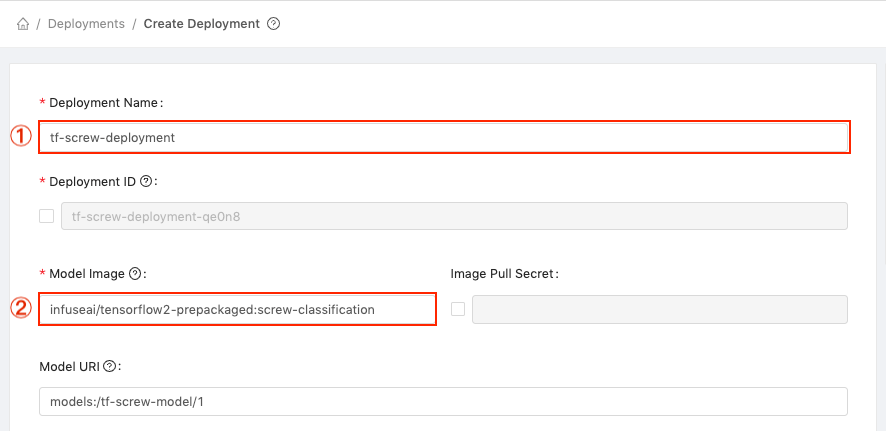
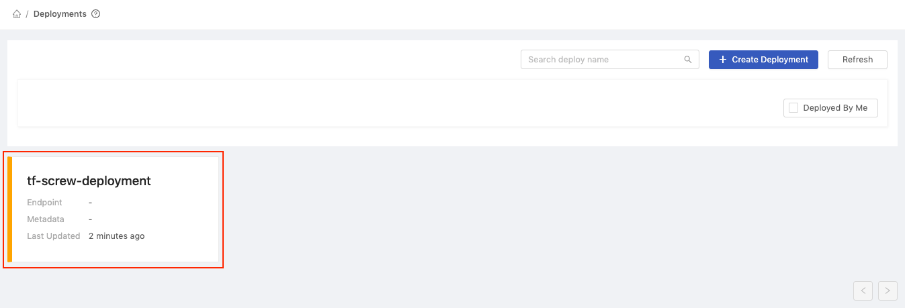
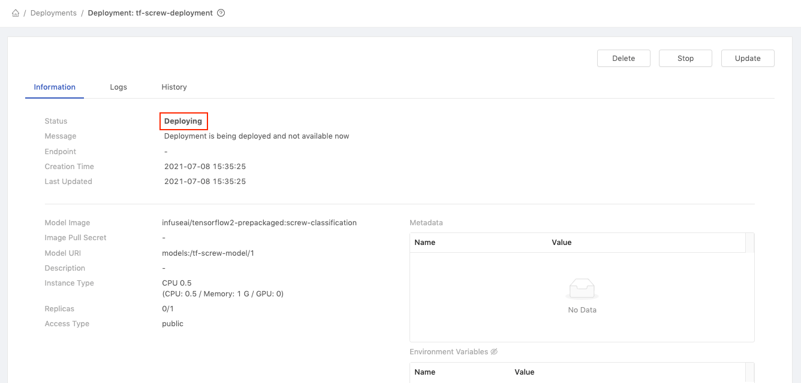

<div class="label-sect">
  <div class="ee-only tooltip">Enterprise
    <span class="tooltiptext">Applicable to Enterprise Edition</span>
  </div>
</div>
<br>

This tutorial shows how to use PrimeHub functions to do the end-to-end machine learning project life cycle.

We have prepared the dataset for you. The dataset contains three folders. `train/good` folder contains the perfect screw. `train/bad` folder contains the screw with some defects. `unlabeled` folder contains the screw images that are not yet labeled as good or bad screw. We will use the `train/good` and `train/bad` folder as our model's training dataset. And use label studio to label the images under the `unlabeled` folder and use it as our model's validation dataset.

## Prepare Dataset

Create a [dataset](guide_manual/admin-dataset) in PrimeHub called `screw`, and set the read/write permission to your group. (If you don't have permission to create the dataset in PrimeHub, please request administrators for assistance.)

## What we need?
- The image `infuseai/docker-stacks:tensorflow-notebook-v2-4-1-dbdcead1`
- An instance type >= minimal requirement (CPU=1, GPU=0, Mem=3G)

Please download the [tutorial_screw_dataset.zip](assets/tutorial_screw_dataset.zip), unload the zip file to the `~/datasets/screw` folder by the [notebook](quickstart/launch-project). Choose the notebook image and instance type based on `What we need?`. (If the image or instance type is not existed in the UI, please request administrators for assistance.)

You might see the large file size warning. Please just upload the zip file. And there will be a upload progress bar in the bottom. Wait the progress bar completed.
    

Open a terminal in the `notebook`.
    

Type the following command:
```bash
cd ~/datasets/screw
unzip tutorial_screw_dataset.zip
rm tutorial_screw_dataset.zip
```

In the `~/datasets/screw`, you can see there are folders `train/good`, `train/bad`, `unlabeled` now.

## 1. Use Label Studio to Label Unlabeled Data

Install and login to the [App](primehub-app-tutorial-label-studio) of label studio.

After login, please click `Create` button. Enter your `Project Name`. Skip the `Data Import` step. And choose the `Labeling Setup`. Here we choose `Image Classification`.
    

Delete the original `Labels` settings and `Add` our own label classes: `good`, `bad`.
    

Click the `Settings` on the upper-right. Click `Cloud Storage` and `Add Source Storage` to sync the `/datasets/screw/unlabeled` data to label. Set `Local path` to `/datasets/screw/unlabeled`, set `File Filter Regex` to `.*png`, turn on toggle of `Treat every bucket object as a source file`. After added, click `Sync Storage`.

Click `Add Target Storage` to sync to labeled results to `/project/<group_name>/screw-labeled`. Choose `Local path` and you need to set `Local path` to `/project/<group_name>/screw-labeled`.

Back to the project in Label Studio. The data in the dataset has been shown on the UI. And you can click `Label` to start labeling. (Tip: you can type keyboard numbers to select the class)
    

> After you labeled all images, you may see the following message. This is a known issue. Please click `OK`, click your project name and refresh the page.
    

Now you have labeled all data by the label studio. We can go back to our [notebook](quickstart/launch-project) to train the model.

## 2. Train the Model

We provide the prepared notebook file [tutorial_screw_train.ipynb](assets/tutorial_screw_train.ipynb) to train the model to classify the good or bad screw.

Here are examples of good and bad screws. The first image is the good screw. The second image is the bad screw and you can see the there is a manipulated front.


Back to PrimeHub [notebook](quickstart/launch-project) based on `What we need?` in the `Prepare Dataset` section and upload the `tutorial_screw_train.ipynb` to the `~/<group_name>/screw-train` folder.

There is one cell need to be modified in the notebook file. In the second code cell, please replace the `<group_name>` into your real group name. And that is the folder location of the labeled results that we labeled in the previous step. We use these new labeled data as our validation dataset.

After modified that cell, you can run all cells in the notebook. It uses the mobilenet as the pre-trained model and uses it's outputted feature vector to classify the screw quality.

We can see that we achieve around 90% of accuracy both in training and the validation dataset after training.

## 3. Send Notebook as Job (Tuning: learning_rate)

Now, we have a runnable notebook to train the screw classification model.

Next, we can access PrimeHub Notebook Extension to submit our notebook as job to perform parameters tuning.

Let's configure the learning_rate to see how model accuracy can be better!

Click on the cell 18 with default learning_rate configured.


Click on `Property Inspector` button.


Click on Add Tag, fill in `parameters`, and click on + icon. This making the feed parameters can be changed to the learning_rate.


Click on PrimeHub button to expand extension menu, we need to setup API Token at first.


Back to PrimeHub UI, select API Token from the top-right menu.


Click on Request API Token button.


After the API token displayed, click on Copy button to store our token value.


Back to Notebooks, click on PrimeHub button and select API Token.


We can paste our token here then click on OK button.


Next, click on PrimeHub button and select Submit Notebook as Job.

In the pop-up dialog, we can adjust Instance Type to gain more running resources, or we can adjust Image to make notebook execution on different environment. Here, we left both the Instance Type and Image are default selected.

Fill in the `Job Name` field with `tf-screw-training-lr-0.01`.

Fill in the `Notebook Parameters` field with `base_learning_rate = 0.01`.

Click on Submit button to start training with base_learning_rate = 0.01.


Again, click on PrimeHub button and select Submit Notebook as Job.

This time we will set base_learning_rate to 0.05.

Fill in the `Job Name` field with `tf-screw-training-lr-0.05`.

Fill in the `Notebook Parameters` field with `base_learning_rate = 0.05`.

Click on Submit button to start training with base_learning_rate = 0.05.


Back to PrimeHub UI, select Jobs page to check our two submitted jobs are succeeded now!


## 4. Model Management (Choose Best Model)
With the Submit Notebook as Job feature, we can set multiple variables combination to fine-tune our model. 

After all submitted jobs completed, we now select `Models` in PrimeHub UI.

In the `Models` page, click on the `MLflow UI` button.


In the MLflow UI, switch to `Experiments` tab.


Select our specified experiment name `tutorial_screw_train`.


It shows all runs in `tutorial_screw_train` experiment, now check our two executed run and click on Compare button.


We will be directed to page that comparing 2 runs' parameters and metrics. We analyzed these 2 runs and found the learning_rate=0.01 can perform better results.


Then, we click on its Run ID: b353b109a79b4ba0ab4dadc3da4a1b03.


Both parameters, metrics, and artifacts of this run can be found in this page.


Scroll down to the Artifacts section. Click on the exported model and Register Model button.


In the model selector, choose the Create New Model.


Fill in the [Model Name] field with [tf-screw-model] and click on Register button.


We can see our model is successfully registered as version 1.


Back and refresh the models page in the PrimeHub UI, now we can see our model tf-screw-model is managed in model list.


## 5. Customize Model Server Image

Now, we have registered current best model in Model Management. To deploy the managed model, we need to setup the pre-packaged model image to be runnable container environment.

Use the [Tensorflow2 Prepackaged Model Server](https://github.com/InfuseAI/primehub-seldon-servers/tree/master/tensorflow2) as template of pre-packaged model image.

```bash
git clone https://github.com/InfuseAI/primehub-seldon-servers.git
cd tensorflow2/
```

We can edit [tensorflow2/Model.py](https://github.com/InfuseAI/primehub-seldon-servers/blob/master/tensorflow2/tensorflow2/Model.py) to meet our input data requirements.

Original template

```python
def predict(self, X, feature_names = None, meta = None):
    ...
    if isinstance(X, bytes):
        img = Image.open(BytesIO(X))
        img = np.array(img).astype(np.float32)
        X = np.copy(img)
        X /= 255.0
        X = np.expand_dims(X, axis=0)
    ...
```

Ours

```python
def predict(self, X, feature_names = None, meta = None):
    ...
    if isinstance(X, bytes):
        img = Image.open(BytesIO(X))
        img = np.array(img).astype(np.float32)
        img = np.stack((img,)*3, axis=-1)
        X = np.expand_dims(img, axis=0)
    ...
```

the `np.stack((img,)*3, axis=-1)` can convert a grayscale input image to a 3-channel image, making it able to fit the shape of model input layer

After edited the Model.py, let's execute following command to build the pre-packaged model image.

```bash
docker build . -t tensorflow2-prepackaged
```

Execute `docker images` to check the built image.

```bash
REPOSITORY                TAG          IMAGE ID       CREATED        SIZE
tensorflow2-prepackaged   latest       689530dd1ef9   3 minutes ago  1.67GB
```

Next, tag the built image based on your docker registries, we added screw-classification tag to this image and used Docker Hub to store image.

```bash
docker tag tensorflow2-prepackaged:latest infuseai/tensorflow2-prepackaged:screw-classification
```

Then push to docker registry.

```bash
docker push infuseai/tensorflow2-prepackaged:screw-classification
```

## 6. Model Deployment

Now, we have prepared the trained model in PrimeHub Model Management and pushed the customized pre-packaged model image to Docker Hub.

Let's continue to deploy our model!

Back to Models page, click on our managed model name tf-screw-model.


It shows all versions of tf-screw-model, let's click on the Deploy button of Version 1.


In the deployment selector, choose the Create new deployment and click on OK button.


We will be directed to Create Deployment page. And the Model URI field will be auto fill-in with registered model scheme (models:/tf-screw-model/1).


Next,

1. Fill in the [Deployment Name] field with [tf-screw-deployment].
2. Fill in the [Model Image] field with [infuseai/tensorflow2-prepackaged:screw-classification]; this is our customized pre-packaged model image that can serve the trained screw model.


Choose the Instance Type, the minimal requirements in this tutorial is CPU: 0.5 / Memory: 1 G / GPU: 0.


Then, click on `Deploy` button.

Our model is deploying, let's click on the `tf-screw-deployment` cell.


In the deployment detail page, we can see the Status is Deploying.


Wait for a while and our model is `Deployed` now!

We can view some detailed information, now let's copy the value of `Endpoint` (`https://.../predictions`) to test our deployed model!


Replace the ${YOUR_ENDPOINT_URL} with the copied `Endpoint` value in the following block.

```bash
curl -F 'binData=@path/to/image' ${YOUR_ENDPOINT_URL}
```

Then copy the entire block to the terminal for execution, and we are sending exact image as request data.

- Example of request data

    ```bash
    curl -F 'binData=@val/good/000.png' https://xxx.primehub.io/deployment/tf-screw-deployment-xxxxx/api/v1.0/predictions
    ```
    

- Example of response data
    ```bash
    {"data":{"names":["t:0"],"tensor":{"shape":[1,1],"values":[2.065972089767456]}},"meta":{"requestPath":{"model":"infuseai/tensorflow2-prepackaged:screw-classification"}}}
    ```
    The positive return value represented as good screw; and the negative return value represented as bad screw.
    
    Therefore, the return value `2.065972089767456` indicated that the requested screw image is a good screw!

Congratulations! We have trained the model in Notebooks, fine-tuned the model in Jobs, versioned the trained model in Model Management, and further deploy it as an endpoint service in Model Deployment. Making it able to respond to requests anytime from everywhere.

