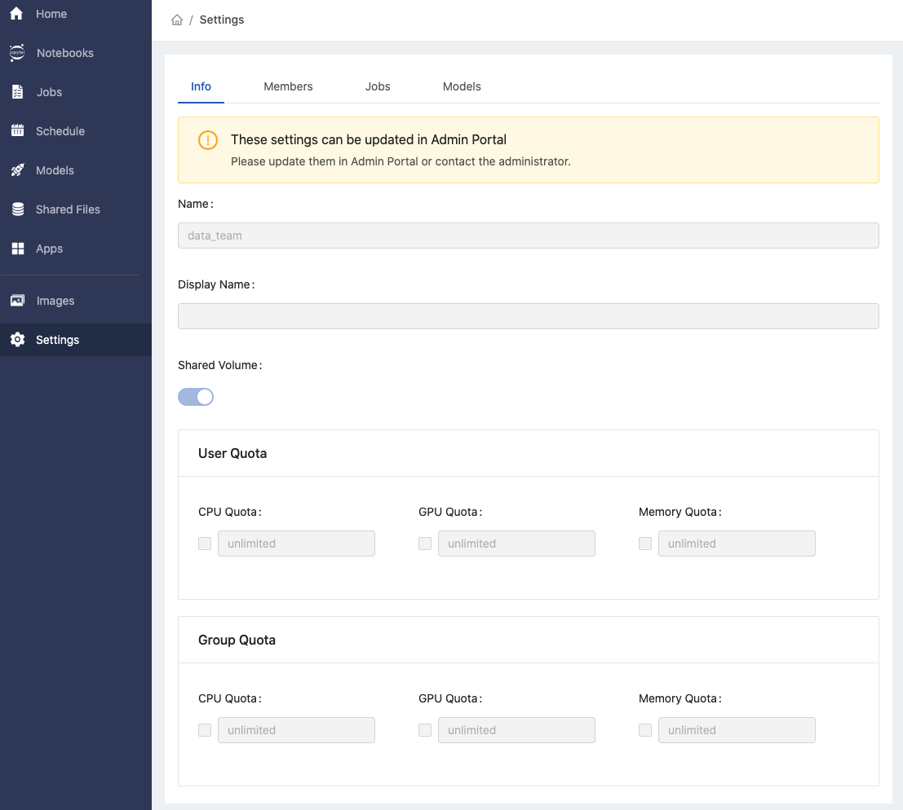

> 3.5 Release Candidate Note

## 🌟 &NonBreakingSpace; What's New

### PrimeHub Apps

+ [Document](primehub-app)

### Group Dashboard

### Group Settings

+ [Document](group-setting)

## 🚀 &NonBreakingSpace; Improvements

## 🧰 &NonBreakingSpace; Bug Fixes

## 💫 &NonBreakingSpace; More Things

+ [Build RStudio binder (repo2docker) image](tasks/repo2docker#example-rstudio-binder)

---

## 🎪 &NonBreakingSpace; In the Community

+ [PrimeHub Community Edition v3.5](https://github.com/InfuseAI/primehub/releases) &neArr;

+ [MLOps Taiwan x Facebook](https://www.facebook.com/groups/mlopstw/) &neArr;

+ [InfuseAI x Youtube](https://www.youtube.com/channel/UCbbRUfqKPWfZxZY62Pian-g) &neArr;
