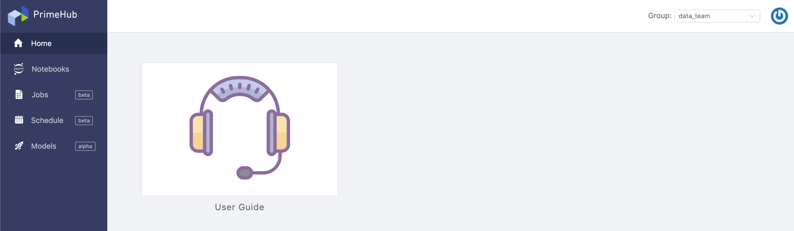
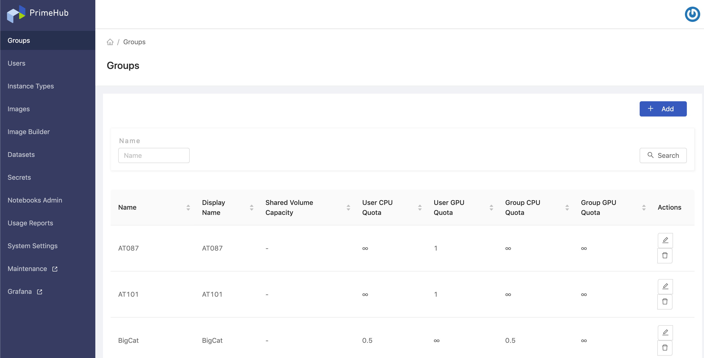

## 🌟 What's New

We are glad to announce our **PrimeHub v3.0** release. **PrimeHub v3.0** has a whole new ML user experience base on the **Group-Context** concept that ML users specify a current working project-group prior to any rest of operations. All of operations are performed within the working project-group. It is much different with the past PrimeHub v2 and it allows users to focus on the current project-group intuitively.

+ [Usage Reports Feature](guide_manual/admin-report) allows admin to have monthly reports of allocated resources usage.
  
## 🦄 Breaking Changes

+ Two portals, [User Portal](quickstart/login-portal-user) and [Admin Portal](quickstart/login-portal-admin), different entrances to different role-based features.
+ **Notebooks Admin** feature, **Maintenance** feature and **Grafana** link are merged into Admin Portal.
  

+ Deprecated the **Launch Group Only** of Dataset.

## 🚀 Improvements

+ Support default value of storageClass
+ Metacontroller and Keycloak are included in PrimeHub Chart
+ Support Rook rgw
+ **JupyterHub** feature is renamed to `Notebooks`
+ **JupyterHub Admin** feature is renamed to `Notebooks Admin`
+ **System** feature is renamed to `System Settings`

## 🧰 Bug fixes

+ Fixed env dataset contain invalid characters.
+ Fixed log component isn't synchronized with latest logs.
  
---

## 🎪 In the Community

+ [PrimeHub CE v3.0 (Community Edition) Release](https://github.com/InfuseAI/primehub/releases)

+ [PrimeHub CE v3.0 installation scenario on Katacoda](https://www.katacoda.com/infuseai)
