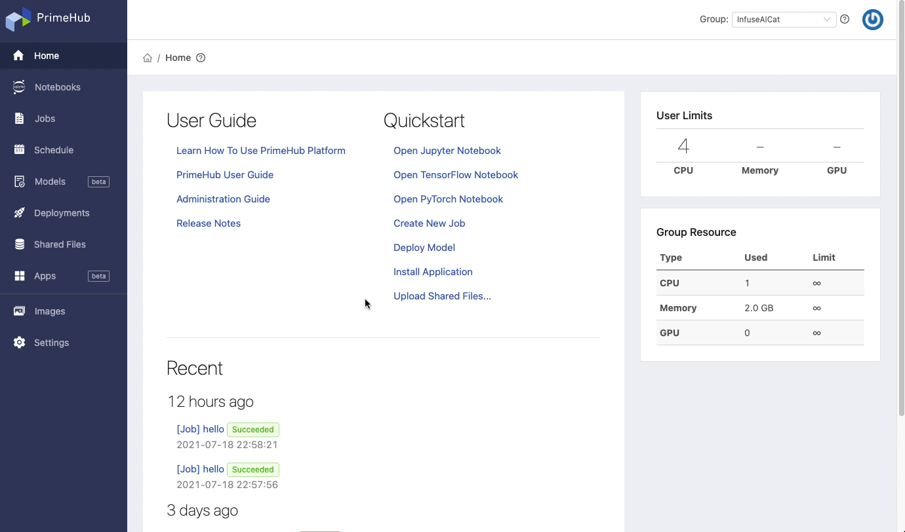
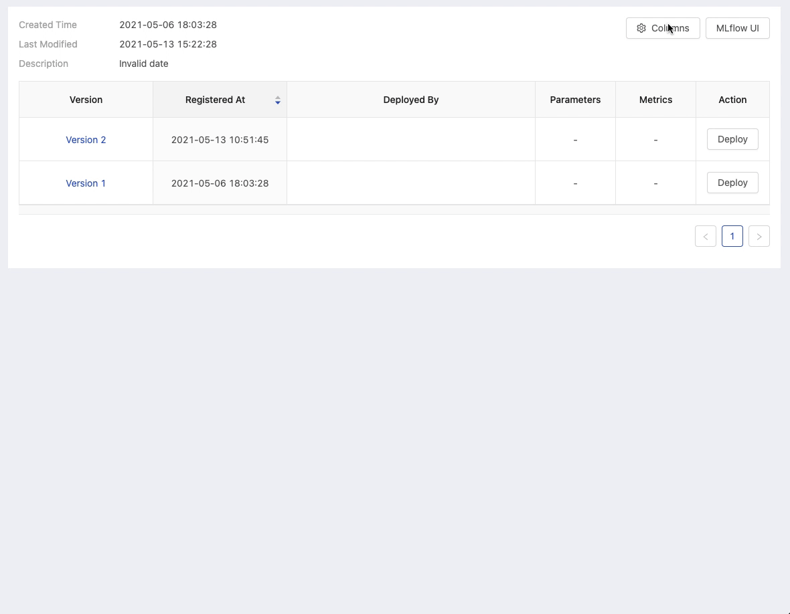

## 🌟 &NonBreakingSpace; What's New

## ❣️ &NonBreakingSpace; Breaking Changes

## 🚀 &NonBreakingSpace; Improvements

+ NFS support by [Model URI](model-deployment-model-uri)

+ To learn what the deployment is for from its ID, now you can name the Deployment ID you want.

+ TensorFlow or PyTorch is frequently used!? Use *Open TensorFlow Notebook* and *Open PyTorch Notebook* quick-launch next time.
  
  

+ Display selected parameters and metrics of a model

  

## 🧰 &NonBreakingSpace; Bug Fixes

## 💫 &NonBreakingSpace; More Things

---

## 🎪 &NonBreakingSpace; In the Community

+ [PrimeHub Community Edition v3.6](https://github.com/InfuseAI/primehub/releases) &neArr;

+ [Ways of doing ML](https://waysof.ml) &neArr;

+ [MLOps.toys](https://mlops.toys/) &neArr;

+ [MLOps Taiwan x Facebook](https://www.facebook.com/groups/mlopstw/) &neArr;

+ [InfuseAI x Youtube](https://www.youtube.com/channel/UCbbRUfqKPWfZxZY62Pian-g) &neArr;
