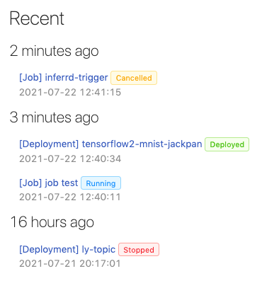

## 🌟 &NonBreakingSpace; What's New

### Overview models params and metrics

  Wondering what makes performance of models varied in versions? Parameters and metrics may show you clues. Selecting parameters and metrics of versioned models to have an overview of differences easily.

  

### Deployment quota per group

  Certain groups use out the license-permitted quota of deployments without the awareness? It won't happen again, administrators, now, can set the limit per group to prevent it.

  

## 🚀 &NonBreakingSpace; Improvements

+ Improve the view component experience of log used by Job, Deployment, Custom Image

### Customizable deployment ID

  Wanted to learn what the deployment is for from its ID? Now you can name the Deployment ID you want to make it self-described.

  

### Quickstart tutorials notebook

  New to PrimeHub? No worries, Just click *Open TensorFlow Notebook* or *Open PyTorch Notebook* to have a Getting-started tutorial Notebook on your demand.
  
  

  

### Colorful status label

  Our World is colorful, so PrimeHub is. We color recent activities to indicate different status.
  
  

### Deployment deletion prompt

  Accidentally delete an deployment without carefulness? Now you have to confirm it is a conscious deletion.
  
  

### NFS support

  NFS is supported by [Model URI](model-deployment-model-uri)

  

## 🧰 &NonBreakingSpace; Bug Fixes

- Fixed: Jupyter notebook is stuck at progress page when spawning
- Fixed: Models shows blank and deployments can't be started after stopping the MLflow server
- Fixed: Wrong string formatting in pop-up while stopping App
- Fixed: Notebook is opened as an embedded page
- Fixed: Notebook spawning progress bar display abnormally
- Fixed: UI staying in Deploying when creating a Deployment, but the pods are running, endpoints are accessible

## 💫 &NonBreakingSpace; More Things

+ License-permitted deployment quota only considers *running* deployments instead of created deployments.

+ PrimeHub Apps of *Community Edition* provides `Public` scope only in terms of `Access Scope`.
  
  
  
+ PrimeHub-Install tool supports `./primehub-install usage` to check the current Kubernetes resources usage.

+ Quick-access to API Token generation page from PrimeHub Notebook Extension

  

+ [A complete tutorial - from training to serving: Construct the end-to-end machine learning project life cycle in PrimeHub with Label Studio](primehub-end-to-end-tutorial-1)

---

## 🎪 &NonBreakingSpace; In the Community

+ [PrimeHub Community Edition v3.7](https://github.com/InfuseAI/primehub/releases) &neArr;

+ [Ways of doing ML](https://waysof.ml) &neArr;

+ [MLOps.toys](https://mlops.toys/) &neArr;

+ [MLOps Taiwan x Facebook](https://www.facebook.com/groups/mlopstw/) &neArr;

+ [InfuseAI x Youtube](https://www.youtube.com/channel/UCbbRUfqKPWfZxZY62Pian-g) &neArr;
