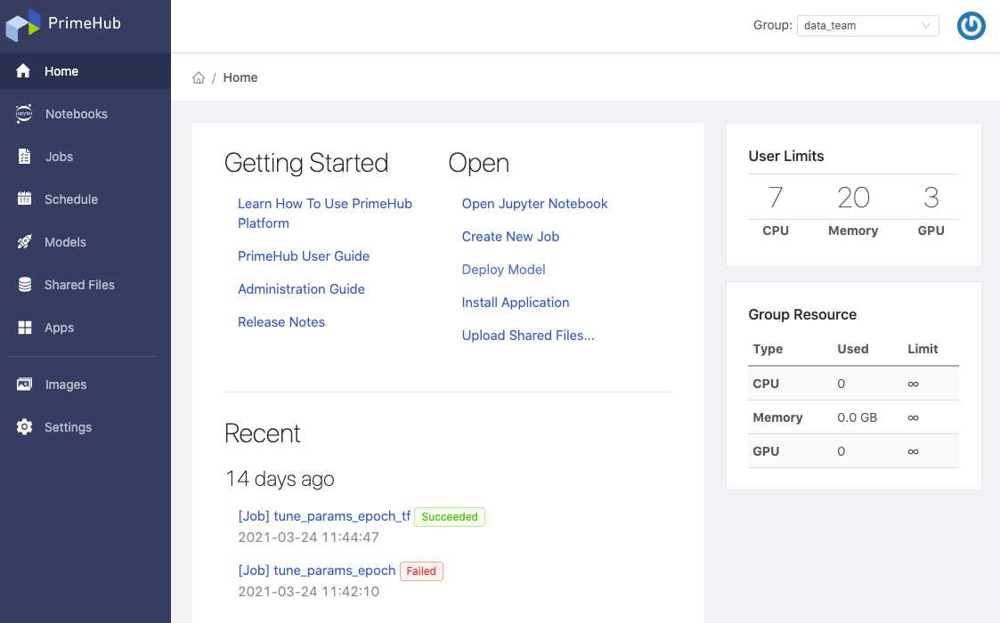

> 3.5 Release Candidate Note

## 🌟 &NonBreakingSpace; What's New

### PrimeHub Apps (Alpha)

Nowadays there are more and more data/tool in ML ecosystem, PrimeHub as a platform would like to provide the capability that scientists are able to integrate 3rd-party tools with PrimeHub and orchestrate these tools for the acceleration of projects. By the reason, we introduce PrimeHub Apps (Alpha).

+ [Document](primehub-app)

### Group Dashboard

Home page is renovated and is introduced a dashboard where user can have a quick access to documents, features and have a quick-view of recent activities, furthermore, have the knowledge of current computing resources utilization of this group.

+ [Document](quickstart/login-portal-user)

### Group Settings

Group Admin now can view settings configured by Platform Admin for the managed group.

+ [Document](group-setting)

## 🚀 &NonBreakingSpace; Improvements

+ Removed **Default Timeout Setting** from *Admin Portal/Groups*.

## 🧰 &NonBreakingSpace; Bug Fixes

## 💫 &NonBreakingSpace; More Things

+ [Build RStudio binder (repo2docker) image](tasks/repo2docker#example-rstudio-binder)

---

## 🎪 &NonBreakingSpace; In the Community

+ [PrimeHub Community Edition v3.5](https://github.com/InfuseAI/primehub/releases) &neArr;

+ [MLOps Taiwan x Facebook](https://www.facebook.com/groups/mlopstw/) &neArr;

+ [InfuseAI x Youtube](https://www.youtube.com/channel/UCbbRUfqKPWfZxZY62Pian-g) &neArr;
