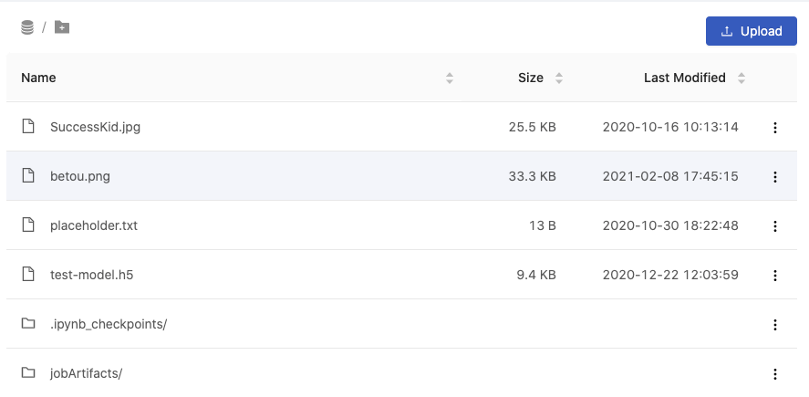

> 3.4 Release Candidate Note

## 🌟 &NonBreakingSpace; What's New

### Build Custom Image

Group administrators can now build new custom images for their managed groups. From the Images tab, they can create custom images by installing packages to already existing base images.

+ [Document](group-image)

### Shared File: Browse

Want to share your project files with your group-mate? Wish to share and find your group files in one place? You can now visit the Shared Files tab in PrimeHub and browse through, view, and download your groups' project files.

+ [Document](shared-files)

## 🚀 &NonBreakingSpace; Improvements

### Real-time resource dashboard update

System administrators can gain more insight with their Grafana dashboard. Instead of only seeing the status per node and GPU, system administrators now have an overall view of what the current resource utilization and GPU allocation per node is.

### Reuse installed packages

In addition to using group-shared images, users can now follow an instruction to reuse installed packages in jobs and notebook environments more easily.

+ [Document](tasks/customize-job-runtime)

## 🧰 &NonBreakingSpace; Bug Fixes

## 💫 &NonBreakingSpace; One More Thing

### MATLAB image

We provide PrimeHub-compatible MATLAB environment image to public. See [How to launch MATLAB environment on PrimeHub](tasks/matlab-img).

---

## 🎪 &NonBreakingSpace; In the Community

+ [PrimeHub Community Edition v3.4](https://github.com/InfuseAI/primehub/releases) &neArr;

+ [MLOps Taiwan x Facebook](https://www.facebook.com/groups/mlopstw/) &neArr;

+ [InfuseAI x Youtube](https://www.youtube.com/channel/UCbbRUfqKPWfZxZY62Pian-g) &neArr;
