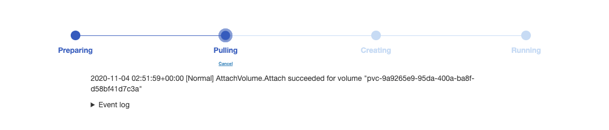

In this release, we wanted to give you more power to plug and chug what you want to use into PrimeHub—including your environment variables for model deployments and any custom software. We also took care of some housekeeping items to get rid of some clutter, allowing a clear path to focus on the project in front of you.

## 🌟 What's New

### Job Monitoring

System administrators can be informed and monitor their teams' resource usage patterns and behaviors for jobs with our new Monitoring tab. View the average resource usage for each job by the most recent timeframes by selecting the filters in the upper right corner of the tab.

+ [Document](job-submission-feature#monitoring)

## 🚀 Improvements

### Environment Variables for Models

Use your own environment variables when creating a model deployment.

+ [Document](model-deployment-feature#environment-variables)
  
### Install Custom Software

Use PrimeHub to install custom software in your environment with `!sudo apt-get install`.

### Image Error Handling

Get past the image-related errors while staying informed when launching your notebook server. If you come across a server request timeout, you will be able to cancel the request, know the reason for the timeout, and continue using the system.

### Archive Jobs

From now on, we will clean up and archive your jobs after seven days for you to prevent you from getting caught up in all of the clutter.

+ [Document](job-submission-feature#lifetime)
  

## 🧰 Bug Fixes

  
---

## 🎪 In the Community

+ [PrimeHub CE v3.2 (Community Edition) Release](https://github.com/InfuseAI/primehub/releases)

+ [InfuseAI x Youtube](https://www.youtube.com/channel/UCbbRUfqKPWfZxZY62Pian-g)